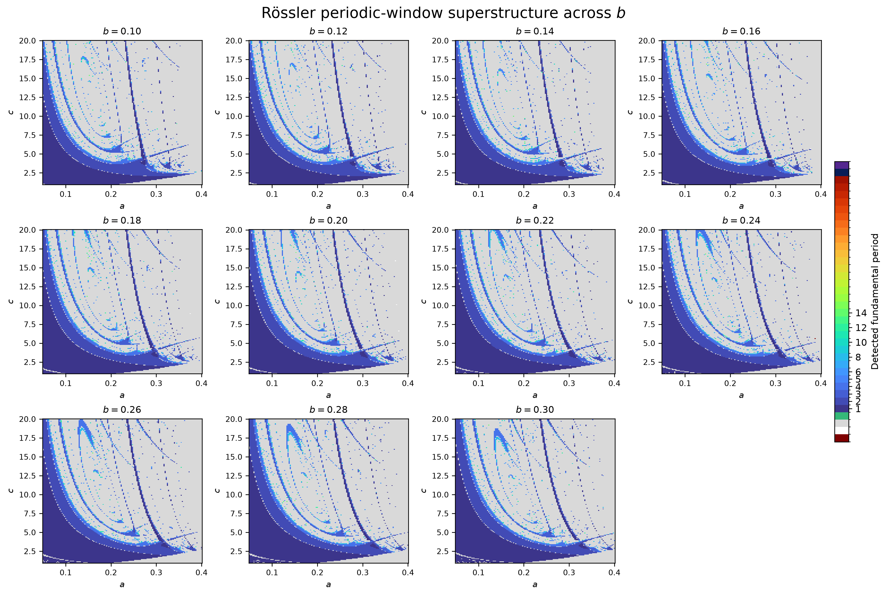
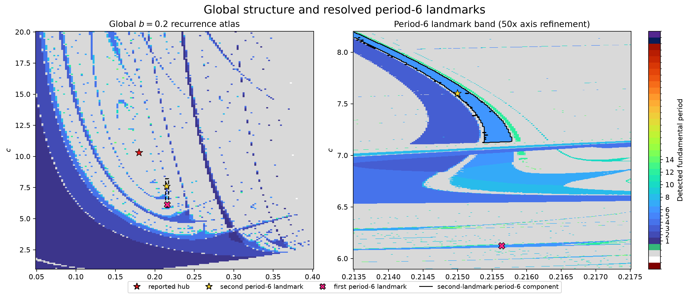
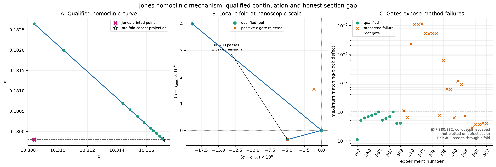
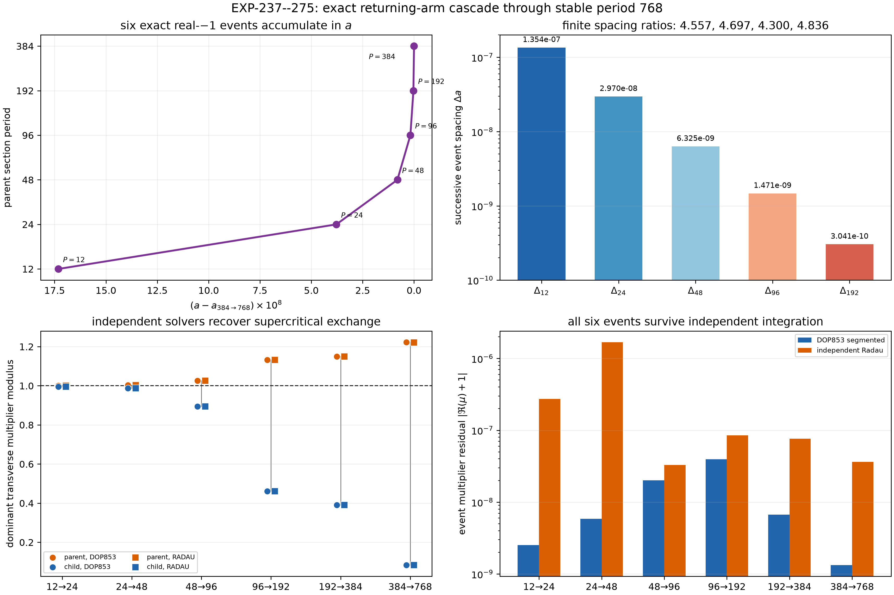

# Butterfly: reproducible periodicity-hub dynamics

This repository turns a 2012 study of Rössler periodicity hubs into a modern,
receipt-bearing program of numerical research. It combines parameter-plane
atlases, invariant-orbit continuation, Floquet analysis, chaotic-saddle
reconstruction, independent integrators, and explicit negative results.



The project began with Timothy D. Jones's
[*Topological origins of a bi-parameter periodicity hub for the Rössler
attractor*](https://arxiv.org/abs/1201.4343). Its current purpose is broader:
determine which historical claims reproduce, strengthen the mechanisms that
survive, correct those that do not, and build methods that can transfer to
other strange attractors.

## What the computations currently show

- The large-scale shrimp and periodic-window skeleton evolves coherently over
  eleven sampled planes, `b = 0.10, ..., 0.30`.
- The reported Jones hub has the claimed local saddle-focus equilibrium. The
  Hopf-born period-1 family reaches the reported hub neighborhood, and four
  exact supercritical period doublings with stable children are independently
  qualified on that path.
- A separate equilibrium-manifold calculation strongly qualifies a nearby
  homoclinic curve. At fixed `c = 10.3084`, the reproduced root is near
  `a = 0.182643608174`, rather than the printed `a = 0.1798`.
- Eighty-one receipt-bound homoclinic roots—including 78 gauge-aligned
  pseudo-arclength roots—continue that curve through a first sampled local
  minimum. The closest sampled root remains `1.74935e-5` above the historical
  fixed-`a` section; the observed outgoing arm then moves away from it.
- A second orbit family is resolved through eight finite period doublings.
  These calculations substantially strengthen the finite cascade, but do not
  prove universality or a global logistic-map conjugacy.
- The Jones and Barrio–Blesa–Serrano papers are treated as independent,
  near-simultaneous co-discoveries of the return-map topology transition's role
  in periodicity-hub organization.

The project does **not** yet claim the printed homoclinic coordinate, uniqueness
of the homoclinic connection, global nonintersection, a complete topological
explanation of the `(a,c)` plane, or a computer-assisted existence proof.
Those boundaries are part of the result, not fine print.

## A visual tour

### From the whole parameter plane to individual shrimp



The left panel gives the global `b = 0.2` recurrence atlas. The right panel is
a 50-times-finer view of the period-6 landmark band, with corrected-orbit
components overlaid instead of inferred solely from pixels.

### The Jones homoclinic mechanism under direct numerical audit



Accepted roots, rejected steps, the first local `a` minimum, the historical
section gap, and the fixed numerical defect gate appear in one receipt-bound
figure. Failed correctors and conditioning rejections remain visible.

### A deep, independently checked returning-arm cascade



Exact real-`-1` events, stable primitive children, two independent integrators,
and finite spacing ratios resolve the returning cascade through a stable
period-768 child. Later high-precision work extends the connected finite chain
while retaining the boundary between finite evidence and universality.

All 30 manuscript figures and their regeneration commands are indexed in
[`paper/figures/README.md`](paper/figures/README.md). The animated multi-`b`
atlas is documented under [`paper/supplement/`](paper/supplement/).

## Reproducibility model

Every promoted result is organized around a prospective experiment manifest
and a machine-readable receipt:

```text
experiments/manifests/       frozen numerical protocols
artifacts/EXP-*/             full local outputs and raw receipts
docs/experiments/receipts/   compact receipts tracked by Git
docs/findings/               scientific interpretations and claim boundaries
docs/claim-ledger.md         claim-by-claim state of the evidence
docs/updates/                chronological research checkpoints
paper/                       manuscript, bibliography, figures, and supplements
```

Source commit, solver configuration, acceptance gates, input hashes, and
failed checks travel with the result. Negative experiments are preserved so a
later narrative cannot silently erase an inconvenient method failure.

## Quick start

The modern research stack requires Python 3.12 or newer. With
[`uv`](https://docs.astral.sh/uv/) installed:

```sh
uv sync --extra dev
.venv/bin/butterfly verify
.venv/bin/python -m pytest -q
```

The command-line interface also exposes frozen CPU scans, resumable tiled
scans, and Lyapunov-spectrum receipts:

```sh
.venv/bin/butterfly --help
```

Check and build the continuously updated paper with:

```sh
.venv/bin/python scripts/check_paper_references.py
latexmk -cd -pdf -interaction=nonstopmode -halt-on-error paper/manuscript.tex
```

GPU execution is used where large independent ensembles justify it. The
Float64 CPU/GPU parity requirements and task-owned RunPod lifecycle are
documented in [`docs/compute/runpod-strategy.md`](docs/compute/runpod-strategy.md).

## Where to read next

- [`docs/README.md`](docs/README.md) — entry point to the living scientific
  record.
- [`docs/claim-ledger.md`](docs/claim-ledger.md) — historical claim versus
  current evidence and required closure test.
- [`docs/TODO.md`](docs/TODO.md) — active execution queue.
- [`docs/updates/README.md`](docs/updates/README.md) — chronological progress
  reports.
- [`paper/README.md`](paper/README.md) — manuscript build, visual inventory,
  citation discipline, and writing rules.
- [`paper/manuscript.tex`](paper/manuscript.tex) — current article source.

## Legacy MPI program

The original C/MPI parameter-plane scanner remains in `src/`, `hdrs/`, and the
top-level `Makefile` as part of the project's computational history. It was
written for GNU Make and Linux MPI clusters and contains site-specific build
defaults. New scientific work uses the tested Python package and frozen
experiment pipeline above unless a legacy reproduction explicitly requires the
original scanner.

## License

GNU General Public License v2. See [`LICENSE`](LICENSE).
