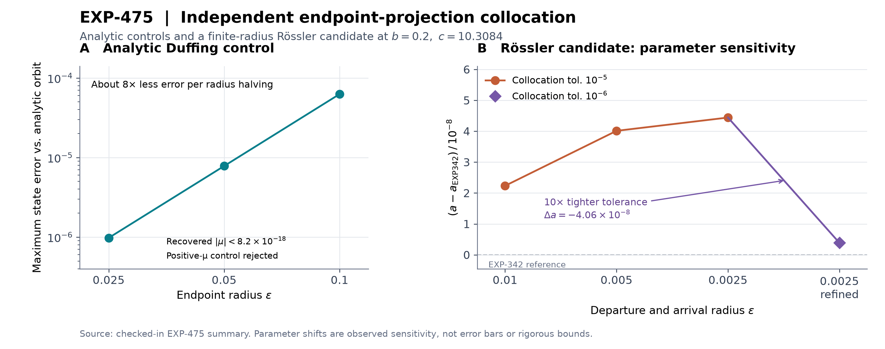

# EXP-475 — Independent endpoint-projection homoclinic pilot

Status: passed the frozen numerical protocol; finite-radius reproduction.

The initial fixed-`c` candidate is reproduced with a different boundary-value
formulation. At `(b,c)=(0.2,10.3084)`, the refined result is
`a=0.18264361203806015`, differing from EXP-342 by `3.86e-9`.
Mesh refinement changes `a` by `4.06e-8`, however, so this agreement is not a
thirteen-digit accuracy result. The defensible location remains approximately
`a=0.1826436`, with the observed numerical sensitivity explicitly retained.

## Protocol and independence

The [manifest](../../experiments/manifests/EXP-475-independent-projected-homoclinic-pilot.json)
and implementation were committed and pushed at
`cf2750824604eb53affe92336b2500ae42d50683` before target execution. The source
tree was clean. The one target invocation took 3.04 seconds on local CPU,
without retries, adjusted gates, paid resources, or uploads.

The new equations integrate the entire unknown path by fourth-order adaptive
collocation on normalized time. Orthogonal complements of the unstable and
stable linear eigenspaces constrain the departure and arrival endpoints,
respectively. Two specified endpoint radii fix the endpoint phases. The system
parameter `a` and total flight time are free within bounded transformations.
The five boundary equations determine the three state functions and two
unknown parameters.

The saved EXP-342 trajectory supplies the initial guess. Its very long,
small-amplitude departure is trimmed, and its arrival is extended to the new
radius. Neither the old matching-sphere residual nor its nonlinear stable
target is used in the new boundary equations. Both endpoints are approximated
by linear eigenspaces; shrinking-radius tests are therefore essential.
Ordered real Schur decompositions form the correct invariant-subspace
complements even for a nonnormal Jacobian.

This changes the endpoint equations and discretization, while sharing the
Rössler model, initial guess, and SciPy ecosystem. It is not independent
discovery and is not AUTO/HomCont validation. AUTO was unavailable in the local
environment; the implementation uses SciPy's documented
[collocation boundary-value solver](https://docs.scipy.org/doc/scipy/reference/generated/scipy.integrate.solve_bvp.html).

## Analytic controls

The same projection-and-radius formulation first solved the Duffing
system `x'=y`, `y'=x-x^3+mu*y`. Its exact homoclinic at `mu=0` is
`x=sqrt(2) sech(t)`, `y=-sqrt(2) sech(t) tanh(t)`.

| Endpoint radius | Maximum state error against the analytic orbit | Recovered `mu` |
| --- | --- | --- |
| 0.1 | `6.27e-5` | `3.44e-18` |
| 0.05 | `7.82e-6` | `8.13e-18` |
| 0.025 | `9.77e-7` | `3.35e-19` |

The state discrepancy falls by about eightfold per radius halving. These
finite-radius discrepancies are distinct from boundary residuals, which are
approximately `1.1e-16`. The positive-`mu` negative control, constrained to
`mu in [0.03,0.07]`, correctly fails the boundary and solver gates. For this
system `H'=mu*y^2` excludes a nontrivial exact homoclinic at positive `mu`
(energy injection, or anti-damping).
Sixteen focused implementation tests passed before target execution.

## Target results

| Both endpoint radii | Collocation tolerance | `a` | Maximum short-replay state defect |
| --- | --- | --- | --- |
| 0.01 | `1e-5` | 0.18264363051140478 | `1.37e-6` |
| 0.005 | `1e-5` | 0.18264364829595603 | `2.00e-6` |
| 0.0025 | `1e-5` | 0.18264365259550344 | `2.80e-6` |
| 0.0025 | `1e-6` | 0.18264361203806015 | `1.06e-7` |

All four cases satisfy the frozen solver, boundary, parameter-interiority,
nontrivial-excursion, source-agreement, and independent short DOP853 replay
gates. The refined path uses 6,545 collocation nodes, has flight time
`121.8103415`, and reaches distance about `54.76` from the equilibrium. Its
scaled boundary residual is `7.22e-16`.

The last radius halving changes `a` by `4.30e-9`; tightening the collocation
tolerance changes it by `4.06e-8`. Discretization therefore dominates the
observed sensitivity at these settings. This comparison is not an error bar,
a validated parameter interval, or a radius-to-zero extrapolation.



## Reproduction and scope

The [compact summary](receipts/EXP-475.json) contains every value needed for
the figure. A fresh checkout can regenerate it without the full raw receipt:

```sh
uv run --locked python scripts/plot_projected_homoclinic_pilot.py
```

The full experiment requires the hash-bound EXP-342 raw receipt listed in the
manifest. With that input available and the frozen source checked out, the
original command is:

```sh
uv run --locked python scripts/validate_projected_homoclinic.py \
  --manifest experiments/manifests/EXP-475-independent-projected-homoclinic-pilot.json \
  --output artifacts/EXP-475/receipt.json
```

The runner refuses to overwrite an existing receipt. Full output is
`artifacts/EXP-475/receipt.json`, 1,633,857 bytes, SHA-256
`7da4fa60891f1ecf057edde9072576e709f270ff0a2143250415e6c87d92309f`.
Its public distribution is tracked separately from this checked-in summary;
the presence of a checksum alone does not make the raw input available.

This result supports the initial revised-coordinate candidate. It does not
prove existence in the infinite-time limit, establish uniqueness, validate
Jones's printed `a=0.1798`, or resolve the later continued curve's apparent
turn. Further accuracy work must retain separate endpoint-truncation and
discretization studies instead of counting more nearby continuation points as
additional independent accuracy evidence.

## Recommended next frozen pilot

Refine collocation tolerance at **all three radii**, keeping the same source
binding, coordinate convention, endpoint equations and explicit acceptance
rules. The present radius series uses tolerance `1e-5`; its apparent radius
trend cannot yet be separated cleanly from the measured discretization effect.
Keep mesh/tolerance differences distinct from endpoint-truncation differences,
and add a new prospectively committed manifest before any additional target
execution.

After the initial candidate passes that stronger study, choose a small set of
points before and near the apparent continued turn. Bind each initial seed's
source revision, trajectory, parameters, endpoint radii, and phase convention;
check trajectory identity so a different connection cannot silently replace
the target. Measure sensitivity specifically in `a` and `c`, comparing it with
the scale of the proposed turn. No such follow-up was executed in EXP-475.
