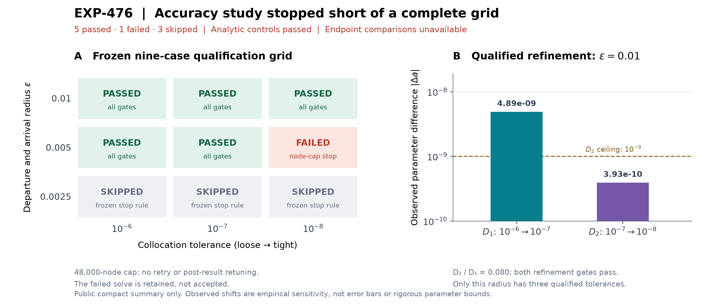

# EXP-476 - Homoclinic radius-by-tolerance grid

Status: **FAILED; accuracy grid incomplete.** Executed once on clean, frozen
source. Five cases passed, one failed, and three were skipped. No retry or
post-result change to the protocol was made.

## Result in brief

The stricter study preserves the nearby candidate but does not settle its
endpoint-radius sensitivity. Only radius `0.01` has three qualified
tolerances. Its successive changes in `a` contract from `4.89e-9` to
`3.93e-10`, satisfying the declared refinement gates for that radius alone.
The sixth case reaches the mesh-refinement cap without satisfying the
collocation criterion. Both adjacent-radius comparisons are **unavailable**.
This numerical failure neither disproves a homoclinic connection nor
establishes Jones's printed coordinate or the later apparent turn.



## Question and frozen design

EXP-475's tolerance refinement shifted `a` more than its last radius change.
This study applies three tolerances (`1e-6`, `1e-7`, `1e-8`) at each of three
equal departure/arrival radii (`0.01`, `0.005`, `0.0025`). It tests whether
discretization effects can be separated from finite-endpoint effects at the
initial `(b,c)=(0.2,10.3084)` candidate. It does not test the later turn.

The [v2 manifest](../../experiments/manifests/EXP-476-homoclinic-radius-tolerance-grid.json)
binds the unchanged EXP-342 trajectory by SHA-256. Every case independently
reconstructs its initial guess from that trajectory; cases are not warm-started
from earlier grid solutions. The model, endpoint equations, parameter/time
box, and short DOP853 replay settings remain those of EXP-475. The replay
defect must now be no larger than the individual collocation tolerance.

For each radius, `D1=|a(1e-7)-a(1e-6)|` and
`D2=|a(1e-8)-a(1e-7)|`. Discretization qualifies only if
`D2<=1e-9` and `D2<=0.3*D1+1e-10` at every radius.

Adjacent radii are compared at the common finest tolerance. Classification
order is fixed before target execution:

1. **Below declared empirical resolution:** both the radius difference and
   neighboring summed `D2` are at most `1e-9`.
2. **Resolved:** otherwise, summed `D2` is at most one-quarter of the radius
   difference.
3. **Unresolved:** neither preceding test passes.
4. **Unavailable:** required numerical cases failed or are missing.

The overall `passed` field requires all nine technical cases and all three
discretization comparisons. Endpoint-effect classification is reported
separately. These empirical thresholds are not rigorous error bounds.

## Implementation and safeguards

- The existing v1 four-case manifest remains supported; EXP-475's frozen
  manifest and raw receipt are unchanged.
- v2 validates a complete Cartesian grid and metadata-keyed comparisons,
  avoiding positional assumptions in the original four-case analysis.
- A target invocation requires clean source and exact agreement between the
  selected manifest bytes and its tracked HEAD version.
- Each case has a cooperative 45-second deadline spanning seed construction,
  collocation and replay. Controls and all cases share a 300-second total
  deadline. The node cap is 48,000. A long native solver operation cannot be
  forcibly preempted by callback checks; over-budget results are not accepted.
- The analytic Duffing controls use tolerance `1e-8`. Positive `mu` is an
  energy-injecting negative control, since `H'=mu*y^2`. Its rejection must be
  a completed numerical result, not a timeout or node-budget failure.
- Collocation paths are checkpointed before replay. Failed numerical gates,
  source reads, timeouts, and expected numerical exceptions retain failed and
  skipped cases. Nonfinite diagnostics cannot pass and are preserved as
  explicitly identified `null` entries in valid JSON.
- Technical failures stop later cases. A sensitivity comparison failure does
  not erase accepted solutions or trigger a retuned run.

The controls-only development invocation passed, without reading or solving
the Rössler target. All 655 pre-run tests and both Python 3.12/3.13 CI jobs
passed before the target run. The source and manifest were committed and
pushed as `af90d04e6b484733bb2535a453157c4830691a34`, preserved by tag
`exp-476-protocol`, before executing the command below. Its output path must
be new; this is a reproduction command, not permission to overwrite the
frozen receipt or retune EXP-476.

```sh
uv run --locked python scripts/validate_projected_homoclinic.py \
  --manifest experiments/manifests/EXP-476-homoclinic-radius-tolerance-grid.json \
  --output artifacts/EXP-476/receipt.json
```

## Frozen execution and evidence

- Source: `af90d04e6b484733bb2535a453157c4830691a34`, clean;
  tree `83df8e6e620371c8086615df3d3b362e03072d06`.
- Manifest SHA-256:
  `8a3657cc921b798eec34af1199d3e53b26aa89cf629f6ab3bf3c6d5f8c6498e5`.
- Raw receipt: `artifacts/EXP-476/receipt.json`, 8,649,021 bytes;
  SHA-256 `c9818275ed3c585934cdeaa85857b04a5e9a6e1a6400f426a5cbf6e06d5b95bc`.
- [Compact public summary](receipts/EXP-476.json) retains every case status,
  controls, scalar diagnostics, and sensitivity classifications.
- Python 3.12.14, NumPy 2.5.1, SciPy 1.18.0; 11.14 seconds, local CPU,
  exit status 2. No service credentials, GPU, or paid resources were used.

The separate [research-exp476 release](https://github.com/tdj28/butterfly/releases/tag/research-exp476)
provides the full raw receipt, both post-result diagnostics, current manuscript,
and `SHA256SUMS`. It does not modify the earlier `research-core-v1` release.
See the [download and inspection commands](../reproducibility.md#exp-476-failed-grid-and-post-result-diagnostics).

| Radius | Tolerance | Fitted `a` (diagnostic digits) | Stored nodes | Outcome |
| --- | --- | --- | --- | --- |
| 0.01 | `1e-6` | 0.18264359001291924 | 5,963 | Passed |
| 0.01 | `1e-7` | 0.18264358512624580 | 12,419 | Passed |
| 0.01 | `1e-8` | 0.18264358473363554 | 26,816 | Passed |
| 0.005 | `1e-6` | 0.18264360781512914 | 6,269 | Passed |
| 0.005 | `1e-7` | 0.18264360291105840 | 12,874 | Passed |
| 0.005 | `1e-8` | 0.18264360251810396 **(not qualified)** | 43,719 | Failed |
| 0.0025 | All three | Not computed | — | Skipped |

The sixth case's maximum relative collocation RMS is `1.37928e-3`, versus
the required `1e-8`. Its boundary residual (`3.03e-16`) and short-arc replay
defect (`2.38e-9`) are small, but do not override that failure. The mesh cap
is a limit on the *next* requested mesh: 43,719 existing nodes plus 31,054
requested insertions would require 74,773 nodes, above 48,000.

For radius `0.01`, `D1=4.886673454773671e-9` and
`D2=3.926102498663653e-10`. The raw arithmetic at radius `0.005` also looks
small, but that sequence is not technically qualified. No radius effect
is promoted from the failed estimate. The sensitivity receipt's
`complete: true` means all nine planned entries are accounted for, including
failed/skipped records; `evaluable: false` correctly marks the incomplete
scientific comparison.

## Post-result mesh inspection, not a new acceptance test

[`inspect_homoclinic_grid_mesh.py`](../../scripts/inspect_homoclinic_grid_mesh.py)
reads only the saved mesh/state arrays and analytic vector field. It performs
no integration, optimization, or new orbit solve. Reconstructing the cubic
polynomials and installed SciPy residual estimator reproduces all six archived
maximum RMS values exactly. The helper-source hashes are recorded because
this diagnostic uses SciPy's internal polynomial-evaluation routines.

The failed mesh contains 15,641 intervals narrower than `1e-10` in normalized
time; the passed `0.01 / 1e-8` case contains none. Near the worst failed interval,
`s≈0.990956655`, the normalized width is `8.62e-12` and `z≈53.76` changes by
only 13 floating-point increments (ulps). The absolute collocation state-balance
defect in `z` is about `1.10e-14`, or 1.55 ulps. Division by that tiny interval
produces a much larger derivative residual. The one-ulp relative derivative
scale is `8.14e-4`, comparable to the measured `1.38e-3` RMS.

This is strong evidence of floating-point-sensitive overrefinement near a
stationary `z` component. Adaptive roundoff feedback is a plausible explanation,
not a reconstructed causal history: only the final mesh was saved. A small
short-arc state error and an interval-local derivative residual measure
different quantities; see the [SciPy residual definition](https://docs.scipy.org/doc/scipy/reference/generated/scipy.integrate.solve_bvp.html).
The maximum residual outside intervals narrower than `1e-10` is still
`2.40e-6`, above tolerance; the failure is not confined to that chosen spacing
threshold, nor has a unique causal mechanism been proved.
None of these observations changes EXP-476's failed status.

```sh
uv run --locked python scripts/inspect_homoclinic_grid_mesh.py
uv run --locked python scripts/plot_homoclinic_refinement_grid.py
```

The mesh diagnostic is `artifacts/EXP-476/mesh-diagnostic.json`, SHA-256
`f27a842cc06b48ff8af19edeea83f6d167922e4a2d829f6fc2ce0ff033e8cb74`.
It refuses to overwrite an existing output. The plot needs only the tracked
compact summary and deliberately shows failed/skipped cells.

### Higher-precision evaluation of the same saved intervals

[`inspect_homoclinic_interval_arithmetic.py`](../../scripts/inspect_homoclinic_interval_arithmetic.py)
then evaluates the same cubic-Hermite/Lobatto residual definition at 80-digit
decimal precision. It treats every archived binary64 input as exact through
`Decimal.from_float`; it cannot recover digits already lost in the saved node
values. Selection is fixed to the worst failed interval and the worst interval
of the accepted `0.01 / 1e-8` case. No integration or solve is performed.

| Saved interval | Archived binary64 RMS | 80-digit reevaluation |
| --- | --- | --- |
| Failed `0.005 / 1e-8` maximum | `0.001379280605` | `0.001379292885` |
| Passed `0.01 / 1e-8` maximum | `9.99981347e-9` | `9.99981342e-9` |

The failed residual changes by only 8.90 parts per million: higher-precision
reevaluation does **not** cure it. It is a residual of the interpolant through
the saved binary64 nodes, not merely inaccurate residual evaluation. An exact
quadratic known-solution control has RMS about `3.08e-68`; rounding only its
tiny-interval endpoint samples to binary64 raises this to `2.78e-4`, even with
80-digit reevaluation. This isolates a possible mechanism, not the adaptive
history of the target solve. Eleven unit tests check the polynomial identities,
endpoint derivatives, controls, and finite diagnostic serialization.

```sh
uv run --locked python scripts/inspect_homoclinic_interval_arithmetic.py
```

The separate diagnostic `artifacts/EXP-476/arithmetic-diagnostic.json` has
SHA-256 `6efd6d9e5e78399d07880347b98dfd90bdc09fd2ee598a29b245567999ed0aa0`.
Its output is also no-overwrite. This post-result analysis does not reclassify
any case or provide a global parameter error bound.

The next numerical task is to qualify a revised representation or mesh strategy
on known solutions, then freeze a **new** prospective target protocol.
Increasing the cap, lowering a gate, or replaying until a pass would not
complete EXP-476. Higher-precision evaluation of existing saved arrays alone
is demonstrably insufficient.

## Interpretation limits

Finite-radius sensitivity is not existence in the infinite-time limit,
uniqueness, a rigorous parameter interval, or validation of Jones's printed
coordinate. Reusing the same source trajectory and finding nearby parameters
does not prove trajectory identity. Selected pre-turn/turn points require a
separate prospective protocol and explicit identity checks after this study.
