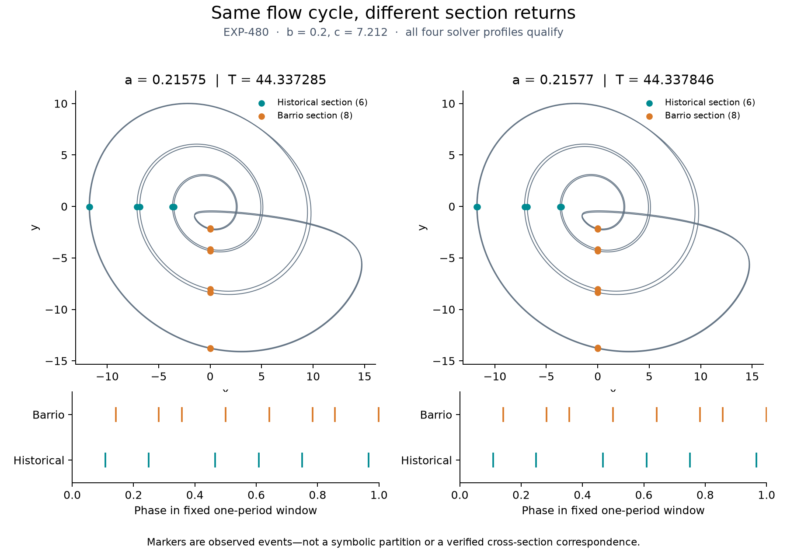

# EXP-480 — Both nominated cycles qualify for paired-section observation

Status: completed; both cases numerically qualified. This is not symbolic-chain
verification. The [adjudicated amendment](../reviews/EXP-480-adjudication.md)
and [frozen machine plan](../../experiments/manifests/EXP-480-event-transport.json)
define the accepted endpoint and all pre-outcome changes.

## Execution and results

Run started September 7, 2026 at 00:40:34 UTC (September 6, 17:40 Pacific),
from clean pushed source `5b584f4a0cf2fe4544e22d5288878300efd35469`, preserved
at remote `codex/exp480-execution`. Local Mac arm64 CPU, Python 3.13.11,
NumPy 2.5.1, SciPy 1.18.0; dependencies pinned by the frozen `uv.lock`.
All eight predeclared profiles completed in **32.28 seconds**, with no retry.

| Fixed candidate | a, b, c | Flow period (base DOP853) | Historical / Barrio returns per period | Outcome |
| --- | --- | --- | --- | --- |
| local-a025-c083 | 0.21575, 0.2, 7.212 | 44.33728504168857 | 6 / 8 | Qualified in all four profiles |
| local-a027-c083 | 0.21577, 0.2, 7.212 | 44.33784632970767 | 6 / 8 | Qualified in all four profiles |

Maximum cross-profile scaled event-state discrepancy is `2.561e-11`, versus
the `1e-6` gate; phase discrepancy is `1.577e-14` periods versus `1e-7`.
Maximum flow closure error is `1.578e-12` versus `1e-9`. The minimum absolute
scaled historical gate distance among all recorded plane roots is `0.1682`,
well outside the new `1e-5` exclusion. Repeated windows, both orientations'
angle diagnostics, extrema margins and all final source/raw audits pass.



The figure uses the predeclared base DOP853 trace for each case, with no fitted
alignment. It is descriptive: the timeline does not add a merged-order
qualification, and none of its event markers is a symbolic partition letter.

## Provenance and reproduction

Raw terminal receipt SHA-256:
`aa4556cdfbca2fa277c8e77daec00f01190e0a8bfde33d9977e5a594c58127b9`.
The separate audit checked all **24 declared files / 6,684,261 bytes**.
The [compact public receipt](receipts/EXP-480.json) records both outcomes.

The raw run plus exact candidate and nomination inputs is also backed up,
unextracted, at
`ubuntu@prax:/home/ubuntu/butterfly-research/exp480-complete-20260907-5b584f4/evidence.tar`.
Archive: **12,349,440 bytes**, SHA-256
`d2070e1d676b30f5dcbf5ecddf8814d3cee76fb8c12a2284084bb34e5f2d9cd5`.
Remote bytes/hash match; file permissions are `0600`, directory `0700`.
All local originals remain. Source and reviewed protocol are separately
preserved by the immutable remote Git ref; the tar is a data archive, not a
standalone software environment.

Original command, from that frozen checkout with the bound inputs restored:

```sh
PYTHONPATH=.:python .venv/bin/python -m scripts.check_historical_event_transport \
  --mode execute --source-commit 5b584f4a0cf2fe4544e22d5288878300efd35469 \
  --output-dir artifacts/EXP-480/run-5b584f4
```

The output directory must be fresh. This records the original invocation; it
does not authorize overwriting or rerunning the completed research attempt.
The checked-in `scripts/summarize_historical_event_run.py` audits that fixed
receipt and produces the figure/archive without integration. Its output path
is also exclusive. `scripts/archive_exp480_to_prax.py` defaults to local
preflight; `--execute` made the single verified backup.

## What changes for Jones?

The six-versus-eight event representation is reproducible for these two
selected cycles, including robust section membership. That supports using
this observation setup in the next study. It does not discover new period
counts, show that the two parameters are distinct centers, certify minimal
flow period, establish a valid scalar partition, locate either critical
letter, recover a historical word, or verify a chain arrow.

Next: the [common-population partition study](EXP-481-common-population-partition-design.md).
