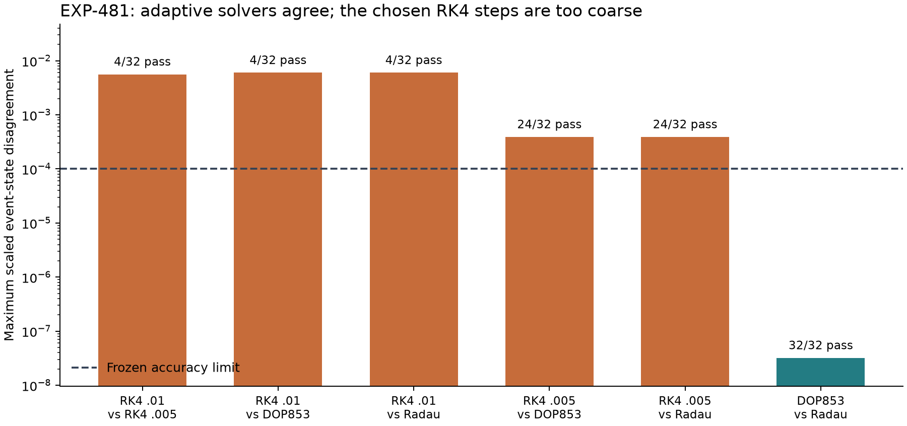

# EXP-481: numerical qualification completed, collection prevented

The research controller has been started from pushed release
`83a737a74d64cacc4028c1bb624a9817f395dbbd` on `codex/exp481-execution` (PR48).
The exact reviewed release check passed: receipt 2,017 bytes, SHA-256
`5b67bb4dbf71523efe042bee3efd3652a4ea05506544b28d1cc5a8d1562ed81c`.
The complete review and accepted repairs are recorded in the
[prospective-review update](2026-09-07-exp481-prospective-review.md).

## Current state

Fresh reviewed setup passed, including **381 source-bound tests with no skips**
and both raw reference audits. All **128 qualification trials** completed, but
only **92 of 192** cross-profile comparisons passed. The controller therefore
prevented collection. Its worker finished cleanly in 41.73 seconds; the overall
campaign is incomplete by design, with no collection batches or map analysis.
The one-shot attempt remains consumed. There is no automatic retry.

The post-run auditor independently replayed all 128 raw RK4/adaptive journals
and reproduced every comparison exactly. It verified the full phase inventory
against the original terminal receipt. This is a real numerical qualification
failure, not a missing file, process timeout or changed outcome summary.



| Solver comparison | Passed / 32 | Largest scaled state disagreement |
| --- | ---: | ---: |
| RK4 .01 vs RK4 .005 | 4 | 0.00560666 |
| RK4 .01 vs DOP853 | 4 | 0.00599631 |
| RK4 .01 vs Radau | 4 | 0.00599629 |
| RK4 .005 vs DOP853 | 24 | 0.000389655 |
| RK4 .005 vs Radau | 24 | 0.000389631 |
| DOP853 vs Radau | 32 | 0.0000000319901 |

The frozen state-disagreement threshold is **0.0001**. All ordered raw/accepted
event counts, capture memberships and timing comparisons agree within their
declared criteria. The failures are dominated by RK4 event-state accuracy.
Both cases contribute 50 failed comparisons; neither is selected away.

Halving RK4's step reduces the median sectionwise state discrepancy relative
to DOP853 by about 15.6 times, consistent with fourth-order convergence. This
is a descriptive error-ratio diagnostic, not a validated error bound. Adaptive
solver agreement can also share bias; it is not a rigorous truth certificate.

**Implication for Jones:** none of his symbolic or homoclinic claims is refuted
by this outcome. These RK4 settings fail the stricter numerical prerequisite
needed to assess the map. No target map, symbol or chain-arrow result was
produced. Preserve the threshold and improve numerical resolution in a
separately frozen successor.

Run directory: `artifacts/EXP-481/target-83a737a`.
The fixed attempt marker is `artifacts/EXP-481/target-once.json`; never remove
it or repeat the campaign to obtain a preferred result. Phase progress and
supervisor logs remain below the run directory. Incomplete evidence remains
incomplete; no automatic restart, resume or sample refill is enabled.

The command is:

```sh
/usr/bin/caffeinate -i .venv/bin/python -B scripts/run_paired_campaign.py \
  --mode execute \
  --source-commit 83a737a74d64cacc4028c1bb624a9817f395dbbd \
  --remote-ref refs/heads/codex/exp481-execution \
  --output-dir artifacts/EXP-481/target-83a737a
```

The process has finished. PR48 was merged after all four release CI checks
passed; the frozen execution branch remains at the actual execution commit.
This post-run audit is on a separate results branch, not an edit to the executed
source or an attempt to rerun it.

No new GPU host or paid compute was started. The only new reviewed API expense
is the completed $0.5888 design review. Symbolic letters/arrows, exact
criticality and the homoclinic assertion remain unverified by this experiment.

## Evidence and next step

The [public result receipt](../experiments/receipts/EXP-481-qualification-result.json)
binds the raw phase, witness, supervisor, setup and stopped-campaign records.
`scripts/summarize_exp481_qualification.py` reproduces the raw audit, figure
and bounded archive without integrating new trajectories.

The local archive is
`artifacts/EXP-481/qualification-result-01/evidence.tar`, 37,713,920 bytes,
SHA-256 `55e1e52f47e8208ce7bf3e082f2e9c42c5d81193b198baca54009fabcc828715`.
Its member manifest was verified and all local originals remain. Upload to the
new task-owned prax folder was **blocked before execution by the environment's
sensitive-egress review**, which requires approval of this exact payload.
No remote backup is claimed. This storage restriction does not block the
numerical follow-up; do not retry the upload through another route.

The successor should test RK4 .0025/.00125 against the retained adaptive
reference agreement while keeping the accuracy threshold. Their accuracy is
not yet observed. First benchmark larger fixed CPU batches on synthetic fields:
naively multiplying the old throughput estimate by four exceeds the old
collection budget, so feasibility must be addressed before a new target run.
Keep EXP-481's complete negative evidence, distinguish already observed
qualification seeds from any fresh confirmatory sample, and obtain the new
prospective review for the materially revised numerical/resource design.
