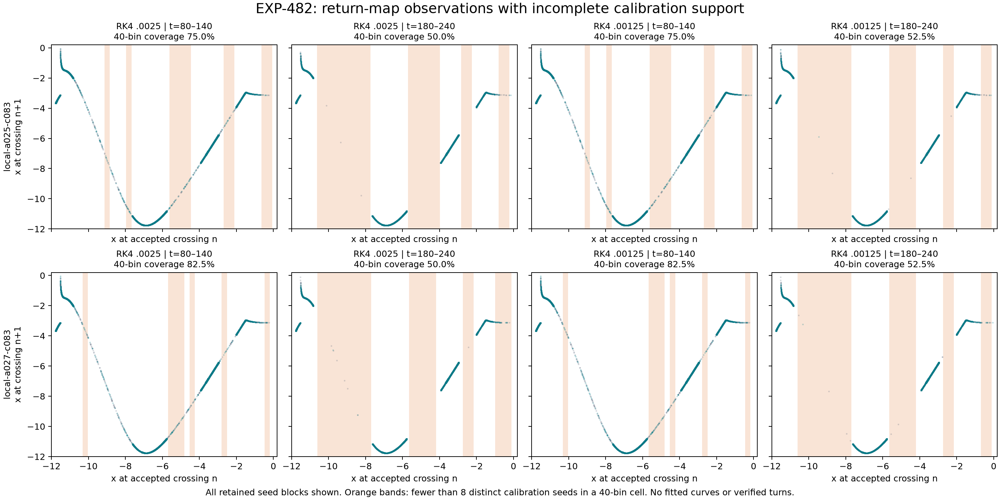

# EXP-482: the run completes, but return-map support is insufficient

Follow-up: [EXP-483 identifies strong early pair-selector loss and fitted-endpoint
exclusion](2026-09-08-exp483-support-diagnosis.md). That diagnosis does not change
the completed experiment's failed support gates below.

**Bottom line:** the finer steps passed all numerical checks and the entire
experiment completed. The sampled points show a clear curved return relation,
especially in the earlier window. Nevertheless, neither case satisfies the
frozen support requirements for a qualified map. This is **not a refutation of
Jones** and is not a verification of his flow-level symbolic chains.

The limiting factor is now **where the observations lie**, not the previous
coarse-step accuracy failure. Thousands of retained trajectories do not imply
well-supported observations throughout the return-map domain.

Top row: a=0.21575; bottom row: a=0.21577. Both use b=0.2, c=7.212.
Gray points are calibration observations and teal points are held out. All
retained seed blocks are shown, with four selected consecutive pairs per seed
and window. Orange bands have fewer than eight distinct calibration seeds in
the displayed 40-bin partition; orange does **not** necessarily mean no data.
These are scatter plots, not fitted curves, verified turning points or symbolic
partitions. All four primary step/window combinations appear for both cases.

## What the frozen test found

Each case started with 8,192 initial states, integrated under both RK4 profiles.
All 64 collection batches completed. There were no recorded trajectory failures
or ambiguous nonfailed events in either profile/case. The joint retained cohorts
pass the prespecified sample-size and step-agreement gates:

| Case | Joint retained | Calibration / held out | Profile retention disagreement |
| --- | ---: | ---: | ---: |
| a=0.21575 | 5,087 | 2,517 / 2,570 | 0.891% |
| a=0.21577 | 5,978 | 3,004 / 2,974 | 0.781% |

The disagreement limit remains 3%; the minimum is 256 seeds per split. Passing
these gates says nothing by itself about the distribution of inputs across the
map domain.

For **each** case, all 20 primary variants remained unresolved:

- Eight early-window variants stopped at an unsupported interior gap.
- Two early-window 30-bin variants reached held-out evaluation but exceeded the
  unsupported-fraction limit.
- All ten late-window variants stopped at insufficient bin coverage.

The late-window coverage is 48–53.33% across the declared variants, below the
70% minimum. The four early-window fits that reached held-out testing had
normalized supported-row q90 errors of 0.00731–0.00861, below the 0.08 limit,
but left 9.056–10.020% of held-out pairs unsupported, above the 5% limit.
Their affine baselines had q90 error about 0.445–0.450 on the same supported
rows. The low spline error is encouraging **only on those supported rows**;
it cannot rescue the unsupported observations, the other variants or the late
window. Error values unavailable after an earlier gate failure remain null,
not zero or an inferred pass.

The two critical-proximity matrices were correctly **not evaluated** because
the joint primary gates failed. There is no qualified branch count, critical
interval, symbolic letter, chain arrow or homoclinic result from this run.
All predeclared diagnostic projections are retained in the receipt and remain
diagnostic; none substitutes for a failed primary.

## A useful descriptive clue, not a replacement test

The independent support counts used for the figure show that every early-window
40-bin cell contains at least one calibration seed, but only 75–82.5% contain
the required eight. In the late window, only 62.5–70% contain even one seed,
and 50–52.5% contain eight. This is a descriptive observation on already seen
data, not a relaxed one-seed acceptance rule.

The same retained cohort becomes concentrated into narrower portions of the
plotted relation at later observation times. These finite-sample plots do not
establish that a true return map is absent in the gaps, that an invariant set
is connected/disconnected, or that the map itself changes with time. They also
do not exclude rare additional sheets. Distinguishing time-window sampling,
reference conditioning and actual geometric structure is the next task.

## Audit and preservation

The complete experiment ended at **2026-09-08 19:58:31 UTC**. Its execution
freeze remains `8ce37169ef9c24c570f5e2b9d5a60e48f310c377` on
`codex/exp482-local-execution`. The fixed EXP-482 attempt remains consumed;
there is no retry, refill, new integration or changed threshold.

All three workers completed with verified cleanup. Collection took 5,038.53 s
and analysis 111.60 s, inside the unchanged phase limits. Peak sampled RSS was
271,532,032 bytes for collection and 254,771,200 bytes for analysis. These are
observed runtimes, not estimates or promises for another experiment.

`scripts/summarize_exp482_maps.py` independently reconsumes the completed
campaign, phase and worker receipts, checks the one-shot marker, reopens all
64 raw collection journals, reconstructs every profile and reruns the exact
frozen analysis. It reproduced the **entire saved analysis exactly**. This is
reproducibility using the same scientific implementation, not an independent
algorithm or mathematical proof. No trajectories were integrated in the audit.
The original 25,861 campaign files total 769,637,502 bytes, excluding the final
campaign receipt; the complete inventory was checked before and after replay.

- Campaign receipt SHA-256:
  `c4ab5fb1fdd07273e5e5f4b2c7548b1d073e3645e1cc63f24738a2bf2418c27e`.
- Original full analysis SHA-256:
  `d43f996f0a9e24d959689fba975cb3f851505a5192a26e4dca006dcf2af2a27d`.
- [Public result receipt](../experiments/receipts/EXP-482-map-result.json):
  every case/projection/window/variant, cohort counts, observed metrics,
  supervisor records and display support counts; SHA-256
  `e5c99429a670dbbc5b5fb4230718f37cc0a6307ba16fc0bc076962e0feeb6aeb`.
- Local audit and figure: `artifacts/EXP-482/map-audit-01`.

The figure was visually checked. Its support counts independently reproduce the
saved 40-bin coverage values, using distinct seeds rather than repeated pairs.
The reporting tests include endpoint bins, repeated seeds, invalid campaign
anchors, unavailable metrics and refusal to use diagnostic success as rescue.
The complete local regression suite passed **1,788 tests**, with one existing
Linux-only process-identity skip on macOS, in 112.39 seconds.
Raw evidence remains local; no new remote backup or upload is claimed. No paid
Pro request or new cloud worker was used.

## Next research work

1. Preserve this completed, support-limited result in the manuscript and ledger.
2. Use the existing journals to diagnose which parts of the domain are missed
   by time-window selection, final-horizon reference conditioning and the
   distinct-seed support rule. Keep this explicitly descriptive/post hoc.
3. Design a separate, geometry-directed section-sampling test if that audit
   supports it. Do not simply increase the sample until this old protocol passes
   or lower its support thresholds. Freeze any new target states/method first.
4. Return to corrected flow orbits, defensible turning regions/partitions and
   actual window-to-window connections. These—not the present scatter plots—are
   the remaining requirements for verifying or challenging Jones's chains.

The [support-diagnostic plan](../experiments/EXP-483-support-diagnostic-draft.md)
uses only preserved data initially. It does not authorize a paid review or a
new trajectory campaign.
