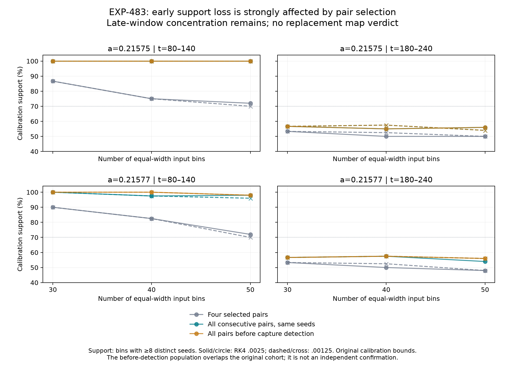

# EXP-483: the early support bottleneck is largely a sampling problem

We have identified a concrete limitation in our measurement method, not a
failure of Jones's theory. Keeping all observed consecutive returns greatly
improves early-window coverage without generating a single new trajectory.
The late window remains concentrated. Separately, the original fitted endpoint
interval accounts for almost all held-out rejections in the four evaluated
fits. This gives us a reason to change methods prospectively, not permission
to relabel EXP-482 a success.

## What changed when we kept the observations we already had?

The comparison uses exactly the same retained seed cohort and calibration
normalization as EXP-482. Counts are distinct seeds, not repeated crossings.
All 30/40/50-bin comparisons and both RK4 profiles are retained; the table
shows the range across those bins and steps, not a selected best case.

| Case / window | Original four-pair coverage | All consecutive-pair coverage |
| --- | ---: | ---: |
| a=0.21575, t=80–140 | 70.0–86.7% | 100% |
| a=0.21577, t=80–140 | 70.0–90.0% | 96.0–100% |
| a=0.21575, t=180–240 | 50.0–53.3% | 54.0–57.5% |
| a=0.21577, t=180–240 | 48.0–53.3% | 54.0–57.5% |

In the displayed 40-bin comparison, early coverage rises from 75% to 100% in
the first case and from 82.5% to 97.5% in the second, at **both** step sizes.
This is strong descriptive evidence that the original four-pair selector
discarded useful rare-domain observations. It is not new independent evidence
for a branch count: all-pair blocks have unequal sizes, no new fitting or
bootstrap acceptance test was applied, and late support still falls short.

Removing final-horizon exclusion of eventually detected captures also helps
early selected-pair coverage: 40-bin coverage becomes 87.5% in both cases.
Using all available pairs **before capture detection** gives 100% early 40-bin
coverage for both cases/profiles. It does not materially restore late support.
These comparisons overlap and are not additive causal effects. Capture is
detected on a fifth qualifying crossing; earlier points may already approach
the periodic reference. They are not thereby independent chaotic-saddle data.

The receipt separately accounts for failed, ambiguous, historical-only,
Barrio-only, both-reference, neither/insufficient, and retained seeds. Failed
or ambiguous seeds contribute no accepted diagnostic pairs. Post-detection
and detection-straddling pairs remain explicitly counted, not mixed into
the before-detection comparison.

## A second bottleneck: where the spline is defined

Only the original early-window 30-bin fits reached held-out evaluation. Their
unsupported observations split into these **disjoint** categories:

| Case / step | Outside fitted interval | Inside interval, unsupported bin | Total held-out pairs |
| --- | ---: | ---: | ---: |
| a=0.21575 / .0025 | 901 | 30 | 10,280 |
| a=0.21575 / .00125 | 908 | 30 | 10,280 |
| a=0.21577 / .0025 | 1,156 | 36 | 11,896 |
| a=0.21577 / .00125 | 1,156 | 36 | 11,896 |

Thus 96.8–97.0% of unsupported observations are outside the **fitted**
interval. That interval runs between median input coordinates of the first
and last sufficiently populated fit bins; it is not the entire calibration
range. This is not evidence that those observations lie outside the physical
return domain. Automatically extrapolating the spline would remove a safety
boundary without establishing correct geometry, so we have not done that.
Variants that never produced a model remain `not-evaluated` here.

## Actual progress and next execution

The diagnostic independently reproduced the original stratum selector's
actual source/target states and times on the entire common cohort. It also
replayed the full original raw-journal analysis exactly and verified the
complete campaign inventory before and after. It completed **864 aggregate
comparison rows in 226.49 seconds**, with no target integration or paid call.

The result supports a direct geometry check: re-integrate actual calibration
crossings chosen across the observed early domain, and compare full
two-dimensional first-return derivatives between independent solvers and
finite differences. [EXP-484](../experiments/EXP-484-return-geometry-pilot.md)
freezes that small pilot. A scalar fold needs an independently justified
curve tangent; a coordinate partial derivative alone must not become C or D.

EXP-482 remains unresolved. Neither a flow-level Jones word nor a chain
arrow is verified or refuted by EXP-483. What we gained is a tested explanation
for much of our early data-support failure, and a concrete next measurement.

## Reproducibility

- Source freeze: `dc545b8c0e37cb0ad366500daf62e223bff712bc`, pushed before execution.
- Local result: `artifacts/EXP-483/support-audit-01/summary.json`.
- Full result SHA-256: `bb14f469fb09a50ac2802a8af9dd28bb1d1570affa02da4553a7f0d2267cbddd`.
- [Public copy of all 864 rows, decompositions and capture counts](../experiments/receipts/EXP-483-support-diagnostic.json).
- Script: `scripts/diagnose_exp483_support.py`; figure: `scripts/plot_exp483_support.py`.
- Tests before the diagnostic: 12 new synthetic checks plus four existing
  summary checks; the full suite then passed 1,800 tests with one pre-existing
  Linux-only skip. Subsequent EXP-484 code has separate validation.
- Original raw data, consumed slots and failed scientific gates are unchanged.
