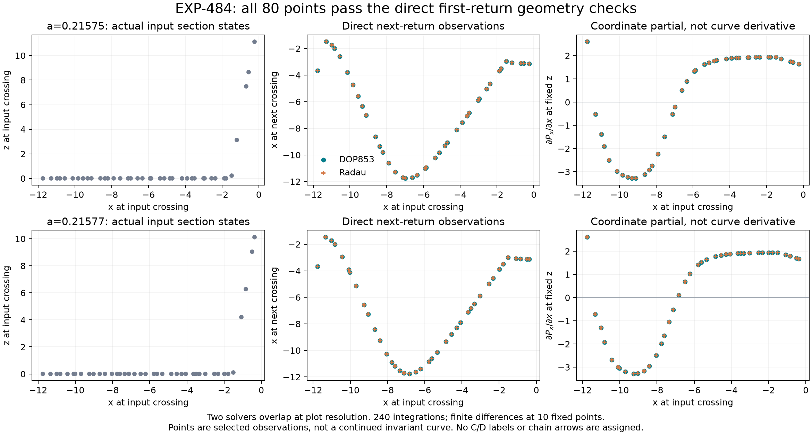

# EXP-484: direct flow geometry passes at all 80 selected points

The next numerical step is complete, not merely planned. Both independent
adaptive solvers reproduce the next return and its local two-dimensional
derivative at every one of the 80 declared section points. All finite-difference
checks at the ten designated points also pass. The complete matrix of **240
target integrations** finished in **62.79 seconds** on the local CPU, with no
paid review, API request or GPU rental.

The two cases are a=0.21575 and 0.21577, with b=0.2 and c=7.212. The 40
actual input states in each case were selected across the original early
calibration domain without target words or held-out states. They come from
27 and 26 distinct original seeds, respectively: 80 section points are **not
80 independent trajectory samples**. Both solvers overlap at this figure's
resolution. Every selected point is shown; lines are not drawn through them
as though they were an established invariant curve.

## Numerical checks

The largest discrepancies across the complete fixed matrix were:

| Comparison | Maximum observed | Frozen limit |
| --- | ---: | ---: |
| DOP853 vs Radau, scaled return state | 1.09e-9 | 1e-6 |
| DOP853 vs Radau, return time | 1.10e-12 | 1e-7 |
| DOP853 vs Radau, relative scaled 2D derivative | 2.04e-10 | 1e-4 |
| Centered finite difference vs variational derivative | 1.77e-8 | 1e-3 |
| New DOP853 return vs saved fine-RK4 pair, scaled state | 6.59e-8 | 1e-4 |
| New DOP853 return vs saved fine-RK4 pair, elapsed time | 2.08e-10 | 1e-4 |

These are observed finite-resolution discrepancies, not rigorous error bounds.
States use the frozen x/z scales 15 and 0.01; derivative comparisons rescale
both input and output coordinates and normalize by the reference matrix's
maximum magnitude, with a floor of one. Finite differences were evaluated at
both declared step sizes and both signs in both section directions, at only
the ten designated points. All 80 points have dual-solver and saved-pair checks.

## Why this matters for the symbolic problem

EXP-483 explained why the early scatter-fit test lost support. EXP-484 now
establishes a numerical way to examine the actual local flow response across
that observed region, including sparsely sampled parts, without extrapolating
an unsupported spline. The derivative includes the change in return time,
which is required when nearby trajectories hit the section at different times.

The right-hand panels are deliberately labeled **coordinate partials**. A
change in their sign is not yet a critical point of the one-dimensional return
map invoked by Jones. Along a curve z=h(x), the relevant derivative would be
`dP_x/dx = partial_x P_x + partial_z P_x * h'(x)`, where that curve and tangent
must themselves be justified. Assigning C/D directly from the plotted partial
would repeat the very representation error we are trying to avoid.

The next scientific step is therefore to establish and transport the relevant
section curve/tangent, test its projected folds for stability under refinement,
and only then assign critical symbols and test an orbit itinerary. Geometry
must determine the symbols; the historical words must not determine the
geometry. No Jones flow-level word, chain arrow or homoclinic claim is newly
verified or debunked by this pilot.

## Audit and preservation

- Prospective source freeze: `31361e388756a7c5e680c30a5d05658dd698ea4a`, pushed
  on `codex/exp484-local-execution` before target execution.
- Inputs and two analytic controls passed in `artifacts/EXP-484/preflight-31361e3`.
- Original target run: `artifacts/EXP-484/target-31361e3`; the one-shot slot
  remains consumed. No target retry occurred.
- Completed run receipt SHA-256:
  `93b2ce9207a9ffdfd75c322aeb94b77d6fe9160a99fbdbb7693ce1567a2a32a3`.
- Audit result SHA-256:
  `54c2b90a092e5fd1b97e6609f1e80dfb1f571924f31e5445c125bb0be5a0b97c`.
- [Public audited result, all points and comparisons](../experiments/receipts/EXP-484-return-geometry-result.json).

The read-only audit checks all **563 files / 696,088 bytes** preceding the
terminal receipt, rebuilds the exact calibration selection, reconstructs all
240 trial identities and first-eligible-event choices, and reproduces every
comparison and overall decision. It independently recalculates the event-time
correction in a separate algebraic form. The original inventory is checked
again afterward. No integrator is called during this audit.

The shared implementation and frozen pilot tests passed in the 1,818-test
pre-execution suite, with one pre-existing Linux-only skip. The new audit also
has synthetic wrong-anchor, wrong-event, wrong-gate, configuration and
derivative checks. Full campaign data release remains a separate task; this
public compact receipt does not contain every raw event from every trial.

Final local validation passed **1,822 tests**, with the same one Linux-only
skip, in 112.11 seconds. Repeating the read-only completed-run audit produced
the identical audit-summary hash; no target flow was reintegrated. The
manuscript now includes the result, its limitation and both EXP-483/484 figures.
The 72-page PDF rebuilt with all 25 cited keys and 36 figure assets present;
new pages 10--11 and 57--58 were visually checked and the author metadata is
blank. No public PDF release was made.
