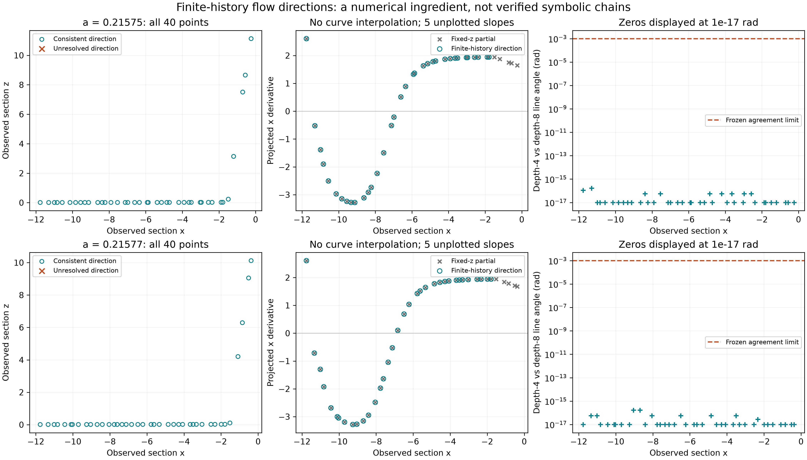

# EXP-485: all 80 finite-history direction checks pass

The fixed run and read-only audit are complete. **All 1,280 target integrations
completed; all 80 points passed the frozen geometry and direction-consistency
checks.** Runtime was 463.00 seconds on the local CPU. Ten points nevertheless
fail the separate conditioning rule for reporting an x-graph slope; they have
not been discarded or relabeled as scalar-map successes.

The next step after EXP-484 is now implemented, executed and audited. It used
local CPU only: no paid review, GPU
rental or API call. The source and prospective protocol were pushed before
execution at `af72692499126fce3da0d887679d8ad384ffad69`, also retained on
`codex/exp485-local-execution`.

The full pre-execution suite passed **1,841 tests**, with one existing Linux-only
skip, in 110.32 seconds. The final runner metadata/output-bound refinement
also passed all 19 focused tests. Input preparation recovered all eight actual
preceding returns for each of the same 80 EXP-484 points. Both analytic flow
controls and the positive/negative direction controls passed. The preflight
used no target integrations.

The fixed target matrix is **80 points x 8 predecessors x 2 solvers = 1,280
integrations**. For each point, products over 1, 2, 4 and 8 preceding returns
estimate a finite-history dominant direction in the declared metric. Both
solvers must reproduce the saved return sequence, and the direction must
stabilize under solver and history changes. An x-graph derivative is not
reported near a vertical direction.

Why this matters: the derivative along a return curve includes how z changes
with x. Treating z as fixed can produce the wrong apparent critical geometry.
This experiment tests a numerical ingredient needed for that correction.
Passing it would not, by itself, establish a generating partition or verify
Jones' words/arrows. It is not a mathematical invariant-curve proof.

- [Frozen protocol](../experiments/EXP-485-transported-tangent-pilot.md)
- Machine plan: `experiments/manifests/EXP-485-transported-tangent-pilot.json`
- Preflight: `artifacts/EXP-485/preflight-af72692`
- One-shot target: `artifacts/EXP-485/target-af72692`
- Reviewable source/results branch: PR #56

The read-only audit reconstructs the entire expected trial matrix, the
first eligible return and its event-time derivative, the complete saved
decisions, and the endpoint directions with a separate matrix-product and
covariance-eigenvector calculation. This is a same-agent local audit with
separate algebra, not a claim of an independent human review.

## What changed scientifically

| Case (b=.2, c=7.212) | Stable directions | Reportable x-graph slopes | Maximum solver line angle |
| --- | ---: | ---: | ---: |
| a=.21575 | 40/40 | 35/40 | 5.10e-11 rad |
| a=.21577 | 40/40 | 35/40 | 9.20e-11 rad |

The maximum depth-4/depth-8 angle is 1.67e-16 rad in both cases. This is
floating-point agreement, **not a physical error bound**. The smaller singular
values are below reliable floating-point resolution; they cannot establish
an exactly rank-one or noninvertible flow map. Both solvers also reproduce
every saved predecessor-to-successor return within the original EXP-484
state/time/Jacobian limits. Products restart at observed states and do not
constitute a rigorous shadowing argument for one uninterrupted trajectory.

Bins 35--39 in each case fail the x-graph conditioning rule. Their directions
are nearly vertical in the declared scaled metric; the original three-dimensional
states and full direction diagnostics remain in the receipt. For the other
35 points per case, the largest directional-slope/coordinate-partial difference
is .00393 and .00387 respectively. Small differences here do not justify using
coordinate partials at the ten excluded points.

The descriptive sign changes occur between observed bins 0/1 and 16/17 in
both cases. Their x intervals are approximately [-11.76325,-11.30060] and
[-6.98244,-6.60395] for a=.21575; [-11.76298,-11.33495] and
[-7.12304,-6.82983] for a=.21577. These are **adjacent observations from
different trajectories, not certified root brackets**. No curve was joined
between them, and no C/D symbol or Jones word was assigned. This post-run
description did not change the predeclared experiment verdict.

For Jones, this is useful progress toward testing the proposed geometry,
not a verification or a refutation of the symbolic chains. The next experiment
should construct actual finite-return image curves around these candidate
regions, compare their projected folds under history/solver refinement, and
test whether they define a common local partition. It must not make a desired
historical word the criterion for choosing the curve or roots. An honestly
conditional numerical reconstruction is useful; an exact global invariant-curve
proof is not a prerequisite for attempting it.

## Auditable outputs

- Completed target receipt SHA-256:
  `bd0e4e76d2be8d8310c8f7bb477c25e7b3854c849451b33719a3e1f3d7f9518a`.
- Consumed slot SHA-256:
  `eb405ce7058ec82dfb3b5c99fde5947c9f2ff5cb074d3dd51c738186788bc95c`.
- [Public audited result](../experiments/receipts/EXP-485-transported-tangent-result.json),
  SHA-256 `25a888fb2b75da5e99141da95072411b5099657c5030d8914a0ade10a74aed60`.
- The audit checks all **2,643 files / 5,387,336 bytes** preceding the terminal
  receipt, reconstructs every trial identity and decision, and checks the
  inventory again after reading. The separate product/covariance calculation
  differs by at most 4.72e-16 rad. No target integrations occur in the audit.
- `audit-01` contains the first complete audit. `audit-02` adds deterministic
  descriptive per-case summaries; the target evidence is unchanged. Both
  audits and the single target attempt are preserved.
  The subsequent read-only `audit-03` repeats the complete audit and descriptive
  calculation with exactly the same result hash as `audit-02`.
- [Vector figure](../figures/EXP-485-transported-tangent.svg) and
  [per-figure receipt](../figures/EXP-485-transported-tangent.receipt.json)
  record all 80 plotted/omitted values, input and code hashes, output hashes,
  the 300-dpi raster setting and non-color encodings. See the
  [figure receipt index](../figures/README.md) for the exact redraw command.

The final full local suite passed **1,849 tests**, with the same existing
Linux-only skip, in 110.86 seconds. The main manuscript now summarizes this
result without promoting the finite-history direction to a verified curve;
the supplement states the floating-point rank and projection limitations.
Full raw-data publication remains separate from the public compact result.
The PDF remains 72 pages with 36 figure assets and all 25 cited keys present;
author metadata remains blank. The edited main and supplement pages were
rendered and visually checked under the PDF workflow. No public PDF release
was made. The update figure was also visually checked. A separate public-file
redraw reproduced the raster, vector and figure receipt byte for byte without
raw experiment journals or new integration. Generated SVG trailing whitespace
is normalized before hashing; the original render is preserved separately.
