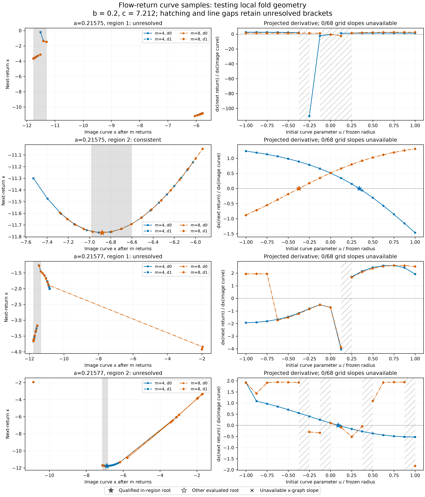

# EXP-486: one consistent fold region, with a crossing-detection warning

The full run and its read-only audit are complete: **928 target integrations,
six qualified curve families out of sixteen, and one qualified region out of
four.** Runtime was 771.33 seconds on the local CPU. No paid review, API call
or GPU rental was involved. The pre-target checkpoint is retained below.

| Parameters (b=.2, c=7.212) | Candidate region | Result |
| --- | --- | --- |
| a=.21575 | Left | All four families fail solver agreement during root refinement. |
| a=.21575 | Right | All four families locate the same numerical projected fold near x=-6.880758. |
| a=.21577 | Left | All four families fail solver agreement during root refinement. |
| a=.21577 | Right | Both depth-4 families qualify; each depth-8 grid contains four candidate brackets, exceeding the predeclared two-bracket limit. No preferred root was selected. |

The qualified region's maximum scaled-coordinate root spread is 4.90e-10,
well below the declared 1e-4 agreement threshold. This is an observed
fixed-family spread, not a rigorous error bound. All center finite-difference
and saved-anchor checks pass. The left-region failures arise later, during
the attempted root refinement; they are not evidence of a validated smooth
fold. The second case's right-region result is unresolved, not a proof that
the fold is absent.

The question is whether the two candidate fold regions in each local case
survive on actual curves transported through the flow. The fixed matrix uses
two cases, two regions, two history lengths and two initial curve directions:
16 families, with both DOP853 and Radau at every evaluated point. We integrate
each curve sample continuously, including the changing section-hit time.

The known-fold, no-fold and vertical-projection controls all pass at both
history lengths through the actual grid/refinement path. The 20 focused tests
also pass. Preparation reconstructs all 16 starting curves from authenticated
EXP-485 evidence without running a Rössler target.
The full pre-target suite passes 1,869 tests with one existing Linux-only skip
in 113.29 seconds. The additional read-only auditor uses separately coded
event-time algebra and candidate-bracket reconstruction; its failure-injection
tests check corruption of tangents, eligibility, chronology and residuals.

The prospective [protocol](../experiments/EXP-486-return-image-fold-pilot.md)
fixes the grid, selection, thresholds, resource limits and missingness rules.
All candidate roots are retained, including out-of-region or unresolved roots;
the test cannot select whichever curve happens to match Jones. Candidate
regions were informed by EXP-485, so this is exploratory, not independent
confirmation. Even a positive result would establish only local numerical
fold geometry, not an invariant quotient or a verified historical chain.

## Execution and audit

Source/protocol freeze `098e58a9c9ad68e2583d60c67bc886e527a61177`
was pushed and verified against the live remote before execution. The
one-shot command completed in `artifacts/EXP-486/target-098e58a`; it ran
input preparation and all six controls before consuming the target marker.
The post-freeze audit tests also pass (26 focused numerical/runner/audit tests).
The complete-grid audit reconstructed all 2,009 inventoried files, every
decision and the event-time derivative using separate algebra. No target
was rerun. This is a same-agent audit, not an independent human review.

- [Public audited result](../experiments/receipts/EXP-486-return-image-fold-result.json),
  SHA-256 `74fd97ef7c32e56a8c29d32113ab7cfa2531f9a48caf543906beb8cb2b5762d4`.
- Completed raw summary SHA-256:
  `a66b1a24e79f94fa5707f9c5e3f9ed8a9877b8ac8ba43f0e5022f9961cd976a0`.
- [Figure receipt](../figures/EXP-486-continuous-return-curves.receipt.json)
  and [hashed receipt index](../figures/EXP-486-continuous-return-curves.index.json).
  The SVG, PDF and 300-dpi PNG are generated from the public result. Lines are
  broken across known unresolved brackets; no invalid slope is interpolated.

Saved-event inspection supplies a concrete next test. In a left-region
witness the solvers agree through four returns, then Radau records a fifth
crossing during the large excursion while DOP853 next records a later crossing.
Small integration error before the excursion does not guarantee complete
event enumeration. The outcome-informed [EXP-487 witness study](../experiments/EXP-487-section-census-witness.md)
tested whether bracketing at extrema of the plane residual recovers the
missing crossing under both solver and step refinement. Its
[completed result](2026-09-08-exp487-missed-crossing-witness.md) confirms
ordinary-event omissions and qualifies one witness; the other retains a
strict state/reference mismatch. It does not repair EXP-486 retroactively.

## Why this matters for Jones

Jones's Figure 6 concerns a mechanism, not merely a matching list of words.
The original text describes a third branch whose reinjection inserts a new
inner visit as a spiral connects a lower-period orbit to a higher-period one.
The same critical point, C, must be identified across that change; D is the
second critical point of the bimodal description. Arbitrarily calling the
left numerical fold C would not establish that identification.
EXP-185 already qualified an operational dictionary at the distant control
`(a,b,c)=(.2,.2,20)`: the lower-x fold maps to D and the higher-x fold to C.
Its acceptance does not automatically transport that dictionary to the two
current nominations at `c=7.212`; the connecting geometry still needs testing.

The immediate chain of evidence is therefore: find consistent projected folds
on actual flow-return curves; test those curves and critical neighborhoods
against held-out returns and the corrected cycles; fix the branch/critical
dictionary from geometry rather than a desired word; then continue a specific
connection and measure the reinjection change. A local positive fold result
would advance the first step only. A local failure would limit this finite-
history reconstruction, not refute every possible return description or
Jones's separate homoclinic claim.
