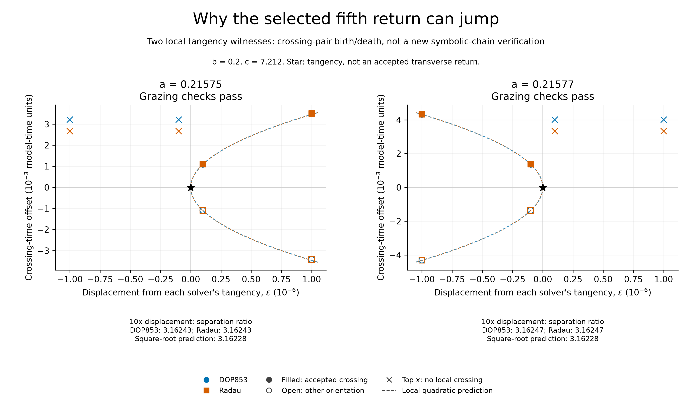

# EXP-489: both problem witnesses have a section-grazing boundary

**Both cases passed the direct mechanism test.** We located a numerical
tangency of the flow to the historical section, then reproduced the predicted
crossing-pair birth/death on either side. All 26 target integrations completed
in 139.94 seconds on the local CPU; no paid service was used.

## The plain-language result

Picture the trajectory barely touching the plane where we count returns.
On one side of that touch, it crosses the plane and immediately crosses back.
On the other, it misses the plane altogether. The actual trajectory can change
smoothly while the list of counted returns changes abruptly.

That is what the two selected witnesses show. All sixteen perturbed runs
retain **four accepted crossings before the fixed tangency window**. When
the extra pair exists, its negative-oriented crossing becomes the fifth
accepted return. When the pair disappears, the fifth accepted return is a
later event, about 6.44 model-time units later in the closest tested comparison.
These are nondimensional model times, not physical seconds.

This answers a more useful question than repeatedly tightening a sensitive
event-state comparison: **why does the selected event change?** A genuine
section-grazing boundary is present near each selected failed fold witness.
It explains why interpolating a smooth return curve across those boundaries
would be misleading. It does not classify every failed bracket in EXP-486.

## What was measured

| Quantity | a=.21575 | a=.21577 |
| --- | ---: | ---: |
| Tangency time, approximately | 32.14298120 | 26.81281511 |
| Initial displacement from original witness, approximately | -5.50156e-6 | +9.20378e-8 |
| Pair exists for displacement relative to tangency | Positive | Negative |
| Observed separation ratio for 10x displacement, DOP853 | 3.16242930 | 3.16247308 |
| Same ratio, Radau | 3.16242917 | 3.16247315 |
| Local square-root prediction | 3.16227766 | 3.16227766 |

Both have b=.2 and c=7.212. Each solver uses both signed displacements at
magnitudes 1e-7 and 1e-6. Every predicted pair has exactly two plane crossings,
one accepted; every predicted no-pair side has none inside the frozen window.
Both solvers pass the prefix, residual, crossing-angle and square-root checks.

We solved `h=0` and `h_t=0` directly using fixed-time flow sensitivities.
The nonzero unfolding derivative is about +77.52 in the first case and -120.73
in the second; the second time derivative is about -12.95 in both. Thus the
local Taylor prediction is nondegenerate. The two solvers' largest observed
scaled-state difference at the tangencies is 9.49e-10. This is numerical
agreement, **not a rigorous error bound or proof of a unique tangency**.

The figure retains both solvers and every side; nearly coincident markers
overlap. Dashed curves are predictions from the local quadratic expansion,
not additional measured trajectories or certified smooth return branches.

## Implications for Jones and for our verification

This is a substantive correction to **our current verification path**, not
a debunking of Jones. A smooth projected critical point and a section-grazing
itinerary boundary are different objects. Only the former, on a justified
return representation, can license the critical-letter assignment we are
trying to verify. We cannot label this discontinuity a fold and then count a
matching word as independent verification.

Nor does this positive result erase earlier failures. EXP-486's unresolved
families remain unresolved. EXP-487/488's mixed accuracy verdicts remain mixed.
The new test uses fixed-time equations with a nonsingular two-variable Newton
matrix, not the ill-conditioned event-time correction at a tangent crossing.
The same underlying ODE is still integrated by DOP853 and Radau.

**Jones's flow-level symbolic chains remain unverified, not debunked.** We now
have a concrete mechanism to handle when establishing the return branches.
Extremum-partitioned counting was already used by the project's earlier
period-six grazing helper; neither that algorithm nor section grazing itself
is claimed as a new discovery here.

## Evidence and reproducibility

- [Prospective protocol](../experiments/EXP-489-section-grazing.md) and
  [preflight record](../experiments/receipts/EXP-489-preflight.json).
- Freeze `ba6b55cb75fbb35fe6bdbcd499868efc9c510469`, pushed and matched against
  the live remote before the sole target marker was created.
- Raw run `artifacts/EXP-489/target-ba6b55c`; summary SHA-256
  `261debe5ddd4059ac75569a930e837a987eca4805d327b61345f0209edb230d6`.
- [Audited result](../experiments/receipts/EXP-489-section-grazing-result.json),
  SHA-256 `61f5fe6b70b07907bc7c4652c4bcde2381c8a184462bbced00ce9545f2c79c1d`.
  Two read-only audit invocations reproduce identical receipts without any
  new integration. They check the full matrix, retained raw states, Newton
  updates, separately evaluated section/tangency algebra and decision replay.
  This is a same-agent local audit, not independent peer review.
- [SVG](../figures/EXP-489-section-grazing.svg),
  [PDF](../figures/EXP-489-section-grazing.pdf), and
  [figure provenance receipt](../figures/EXP-489-section-grazing.receipt.json).
  Source, generator, audit and output hashes have a verifiable receipt index.
- Release checks: 1,918 tests passed with one existing Linux-only skip;
  all six figure tests were rerun after clarifying that the plotted time units
  are nondimensional, not physical milliseconds. Citation/figure availability,
  the generated quadratic control table and the tracked-file public scan pass.
  The final PDF was rendered and visually checked after correcting a first-draft
  label overlap. No manuscript release or new manuscript claim is implied.

## Next execution target

Carry this distinction into the full finite-image curve matrix: locate and
retain section-grazing boundaries, do not bridge them with a smooth fit, and
qualify genuine fold searches only on event-consistent branches. Retain both
depths, both directions and both parameter cases, including all failures.
Then test the resulting conditional partition on held-out returns and the
corrected periodic cycles before assigning C/D or comparing a Jones arrow.
The single already-qualified right-hand EXP-486 region remains the positive
geometry baseline; this two-witness result does not qualify the other regions.
