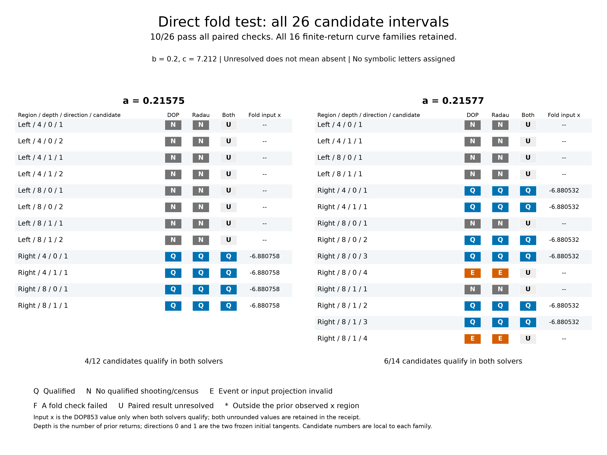

# EXP-490: testing every original fold candidate directly

**The complete run and raw-evidence audit passed: ten candidate searches
qualify, sixteen remain unresolved.** All 52 solver profiles completed, with
208 retained target trajectories in 1,572.14 seconds on the local CPU. Eight
of sixteen curve families contain qualified in-region folds. All eight are
right-region families, covering both parameter cases, both history depths and
both initial directions. No paid review or remote numerical worker was used.



## The result in plain language

We can now recover the right-hand fold at **both** parameter values across all
four depth/direction combinations. The second case's depth-eight comparisons
were previously blocked by the number of candidate intervals; the direct test
resolves genuine folds there without declaring the whole curve qualified.

| Complete candidate outcome | a=.21575 | a=.21577 | Total |
| --- | ---: | ---: | ---: |
| Both solvers qualify an in-region fold | 4 | 6 | 10 |
| Both searches leave their fixed boxes | 8 | 6 | 14 |
| Both converge but fail input-projection qualification | 0 | 2 | 2 |
| All original intervals retained | 12 | 14 | 26 |

Both cases have b=.2 and c=7.212. A failed bounded search is not proof that
its interval lacks a fold. No family, solver or failed interval was discarded.

The qualified input x locations are approximately **-6.880757981802** and
**-6.880531997427**, respectively. The observed spreads across all successful
solvers, directions and depths are 1.03e-12 and 7.17e-12. These are numerical
agreement measures, not rigorous error bounds or proof of an invariant curve.
Every successful finite-difference curvature comparison has relative error
below 8.97e-8 against the separately integrated second sensitivity; the frozen
acceptance limit was 1e-3.

Ten successful searches do **not** mean ten distinct physical critical points.
In the second case's depth-eight families, two different upstream intervals
reach nearly coincident fold locations after eight returns. Their separation
in initial u must not be counted as extra branches of a scalar return map.

## A second source of false fold candidates

The final candidate in each second-case right-region depth-eight family
converges to the shooting equations, but fails the input-curve check in both
solvers. At the center, its scaled input tangent gain is only 2.15e-11 to
1.97e-10, far below the fixed 1e-4 limit. The neighboring input x tangents have
opposite signs. Yet the two neighboring **return-map slopes are both positive**,
approximately 1.944294: this is not a qualified maximum or minimum of that
return relation. These four solver profiles are target failures, not analytic
controls. Their observations are retained in the public audited receipt.

Together with EXP-489, this distinguishes three objects that can be confused
by a naive slope search: a genuine projected return fold, a section-grazing
event-list jump, and an ill-conditioned input-curve parameterization. It does
not classify every unresolved interval as one of the latter two mechanisms.

## What this calculation changes

EXP-489 established two local section-grazing boundaries. Those are places
where the list of counted crossings changes, even though the underlying flow
is smooth. A slope-sign change across that boundary is not automatically a
smooth maximum or minimum of the return map.

EXP-490 therefore solves the projected-fold equations directly. It integrates
the flow plus first and second sensitivities, locates a candidate stationary
return, and then independently recounts the section events. A solution must
be the specified return, remain transverse to the section, have nonzero
curvature, and pass opposite-side, finite-difference and two-solver checks.
Newton is the root corrector; DOP853 and Radau still integrate the ODE.

The complete test retains all **26 original candidate intervals across 16
curve families**: both parameter cases, both observed regions, both history
depths and both initial directions. There are 52 solver profiles. Each has a
fixed search box and a maximum of eight Newton trajectories. Leaving that
box is unresolved, not evidence that the interval contains no fold.

Before targets, 15 focused tests and all 12 analytic controls passed. The full
suite passed 1,933 tests with one existing Linux-only skip. Both remote Python
3.12/3.13 checks passed on the exact freeze. The preflight record discloses
development failures and their corrections; no target threshold was loosened.

## Scientific boundary

The already-qualified right-hand EXP-486 fold is a comparison, not an
independent discovery. A newly qualified fold is still a feature of a finite-
return image curve, not automatically an invariant quotient or a critical
symbol. The complete source-derived Jones word/arrow list remains withheld
from the root objective. No C/D label or symbolic chain is assigned by this
experiment. Earlier failed experiments keep their original verdicts.

The original paper does not publish the full section equation and numerical
partition used to generate every word. Our chosen historical-section
implementation is a modern reconstruction, not recovered original code.
Correcting this implementation cannot, by itself, establish that Jones made
the same event-selection mistake.

## Reproduction anchors

- Executed source `892ab8f4719fbf4463bf9b4943314c9d4c8eda5e`, matched against
  the live remote before launch and preserved on `codex/exp490-local-execution`.
- [Protocol](../experiments/EXP-490-direct-folds.md).
- [Preflight](../experiments/receipts/EXP-490-preflight.json).
- [Complete audited result](../experiments/receipts/EXP-490-direct-fold-result.json),
  SHA-256 `ec74b11f2e9784ab990d142e3df36e7c500f3235faeefc92afdca50778e88b66`.
  The published receipt is byte-identical to the read-only audit output.
- Completed raw summary SHA-256
  `41fe7b8e5346a97946c2bb51400fb1109d0b5a29d682653494b36fd2962b345e`.
- Public executable input: `experiments/manifests/EXP-490-candidates.json`,
  SHA-256 `f7ef9d69bad22cd0ce8ca3c112e4c4d2c420ac247c0d3187359a33cc71329fea`.
  The successor can run from this table without access to the old raw archive.
- Sole raw attempt: `artifacts/EXP-490/target-892ab8f`. The exclusive
  `artifacts/EXP-490/target-once.json` marker must not be reset or reused.
- Auditing is local and same-agent, not independent peer review.
- [Vector figure](../figures/EXP-490-direct-folds.svg),
  [PDF](../figures/EXP-490-direct-folds.pdf),
  [figure provenance](../figures/EXP-490-direct-folds.receipt.json) and
  [hashed index](../figures/EXP-490-direct-folds.index.json).
  The figure was rendered and visually checked; the public SVG/PDF/300-dpi PNG
  and their source/code/receipt hashes pass verification. Every candidate and
  both solvers are shown; missing qualified locations are explicitly blank.

The final local suite passed **1,939 tests**, with one existing Linux-only
skip. This includes six complete-figure-matrix tests. Manuscript citation and
figure availability checks and the generated quadratic control table pass.
The frozen numerical source hashes remained unchanged during execution.
This update is not a new manuscript release or a relaxation of the historical
turning-point impact audit required before that release.

For an independent researcher, a fresh clone of the preserved execution
branch and the locked dependencies contain all executable inputs for this
successor. No API credentials or old local target archive are needed. The
original attempt here remains consumed; do not reset its marker to reproduce it.

```sh
git clone --branch codex/exp490-local-execution https://github.com/tdj28/butterfly.git butterfly-exp490-replay
cd butterfly-exp490-replay
uv sync --locked --extra dev
uv run --no-sync python scripts/run_exp490_direct_folds.py \
  --output-dir artifacts/EXP-490/independent-replay
```

This requires the protocol's initial 16 GiB free-space reserve and starts a
new independent calculation. The published figure can instead be redrawn
without integrating the flow using the command in the [figure index](../figures/README.md).

## Implications for Jones and next execution target

**Jones's flow-level symbolic chains remain unverified, not debunked.** The
progress is concrete: we now have an event-checked right-hand fold at both
local parameter values, plus actual rejection cases showing why a naive
critical-point search could mislead us. We do not yet have the complete
two-critical-point representation needed to assign C/D or compare a word.

The next calculation must build event-consistent, well-conditioned curve
segments, explicitly cutting at grazing boundaries and input-projection
turns and retaining uncovered intervals. Compare the geometric fold locations
across those segments rather than counting upstream u roots. Then qualify the
conditional return representation on held-out returns and corrected cycles,
before assigning critical symbols or testing a Jones arrow. Neither a blind
retry of the failed boxes nor a larger budget substitutes for that definition.
