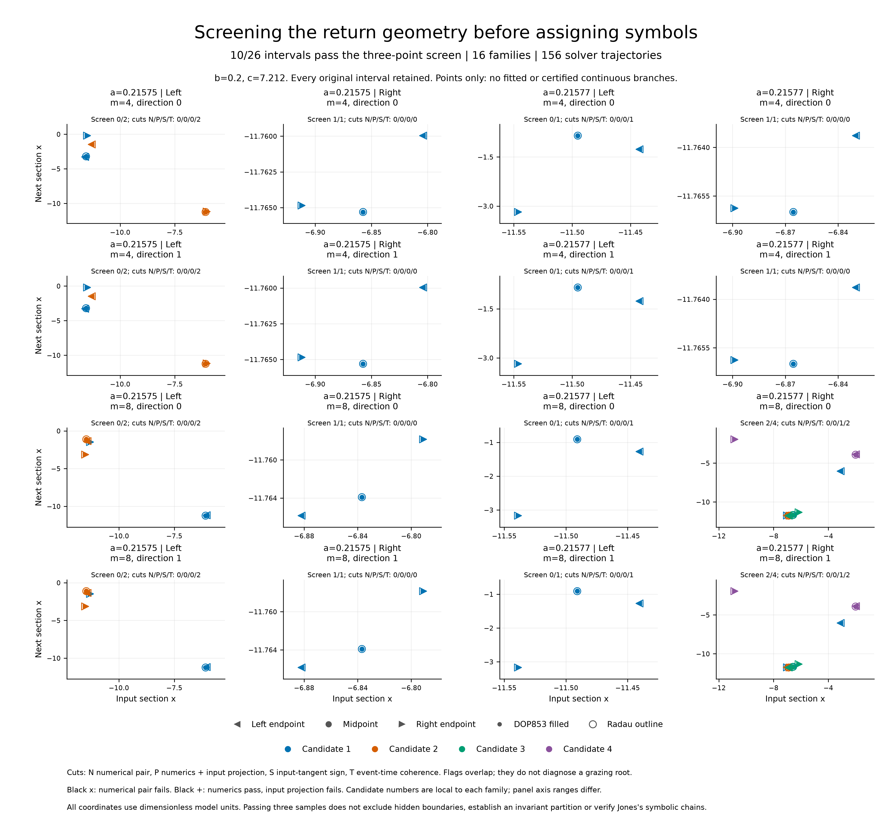

# EXP-491: screening the full candidate intervals

## Result in plain language

**All 78 sampled points reproduce numerically, but only ten of the 26
intervals pass the three-point return-curve screen.** The other sixteen
have large changes in the selected event times between samples. Two also
reverse the input x-tangent sign. Accurate isolated points are therefore
not sufficient to treat the entire plotted curve as one smooth return map.

The ten passing intervals are exactly the ten previously qualified EXP-490
fold searches. They cover all eight right-region history/direction families.
This is useful consistency across two different calculations, **not an
independent cohort or an interval-continuity certificate**. The old outcomes
informed the choice of these diagnostic inputs. None of the earlier failed
verdicts is changed.



| a | Region | Intervals | Screened regular | Time-coherence failures | Input-sign failures |
| --- | --- | ---: | ---: | ---: | ---: |
| .21575 | Left | 8 | 0 | 8 | 0 |
| .21575 | Right | 4 | 4 | 0 | 0 |
| .21577 | Left | 4 | 0 | 4 | 0 |
| .21577 | Right | 10 | 6 | 4 | 2 |
| Both | All | 26 | 10 | 16 | 2 |

All cases use b=.2 and c=7.212. Flags overlap; the two input-sign failures
are among the sixteen time-coherence failures. All ten screened intervals
also have opposite endpoint output slopes in both solvers.

## What was measured

Each original interval contributes its left endpoint, arithmetic midpoint
and right endpoint, with DOP853 and Radau: **156 target trajectories**.
Every selected prefix event is compared, not just its final point. All 78
paired samples pass both numerical and input-projection checks.

| Whole-prefix solver comparison | Largest observed error | Frozen bound |
| --- | ---: | ---: |
| Scaled state infinity error | 5.175e-8 | 1e-6 |
| Event time | 6.402e-12 | 1e-7 |
| Corrected-tangent relative error | 3.508e-10 | 1e-5 |
| Return-time derivative relative error | 2.963e-10 | 1e-5 |

In the sixteen failed intervals, the largest adjacent selected-event time
change per solver is **6.0783--6.3938 model-time units**, above the bound of 1.
The corresponding maximum derivative-prediction residuals are
**6.3667--6.6207**, above the bound of 0.25. In the ten passing intervals, every
adjacent time change is at most 0.246843 and every prediction residual is at
most 0.002726. These widely separated observed values make this screen's
classification unambiguous; the chosen numerical bounds still do not become
a rigorous continuity theorem.

No selected prefix crossing is missing from the ordinary solver event list
in this particular fine-step run. No uncertain extrema were reported in its
selected-prefix adjacency check. This does not erase the earlier coarse-step
omissions, prove all roots were found, or rule out a tangency between the
three samples. A count of three accurately reproduced samples is not a
certificate for the whole interval.

The two input-sign failures are the second case's right-region depth-eight
candidate 4, in directions 0 and 1 (one-based local candidate numbering). Their
sampled inputs are individually well conditioned, whereas EXP-490 found
severe input-conditioning failure at its different interior root locations.
These facts are compatible; the endpoint/midpoint screen does not sample
every interior point or establish a unique intervening mechanism.

## Implication for Jones

This strengthens the evidence for the already recovered right-hand
projected folds and explains why isolated derivative signs could not settle
the remaining geometry. It is **not a debunking of Jones**, but neither is
it verification of the flow-level symbolic chain. We still cannot label all
apparent bends as C or D or join them into an invariant scalar partition.
The [new explanatory note](../methods/return-map-geometry-and-symbolic-validation.md)
derives the distinction between a projected output fold, a grazing-induced
event change and an input-coordinate failure, with algebraic regression
checks.

The next calculation should localize the event-domain boundaries responsible
for the sixteen flagged intervals, retaining the entire case/history/direction
matrix. Two selected grazing witnesses were directly qualified in EXP-489;
this screen does not extend that conclusion to every flagged interval.
Work on conditioned segments must preserve gaps and test agreement between
different finite-history curves before any held-out symbolic coding test.
Global continuity is not a prerequisite for every symbolic description.
A consistent piecewise return-domain description may be appropriate here.
The next test must distinguish a geometrically meaningful inserted inner
return from an extra intersection created by the chosen section; this
possible connection to Jones's insertion mechanism remains a hypothesis.

## Reproducibility and release

- [Prospective protocol](../experiments/EXP-491-event-sheet-probe.md) and
  [preflight record](../experiments/EXP-491-preflight.md).
- Exact executed source: `4c8ec515a80f2ac591cf819fb314a643345b756e`, pushed
  and verified before execution, preserved as `codex/exp491-local-execution`.
- The run started 2026-09-09 04:28:29 UTC and completed at 04:47:50 UTC, in
  **1,160.794844 seconds** including controls. Monitoring was limited to
  operational completion until the full result was audited.
- Local raw directory: `artifacts/EXP-491/target-4c8ec51`, with 470 bound
  files plus the completed summary. Summary SHA-256:
  `a47959ab1041aac772908524a45e1ae4451fcdf88fc903107333c6f5c826a69f`.
  The exclusive `artifacts/EXP-491/target-once.json` must not be reset.
- Both complete read-only audits passed and produced byte-identical receipts;
  no trajectories were reintegrated. The audit checks the full matrix, raw
  geometry, independent event algebra and sensitivities, analytic controls,
  all decisions and file hashes. It is a **same-agent audit**, not independent
  peer review or rigorous integration validation.
- [Public audited result](../experiments/receipts/EXP-491-event-sheet-result.json),
  1,971,629 bytes, SHA-256
  `d96454454290ed83d5503fce91f9b86ccce516b40b50a84b9d35ab512f6fc879`.
- [Figure provenance](../figures/EXP-491-sampled-event-sheets.receipt.json)
  and [hashed index](../figures/EXP-491-sampled-event-sheets.index.json)
  retain all 26 intervals, all 156 solver points, exclusions, code/input/output
  hashes, units and the claim boundary. No fitted curve is drawn.
- All 48 analytic controls pass. The pre-target suite passed 1,960 tests;
  the expanded figure/documentation suite passed **1,973 tests** in 133.88
  seconds, with one Linux-only skip. The final focused tests passed 34/34.
- The PDF was rendered and visually checked; an overlapping automatic axis
  offset label was corrected without changing any data. The final SVG, PDF,
  300-dpi PNG, figure receipt and index were independently redrawn from public
  inputs and reproduced byte-for-byte. No raw trajectory was needed for that
  redraw.
- The new uncertain-extremum adjacency guard changes none of the 72 preserved
  EXP-490 census outcomes. Its bounded impact receipt does not clear the
  separate legacy stationary-inflection issue.
- **No paid review, GPU rental, API request or new upload.** Raw meshes remain
  local; the public compact receipt is not a released raw archive. The formal
  manuscript is unchanged pending the separately documented legacy audit.

Read-only full replay, requiring the retained raw directory:

```sh
.venv/bin/python scripts/audit_exp491_event_sheet_probe.py \
  --run artifacts/EXP-491/target-4c8ec51 \
  --expected-summary-sha256 a47959ab1041aac772908524a45e1ae4451fcdf88fc903107333c6f5c826a69f \
  --output-dir artifacts/EXP-491/independent-replay
```

The replay output directory must be new. Public-data-only figure redraw is
documented in the [figure index](../figures/README.md).
