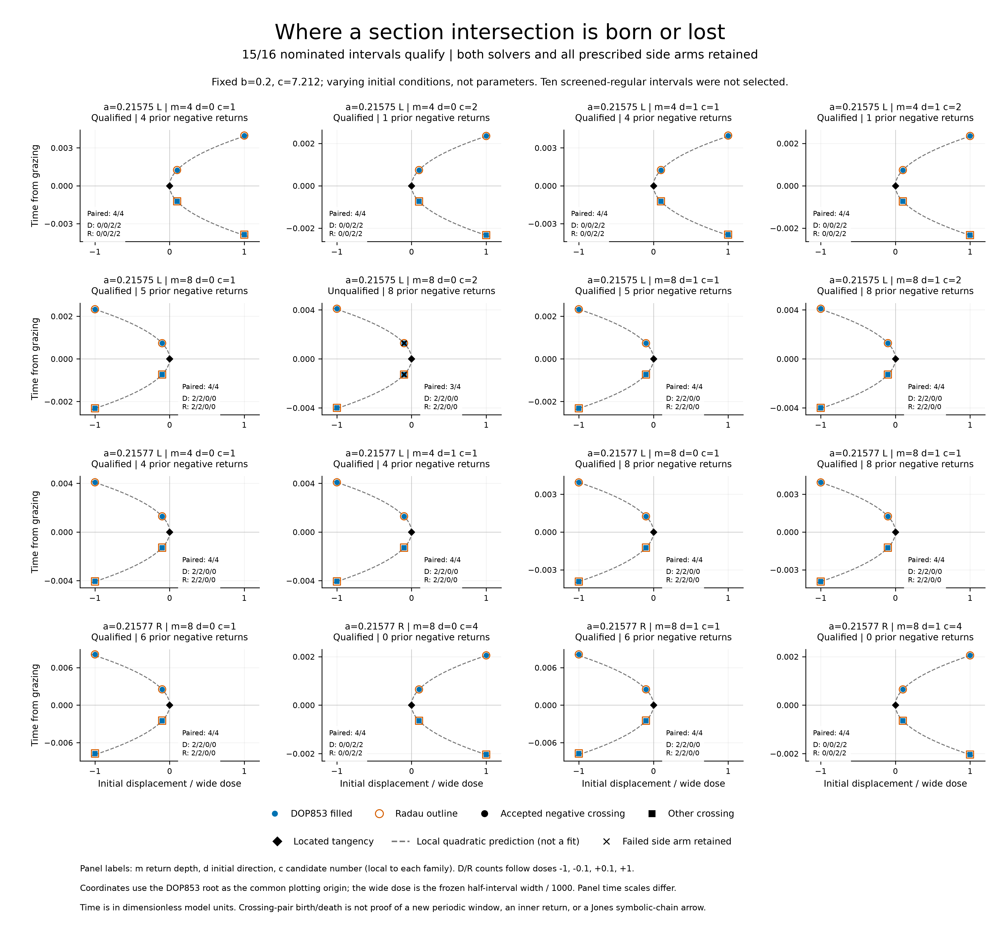

# EXP-492: directly locating the sixteen event boundaries

## Result: fifteen complete passes, one retained accuracy failure

**The complete run and raw-data audit are finished.** All sixteen nominations
produce paired nondegenerate tangency roots, and both solvers pass their local
crossing-pair and square-root-scaling tests in every case. Fifteen pass the
additional whole-event-sequence solver comparison. One fails that comparison
and remains unqualified; no threshold or old verdict was changed.

This resolves most of the sixteen event-time warnings from EXP-491 as
directly located section-grazing boundaries. It is more informative than
another sampled return-map plot: we solve for the tangency and then reproduce
the appearance/disappearance of two section crossings, exactly one of which
is an accepted negative crossing. These are initial-condition boundaries at
fixed parameters, not sixteen new periodic windows.

## Complete numerical evidence

- 248 retained target IVPs: 120 fixed-time Newton integrations and 128 full
  side censuses; all sixteen candidates, both solvers and all four side doses.
- 32/32 root and per-solver side/scaling checks pass. All roots are inside
  their original search boxes. All side arms ran; none was replaced or skipped.
- 63/64 paired side-sequence comparisons pass. Both solvers agree on every
  accepted-event count; all 512 corresponding accepted events are retained.
- The complete criterion passes 7/8 nominations at a=.21575 and 8/8 at
  a=.21577, covering all ten nominated depth/direction families. b=.2 and
  c=7.212 are fixed. The ten other EXP-491 intervals remain unselected, not
  certified boundary-free.
- Maximum paired root differences: u=6.90e-15, time=1.50e-13, scaled
  state=1.14e-8. Maximum root residuals are 6.88e-11 in the section equation
  and 4.32e-11 in normal velocity. These are observed discrepancies/residuals,
  not rigorous error bounds.
- The two-dose separation ratios range 3.1623060--3.1630994, compared with
  sqrt(10)=3.1622777. The complete local test passes in both solvers at all
  sixteen nominations; this does not override the separate accuracy failure.

The unqualified case is
`local-a025-c083--region-0--depth-8--direction-0--candidate-1`
(candidate2 in the one-based figure). Its narrow negative dose is
-2.197194770037292e-8. At the ninth accepted event, the paired scaled state
difference is 1.3365047735e-6, above the frozen 1e-6 bound; its time difference
is 1.44837e-10, within the time bound. The z scale is .01, so a small absolute
discrepancy can still fail this declared accuracy test. Both methods pass
the local geometry, but the complete candidate **does not pass**. No retry,
averaging, tolerance relaxation or favorable-profile substitution was used.

## A useful reduction in the geometry

The sixteen nominations are not sixteen distinct physical tangencies.
Their grazing heights cluster near z=12.977128055 at a=.21575 and
z=12.976819188 at a=.21577, with observed within-case spreads 5.13e-10 and
3.76e-10 respectively across all roots. Their different initial coordinates
and prior-return counts are consistent with repeated preimages of the same
local physical boundary in each case. This finite numerical coincidence is
not a global uniqueness proof or independent confirmations of sixteen objects.

On the reconstructed section, tangency forces x=x_s,y=y_s: the orbit passes
through the vertical line over the small equilibrium's x--y projection.
That gives a concrete next mechanism test. Does passing this boundary add
the projected inner turn described by Jones, or have we only changed a
counter? The subsequent
[EXP-493 saved-trajectory diagnostic](2026-09-09-exp493-projected-inner-turn.md)
measures planar angle from trajectory geometry before comparing event counts.
It retains the unqualified parent and cannot promote it to a complete pass.

For Jones, this is progress toward reconstructing the mechanism, not yet
verification of the flow-level symbolic chains. C/D assignments, held-out
word tests and continuation of a p to p+1 connection remain open. A projected
axis encounter at z about 13 is not, by itself, equilibrium contact or a
homoclinic connection. No claim about the entire parameter plane follows.

## Execution and reproducibility

The complete sixteen-candidate run used frozen source
`919f16f1846d145ff14ad1da35e3fb516cd1e849`, verified against the live remote
before execution. The same source is preserved on
`codex/exp492-local-execution`. Raw output is local at
`artifacts/EXP-492/target-919f16f`; it is not a public raw-data release.

Before launch, all 48 analytic control IVPs and their separate exact-event
audit passed; 34 focused tests and the full 2,007-test suite passed, with one
Linux-only skip. The input reconstruction was byte-identical. See the
[frozen protocol](../experiments/EXP-492-event-boundaries.md) and
[preflight](../experiments/EXP-492-preflight.md).

The run repeated its analytic controls and consumed its exclusive marker.
It completed 2026-09-09 at 06:37:29 UTC after 1,408.213763 seconds. The completed
summary binds 426 files, with SHA-256
`4a856360eb1c8da8099fd39ca09e4543423ed32a8a4dd20766f175a7c98e86a6`.
Two complete read-only raw-data audits produced byte-identical results;
neither reintegrated the flow. This is a same-agent audit, not peer review.

The [public compact result](../experiments/receipts/EXP-492-event-boundary-result.json)
has SHA-256
`7544eb230106e6b1f6fccf658fb6f60e6ef53230bcc0709b0b6e912addc268bf`.
The figure retains all nominated conditions and both solvers, and separates
measured crossings from the local quadratic prediction. Its SVG, PDF and
300dpi PNG have source/code/output hashes and a per-figure receipt/index.
The first layout was revised because count labels could obscure points;
the final labels occupy the zero-root half of each panel. No data changed.

The result-branch suite passed 2,019 tests with one Linux-only skip in 136.82s.
A further figure regression checks that a paired accuracy failure is marked
on both solver arms, even when both local geometry tests pass.

No new paid service, Pro review or upload was involved. The formal manuscript
is unchanged; the separate legacy turning-point impact audit remains required
before a manuscript release. Next is the saved-data inner-turn test, not
another broad parameter scan or another paid-review gate.
