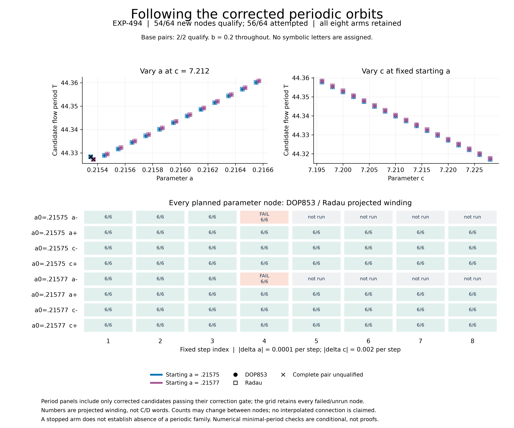

# Moving the inner-turn test onto corrected periodic orbits

## Result: qualified six-return cycles, and a caught double-traversal trap

EXP-494 completed from public source
`4e5054955e8ddeb9db94e4702fe78d6232eda303`, also preserved at
`codex/exp494-local-execution`. The exact source was verified on the remote
before the runner opened any new geometry or generated target trajectories.

The question is about periodic families, rather than nearby transient
initial conditions. The fixed survey has 64 new parameter nodes: two starting
cycles, increasing/decreasing a and c, eight steps per arm. Each node uses
both DOP853 and Radau. Two paired base corrections and all eight retained
EXP-480 profiles also receive winding/minimal-period diagnostics.

The known 6/8 return counts restrict a repeated-traversal multiplicity to two;
the new check explicitly tests the half-period state rather than assuming
the candidate period is minimal. The survey permits winding/count changes
between parameter nodes. It does not fit a C/D dictionary or compare words.

All four actual circular-orbit controls and 35 focused regressions passed;
the final full suite passed **2096 tests**, with one Linux-only skip.
The [preflight](../experiments/EXP-494-preflight.md) retains the pre-outcome
test failures and repairs. The
[frozen protocol](../experiments/EXP-494-periodic-winding-transport.md) gives
every threshold, grid point, stopping rule and claim limitation.

Raw data are retained in `artifacts/EXP-494/target-4e50549`: all shooting
trial meshes, observation meshes, dense interpolation coefficients, ordinary
and extremum-bracketed crossings, and failed or unrun branches. No failed
point can silently supply the next continuation seed. The full ledger is
audited after completion before interpreting a winding transition.

The run completed **806 target integrations / 116 solver profiles** in
1515.00 seconds, with all 66 planned nodes in its terminal ledger. Among
the 64 new parameter nodes, **54 qualified, two failed, and eight were not
run after their preceding failure**. Both paired base nodes also qualified.
All eight saved EXP-480 profiles pass the new conditional minimal-period
check. Their half-period scaled state separations exceed 0.0208, versus the
1e-5 exclusion threshold: they are not simply repeated shorter cycles.

All 112 qualified new/base solver profiles have **six historical returns,
eight Barrio returns, and projected winding six**. The qualified sampled
periods range from 44.3170798511538 to 44.36075079877746. The minimum measured
projected polygon radius is 0.33123165672413174; these sampled periodic
orbits are not the near-axis initial-condition arcs of EXP-492/493. This
does not certify every point between samples or the surrounding rectangle.

## Why the two failures matter

At decreasing-a step four, **both solvers pass the ordinary periodic
correction, phase and small-step gates**, and both still count 6/8 crossings
over the supplied period. But the state already repeats after half that
period. The new primitive-period guard correctly refuses to continue those
points as genuine six-return cycles.

| Parameter point (b=0.2, c=7.212) | Supplied period, DOP853 | Shorter period, DOP853 | Shorter-period historical / Barrio returns |
| --- | --- | --- | --- |
| a=0.21535 | 44.32833328025818 | 22.16416664012909 | 3 / 4 |
| a=0.21537 | 44.32722719369045 | 22.163613596845224 | 3 / 4 |

The [explicitly post-run diagnostic](../experiments/EXP-494-shorter-cycle-amendment.md)
tested the half-period interpretation on all four failed solver profiles,
without new integration. Both solvers, both repeat windows, and both paired
comparisons pass: the shorter cycles have winding three, with coprime
section counts 3 and 4. Maximum scaled shorter-window closure is
6.10e-11. These are conditional numerical period-three identifications;
they do **not** replace either primary failure or prove a period-doubling
bifurcation. Corrector convergence alone cannot establish continued
primitive-family identity.

## Implications for Jones and the next experiment

This strengthens the observation setup and exposes a concrete false-positive
route in our own continuation workflow. It does not debunk Jones's chains,
but it also supplies **no six-to-seven insertion**: every qualified sample
stays at winding six. A local extra turn on a transient initial-condition
curve cannot be silently transferred to these periodic cycles.

Next target: qualify critical-to-orbit membership and the local branch
dictionary on primitive candidates, distinguish primary shrimp-center
evidence from a repeated parent or possible doubled daughter, and then test
one source-matched insertion. The nearby three/six relationship may motivate
a separate flip test, but another doubling calculation is not a substitute
for the symbolic insertion test. The two closely spaced starting cases are
not independent discoveries or evidence for two distinct global families.

## Audit, data and reproducibility

The complete numerical replay passes: 116 final observations, all eight
older raw profiles, 66 ledger nodes, **1161 bound files / 2,123,676,101
bytes**. It replays event roots from the retained dense polynomials, cycle
geometry, correction closure, paired decisions and blocked-arm seed rules.
The unchanged primary summary is SHA-256
`3a51ec4aaf07d15975c25e9dc47a907b0e43cc6d9a8cee7fddfe1d3f85263e6e`.

The first audit was interrupted because lazy NPZ reads repeatedly
decompressed entire arrays. The [I/O-only amendment](../experiments/EXP-494-audit-io-amendment.md)
adds a tested, hash-recorded cache adapter around the unchanged frozen
auditor. It does not relax a scientific check. The artifact bundle was then
extracted into a fresh directory and the complete audit passed there too,
without using the original parent-data directory or making new integrations.

The [compact full-grid data](../experiments/receipts/EXP-494-periodic-transport-data.json.gz),
[audit receipt](../experiments/receipts/EXP-494-periodic-transport-result.json),
[shorter-cycle diagnostic](../experiments/receipts/EXP-494-shorter-cycles.json)
and [full-data index](../experiments/receipts/EXP-494-full-data-index.json)
are separate products. The full raw bundle includes **1189 members /
2,140,190,117 bytes**, including required EXP-480 inputs and the EXP-494
attempt marker, in four bounded tar shards. See
[the release instructions](../reproducibility-exp494.md) for access/replay.

The figure is generated from the audited full-grid data. Its initial layout
overlapped the legend and axis label; the corrected PDF was rendered and
visually checked before publication. It makes no fitted curve or interval
continuation claim. The formal manuscript is not silently refreshed by this
update; its legacy turning-point impact audit remains a separate prerequisite.

No paid reviews, API calls, or cloud GPU charges are authorized or needed for
this run. This says nothing about previously incurred project spending.
