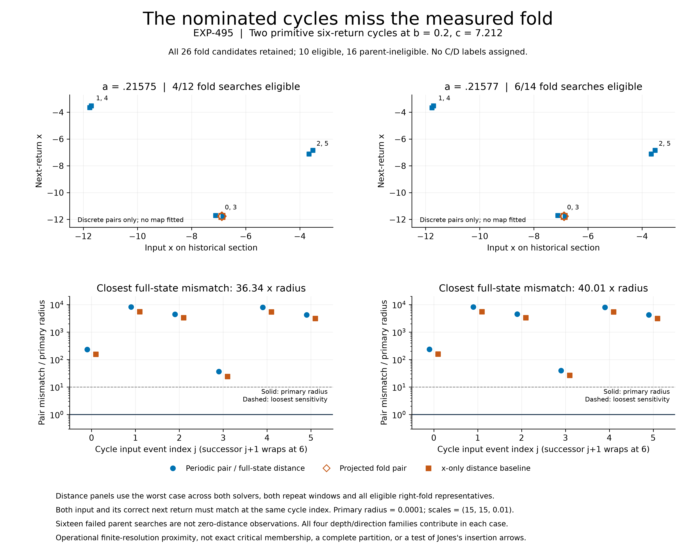

# EXP-495: the nominated cycles are not yet critical-point centers

**Both nominated primitive cycles fail the frozen proximity test to the
measured right-hand projected fold.** This identifies a missing link in our
own center nominations; it does not refute Jones's symbolic mechanism.

The complete saved-data analysis and separate scalar-coordinate audit pass.
All **26 original fold candidates** remain in the ledger. Ten previously
qualified, in-region searches supply **240 consecutive-pair comparison cells**:
six possible cycle indices, two solvers and two repeat windows per search.
Sixteen parent-ineligible searches remain explicitly unevaluated, not zeros.
No new integration, paid review, API generation or GPU job was used.



## What the test actually asks

A plotted return-map critical point is an **input**, whose next return is its
image. A cycle must pass close to both in the correct order to satisfy even
an approximate critical-contact test. Looking only for a near-overlap with
the image is insufficient. We compare each fold input with cycle event j
and its image with event j+1, retaining all six j choices. Periodic closure
supplies the last-to-first successor; EXP-494 already qualified its primitive
period, repeated windows and paired observations.

Each distance is the maximum of the two endpoint infinity-norm differences
after scaling (x,y,z) by (15,15,.01). The table uses the worst case across
both solvers, both windows and all qualified right-fold representations at
that parameter point. All four history-depth/direction families contribute
in each case. The x-only comparator is reported beside the full-state metric.

| a (b=.2, c=7.212) | Eligible / all original fold searches | Closest full-state pair distance | Closest x-only pair distance | Primary radius |
| --- | ---: | ---: | ---: | ---: |
| .21575 | 4 / 12 | .00363436376723623 | .00238870659207944 | .0001 |
| .21577 | 6 / 14 | .00400118351794338 | .00262904248830017 | .0001 |

In both cases the nearest consecutive pair starts at **zero-based event 3**.
The full-state distances exceed the primary radius by **36.34** and **40.01**
times. Neither case passes any level of the complete sensitivity ladder
1e-6, 1e-5, 1e-4, 1e-3, even under the x-only comparison. All ten eligible
candidate-level comparisons also fail the primary test; this is not one
bad representation concealing otherwise successful contact.

These thresholds specify numerical proximity, not confidence intervals or
rigorous error bounds. The fold is measured on finite-return image curves,
not a proved invariant quotient. Failure therefore means **not proximate
under this operational test**, not mathematical nonexistence of a suitable
critical point, a symbolic partition or Jones's orbit.

## What this changes for Jones verification

We should not treat the two exploratory scout nominations as already located
doubly-superstable centers. Their periodic observation is qualified, but
their contact with this measured fold is not. This distinction was previously
unresolved; EXP-495 supplies the explicit negative proximity result.

The next numerical objective is narrower and testable:

1. Refine a **critical-contact condition** jointly with a qualified primitive
   periodic family. Recompute the fold at every changed parameter value;
   never transport today's fold coordinates unchanged to a neighboring orbit.
2. Keep all four depth/direction representations and both solvers, and carry
   forward the shorter-cycle guard. Distinguish a failed corrector from the
   absence of a contact; retain every bracket and failed attempt.
3. Separately identify the second critical object or justified piecewise
   domain boundary and qualify the branch dictionary before assigning C/D.
   One smooth right-hand fold cannot supply both symbols.
4. Only then test a source-matched insertion arrow. A nearby three/six doubling
   relation, a matched word at one point or a visually similar plot is not
   that arrow.

The source-derived Jones words were not used to select event matches or tune
the distance thresholds. No flow-level word or arrow is newly verified, and
no Jones homoclinic or whole-plane claim is assessed here. The formal manuscript
remains unchanged; its legacy turning-point impact audit is still required.

## Evidence, reproduction and validation

- [Prospective protocol](../experiments/EXP-495-fold-cycle-membership.md),
  [machine plan](../../experiments/manifests/EXP-495-fold-cycle-membership.json)
  and [preflight](../experiments/EXP-495-preflight.md).
- Exact pushed execution source: `e08a85717fb53b55ecf999b5b3c797f530c55610`,
  preserved at `codex/exp495-local-execution` before measuring distances.
- [Complete result](../experiments/receipts/EXP-495-fold-cycle-membership.json),
  **267,646 bytes**, SHA-256
  `197e7564130f0bddd4022057f6fdaaeac9a39d7cb615374b0418482f04247863`.
- [Local primary audit](../experiments/receipts/EXP-495-fold-cycle-membership-audit.json)
  and [public replay receipt](../experiments/receipts/EXP-495-public-replay.json).
  The public replay needs only the four pinned public input artifacts and
  frozen source; it does not require a private attempt file or new integration.
- Original local result and consumed analysis marker remain at
  `artifacts/EXP-495/target-e08a857` and `artifacts/EXP-495/analysis-once.json`.
  Neither may be reset to obtain another result.

The primary audit reconstructs every coordinate difference, cyclic successor,
scaled norm, envelope and threshold decision with separate scalar arithmetic.
The public figure also verifies the full matrix before plotting and binds its
data, generator and output hashes. Its initial crowded labels were corrected;
the final PDF was rendered and visually checked. Grouped nearby event labels
do not merge the six plotted observations. This is same-agent numerical
replay, not independent-team replication.

From the repository with its locked development environment:

```sh
PYTHONPATH=.:python .venv/bin/python -m scripts.audit_exp495_fold_cycle_membership \
  --public \
  --result docs/experiments/receipts/EXP-495-fold-cycle-membership.json \
  --expected-sha256 197e7564130f0bddd4022057f6fdaaeac9a39d7cb615374b0418482f04247863 \
  --output artifacts/EXP-495/reader-replay.json
```

Choose a new output filename; writes are exclusive. Plot verification is:

```sh
PYTHONPATH=.:python .venv/bin/python -m scripts.plot_exp495_fold_cycle_membership \
  --verify-only --output-dir docs/figures
```

The pre-outcome suite passed 2138 tests with one existing Linux-only skip.
The 25 focused analysis/figure tests pass, including complete public-data
replay, failed-parent retention and tamper rejection. The final full suite
passed **2144 tests**, with the same one Linux-only skip, in 137.05 seconds;
the receipt is `artifacts/EXP-495/release-tests-01.xml`. No paid review was
requested, consistent with the human-controlled policy.

## Fresh public-checkout check

After pushing result revision `fe72cd3d5708f0866b8ee7cbc388da1201c33fb0`,
a new shallow, blob-filtered HTTPS clone materialized only the 18-file replay
and figure dependency set. Both the public numerical audit and figure
verification passed there. The analysis module's root was verified to be that
fresh checkout, with **no `artifacts/` directory present**. Its audit receipt
is byte-identical to the published public replay receipt; the local witness
copy is `artifacts/EXP-495/fresh-checkout-replay-01.json`.

This tests the actual publicly obtainable source/data closure. It reused the
existing locked Python dependency environment and was run by the same agent;
it is not a clean dependency installation or independent-team replication.
