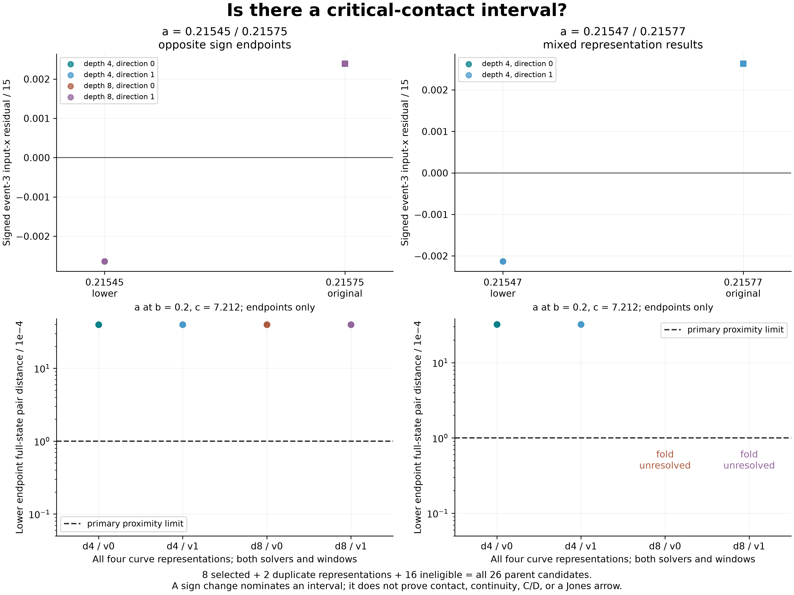

# EXP-496: one qualified endpoint interval for contact localization

**The first case has reproducible opposite-sign endpoints in all four curve
representations. The second case remains mixed.** This is a useful localization
lead, not an interior contact, a C/D dictionary or a Jones arrow.

All sixteen DOP853/Radau profiles completed, retaining **124 trajectories**.
The full raw-mesh and separate scalar-contact audit passes. Six of eight selected
representations qualify in both solvers; two remain unresolved. All 26 original
candidates remain accounted for: eight selected, two unselected duplicate
representations and sixteen parent-ineligible candidates.



## What changed

EXP-495 showed that neither original nomination meets the measured fold-contact
proximity rule. EXP-496 recomputes the fold at each family's already-qualified
lower-a endpoint, reusing its primitive six/eight periodic observations. Both
solvers and repeat windows remain in every comparison. The fixed event is
zero-based event 3, selected using EXP-495.

| Case / a interval, b=.2, c=7.212 | Complete lower-fold representations | Upper signed residual | Lower signed residual | Verdict |
| --- | ---: | ---: | ---: | --- |
| local-a025-c083 / [.21545, .21575] | 4/4 | +.002388707 | −.002638504 | Opposite signs in all 16 method/window variants |
| local-a027-c083 / [.21547, .21577] | 2/4 | +.002629042 | −.002129095 in qualified depth-four rows | Mixed; no complete case-level qualification |

Residuals are `(cycle_event_3.x - fold_input.x)/15`; values above are rounded,
with complete per-variant values in the receipt. The first case's lower
full-state pair mismatch is about **39.91 times** the primary radius; the
second case's qualified depth-four rows are about **32.22 times** the radius.
Neither lower endpoint is itself a qualified contact. Opposite signs nominate
a search interval; two endpoints do not prove continuity or an interior root.

There are **144 evaluated lower-endpoint ordered-pair cells**: six qualified
representations times two methods times two windows times six cycle indices.
The two unresolved representations have no contact distances, not zero distances.
Neither another cycle index nor the favorable subset of the second case can
rescue the frozen primary verdict.

## Why two searches fail

Both second-case depth-eight representations converge algebraically but fail
the input-curve regularity gate in both solvers. Their center gains range from
roughly 3.9e-12 to 2.7e-11, against the unchanged minimum 1e-4. Their side
input-x tangents reverse sign. This is why determinant convergence alone is
not a qualified return-map fold. The failures remain; conditioning was not
loosened and another preimage was not substituted.

This limits those transported finite-image-curve searches; it does not establish
nonexistence of the physical fold or refute Jones. The first case passes the
complete criterion and is eligible for the next localization study. The nearby
cases are not independent discoveries of different periodic families.

## Evidence and reproduction

- [Prospective protocol](../experiments/EXP-496-contact-endpoint.md),
  [preflight](../experiments/EXP-496-preflight.md),
  [machine plan](../../experiments/manifests/EXP-496-contact-endpoint.json), and
  [candidate ledger](../../experiments/manifests/EXP-496-candidates.json).
- Execution source `7513bed94ed206e57438a5cb3497c736da98ea11`, pushed before
  targets and preserved at `codex/exp496-local-execution`.
- [Audited result](../experiments/receipts/EXP-496-contact-endpoint-result.json),
  SHA-256 `c6ad2dca38df1e0628550b5f697252ce81e62cb47db9ae1dec9736d8c5ab3e6b`.
- Raw summary SHA-256
  `b99970186185c73b0104f257966b18dd22f764d7b1d364c8319c222c2c1bbe24`.
- [Full raw-data index](../experiments/receipts/EXP-496-full-data-index.json),
  SHA-256 `1dd72bdd60537709f6d06a04a358d52a52fd5a0f617162ad06a418c901e19233`:
  159 files, **531,055,878 bytes**, including every returned target mesh,
  profile, analytic control and start record. No other experiment's restricted
  archive is included. Public release/network verification is pending at this
  result checkpoint.
- Local raw directory `artifacts/EXP-496/target-7513bed` and consumed witness
  `artifacts/EXP-496/target-once.json` remain unchanged; neither may be reset.

The complete archive was safely extracted into a new local directory and its
[public audit replay](../experiments/receipts/EXP-496-public-replay.json) passed
with zero new IVPs and no private attempt-marker dependency. The figure was
generated after the numerical audit, replayed against scalar arithmetic and
visually inspected. It shows endpoints, not an interpolated parameter path.
Overlapping observations are not independent statistical samples. This is
same-agent numerical verification, not independent peer review or new integration.

With the raw index and tar shard in one directory, choose a fresh output:

```sh
PYTHONPATH=.:python .venv/bin/python -m scripts.release_exp496_contact_endpoint \
  --extract-and-replay --index DOWNLOAD/EXP-496-full-data-index.json \
  --index-sha256 1dd72bdd60537709f6d06a04a358d52a52fd5a0f617162ad06a418c901e19233 \
  --output-dir artifacts/EXP-496/reader-replay
PYTHONPATH=.:python .venv/bin/python -m scripts.plot_exp496_contact_endpoint \
  --verify-only --output-dir docs/figures
```

The final tooling suite passed **2176 tests with one existing Linux-only skip**,
in 143.20 seconds (`artifacts/EXP-496/release-tests-01.xml`). The preflight retains
the first restricted-host suite's process-inspection failures and successful
host-access rerun. All twelve actual analytic controls passed before targets.
Measured execution time was 876.33 seconds. No paid Pro review, new GPU rental,
API generation or restricted upload was used.

## Next concrete test

Localize inside the fully qualified first-case interval using a prospectively
bounded scalar refinement. At every proposed parameter, re-correct and
re-observe the primitive cycle and recompute all four fold representations in
both solvers. Keep full-state input/next-return proximity, fixed event identity
and shorter-cycle safeguards. Carry the second case as ineligible, not silently
repaired or erased. A qualified local contact would precede the second critical
object and source-matched insertion test. No flow-level chain is newly verified.
