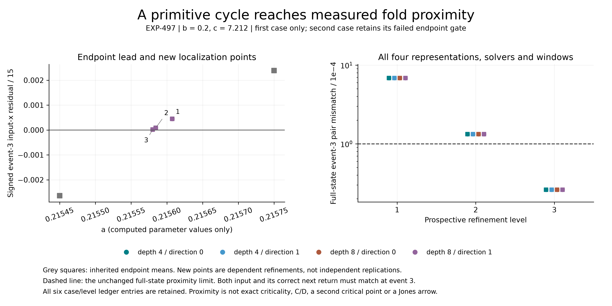

# EXP-497: a primitive cycle meets measured right-fold proximity

**The third interior point passes the unchanged full-state proximity criterion
in all sixteen representation/method/window variants.** Its cycle remains
conditionally primitive, with six historical-section and eight Barrio-section
returns in both repeated windows. This closes one specific numerical gap after
the negative original-center screen and the
[EXP-496 endpoint lead](2026-09-09-exp496-contact-endpoint.md).

The evaluated point is **a=0.21558015990653545, b=.2, c=7.212**. Its worst
scaled input/next-return pair mismatch is **2.60310352808e-5**, or **0.26031
times the primary radius 1e-4**. This is an evaluated parameter and operational
proximity result, not an exact critical parameter or parameter-error bound.



| Level | Evaluated a | Worst event-3 full-state pair mismatch | Multiple of primary radius | Frozen decision |
| --- | ---: | ---: | ---: | --- |
| 1 | .2156074533571891 | .000684060435355 | 6.84060 | Replace upper endpoint; not proximate |
| 2 | .2155844844972852 | .000133018277360 | 1.33018 | Replace upper endpoint; not proximate |
| 3 | .21558015990653545 | .000026031035281 | .26031 | Proximate; stop |

All three points retain primitive six/eight counts in both solvers and windows.
The final corrected periods are approximately 44.3325398906676 and 44.3325398906678
for DOP853 and Radau. These paired values are not rigorous error bounds. The
final point passes radii 1e-4 and 1e-3, but not 1e-5 or 1e-6, at fixed event 3.

The complete run retains **179 target IVPs**, six periodic profiles and 24 fold
profiles. All four depth/direction representations qualify in both fold solvers
at each evaluated point. There are 288 ordered-pair comparison cells: three
points times four representations times two methods times two repeat windows
times six cycle indices. The primary index remains zero-based 3; the other
indices cannot rescue it. Tiny census-guard IVPs and the analytic controls are
additional to the retained target count, as specified in the protocol.

The complete six-row two-case/three-level ledger is retained. All three levels
of the second case remain unrun with their inherited endpoint-failure reason;
its depth-eight failures were not repaired or dropped. The three computed points
are dependent false-position refinements, not independent replications.

- [Prospective protocol](../experiments/EXP-497-contact-localization.md)
- [Machine plan](../../experiments/manifests/EXP-497-contact-localization.json)
- [Preflight and retained fixes](../experiments/EXP-497-preflight.md)

## What this does and does not establish

We now have a qualified primitive cycle close to the input and correct next
image of one measured right-hand fold, in the full state rather than x alone.
This is a usable calibration point for the next branch-dictionary study.
It does not establish a second critical point, C/D, an invariant quotient,
exact criticality, a zero flow multiplier, a doubly-superstable center or a
source-matched Jones word/arrow. No homoclinic claim changes. The original
nominations' EXP-495 failures remain failures; this is a new parameter point.

The local radius is an operational criterion for finite-return image curves,
not a rigorous bound on a true invariant critical point. Agreement across the
two history lengths/directions and solvers is numerical corroboration, not a
proof of a continuous partition over an entire parameter interval.

## Evidence, reproducibility and publication boundary

Execution source is `ec0bca1c35fd7ee34c99088dedd028cf4b4ca635`, pushed before
targets and preserved at `codex/exp497-local-execution`. The runtime checked
the live pushed SHA, clean source, input/import closure and disk reserve,
repeated its controls and created the exclusive consumed-attempt marker.
Evidence is retained at `artifacts/EXP-497/target-ec0bca1`; the witness is
`artifacts/EXP-497/target-once.json` and must not be reset.

The full audit passes: retained corrector closure/phase states, dense-coefficient
event/primitive-period reconstruction, every fold Newton trace and census,
paired qualification, the complete adaptive/blocked-level ledger, and separate
scalar contact arithmetic. The original numerical sources remain unchanged.
Measured execution time was 964.06 seconds. This is same-agent numerical auditing,
not independent peer review.

- [Complete audited result](../experiments/receipts/EXP-497-contact-localization-result.json),
  SHA-256 `ed229b4a772ef19d227272006401d19090ee5e28a357791f25400cafa3271cff`.
- Raw summary SHA-256
  `00e643d414baa4b1f8be8ae9d6fc1f710e4bf5c18816ad14c6361549433d1315`.
- Full local raw evidence: 256 files, 628,218,782 bytes, including controls, starts,
  correction records, all returned meshes and terminal results.
- A second, marker-free audit passed against the same local raw files, without
  new IVPs (`artifacts/EXP-497/marker-free-replay-01.json`). This is not a public
  download or independent-environment replication.

The raw evidence remains local. EXP-496's public raw-archive upload was denied
pending exact-payload human approval; no alternate upload route has been used,
and EXP-497's raw files have not been published either. This does not prevent
local research, but full public trajectory replay is not yet available for
these two experiments. The public summary and figure support saved-state and
adaptive-ledger replay, not independent verification of unavailable raw meshes.

The final SVG/PNG figure was visually inspected and its bytes/data/producer
hashes verified. An initial label/legend overlap was fixed in the rendering
code only; original figures remain in local artifact directories. Verify the
public saved-result figure with no new integrations:

```sh
MPLCONFIGDIR=artifacts/plot-cache PYTHONPATH=.:python .venv/bin/python \
  -m scripts.plot_exp497_contact_localization --verify-only --output-dir docs/figures
```

With the retained raw directory available, choose a fresh receipt filename:

```sh
PYTHONPATH=.:python .venv/bin/python -m scripts.audit_exp497_contact_localization \
  --run artifacts/EXP-497/target-ec0bca1 \
  --expected-sha256 00e643d414baa4b1f8be8ae9d6fc1f710e4bf5c18816ad14c6361549433d1315 \
  --output artifacts/EXP-497/reader-audit.json
```

Pre-outcome validation passed 2,194 tests with one existing Linux-only skip and
all sixteen actual analytic controls. The expanded tooling suite passed 2,197
tests with the same skip in 143.89 seconds. After final figure QA and public-data
regression, all 21 focused checks pass; the final full suite passes 2,198 tests
with the same skip and no failures or errors in 139.465 seconds. Its receipt is
`artifacts/EXP-497/release-tests-02.xml`. No paid Pro review, GPU rental, API
generation or restricted upload was used.

## Next scientific step

Use this point as a measured anchor while identifying the second critical
object or justified piecewise domain boundary. Qualify an operational branch
dictionary and its relationship to the physical extra inner return before
assigning C/D. Then test one source-matched p-to-p+1 connection with corrected
primitive endpoints. A one-fold proximity success is an ingredient of that
test, not its completion. The manuscript's separate legacy turning-point
impact audit remains required before a new formal manuscript release.
