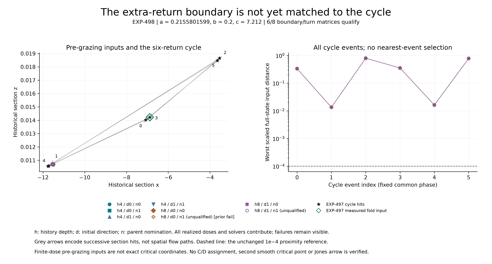

# EXP-498: bring the extra-return boundary to the primitive-cycle point

**The run and raw-data audit are complete: six of eight boundary/turn matrices
qualify.** All eight paired grazing roots and all local extra-turn diagnostics
pass, but two near-tangent event-state comparisons exceed the unchanged
accuracy limit. The overall qualification remains unresolved.

The second important result is geometric: the sampled pre-grazing return
states are not close enough to any of the six cycle events. The EXP-497 point
therefore remains a one-fold proximity point, not a verified two-object contact
or a Jones CD center.



[EXP-497](2026-09-09-exp497-contact-localization.md) supplied a primitive-cycle
point close to one measured right-hand fold. The earlier grazing/extra-turn
evidence was obtained at different parameters. EXP-498 recomputes that boundary
at the exact new cycle parameters, rather than transporting a C/D label by
assumption.

## What ran

- All eight first-case boundary nominations, including the old failed
  depth-eight/direction-zero/candidate-one accuracy comparison.
- Both DOP853 and Radau; unchanged root, event, paired-state and winding gates.
- Four fixed opposite-side displacements per qualified paired root.
- The complete 26-parent ledger, with eighteen unrun rows and explicit reasons.
- All six cycle events in both repeat windows when comparing the last regular
  return before grazing. The grazing state itself is not that preceding input.

New root boxes were declared prospectively around the old fitted roots, at the
new parameter value. Old boxes, outcomes and failures stay unchanged. A new
success does not retroactively repair the old failed comparison. The maximum
was 192 retained target integrations, plus the separately bounded tiny guards;
the actual run retained **136 target integrations**.

The test can establish a local boundary mechanism at the same parameters as
the cycle, and describe its input geometry. It cannot certify a second smooth
critical point, invariant quotient, C/D, a Jones word or an insertion arrow.
All eight new boundary/turn matrices must qualify before the overall input
ordering receives a positive label; no subset can rescue that conclusion.

## Complete result and retained failures

| Check | Outcome |
| --- | --- |
| Parent ledger | All 26 retained; eight selected and eighteen explicitly unrun |
| Paired grazing roots | 8/8 pass; all sixteen individual correctors qualify |
| Full side-event solver comparisons | 30/32 pass |
| Local polygon profiles / paired polygon comparisons | 64/64 and 32/32 pass |
| Opposite-side extra-turn comparisons | 32/32 pass |
| Complete boundary/turn matrices | 6/8 pass; no full-matrix qualification |
| Predecessor observations / cycle-distance cells | All 64 observations and 768 cells retained |

Both failures occur for depth-eight nomination one, at the smaller negative
displacement. Direction zero has scaled state mismatch **1.5126663e-6**;
direction one has **1.0931970e-6**, against the same **1e-6** limit. Direction
zero also failed the earlier EXP-492 accuracy test; direction one previously
passed. The old outcomes remain separate and unchanged.

These are not Newton failures or missing crossings. The failed comparison is
accepted event index eight, about .001272 model-time units after the fitted
grazing time. Its paired event-time differences are approximately 1.638e-10
and 1.184e-10, while its crossing angles are about 1.75e-4. The full-state
accuracy failures remain binding despite these small time differences and
passing local winding checks. A successor must diagnose or improve this
near-tangent accuracy, not round the mismatches down or relax the threshold.

Across all realized finite-dose inputs, the predecessor x range is
**[-11.51982240, -11.51972269]** and the maximum pairwise scaled state spread is
**6.64737e-6**. The measured right-fold input has x approximately **-6.88267731**.
These are sampled-state descriptions, not an exact limiting boundary location.
The formal ordering verdict remains `unresolved` because the complete
boundary/turn gate fails; the visibly leftward cluster cannot override it.

The most favorable cycle index under the frozen worst-over-variants criterion
is index one, with distance **.01346451**, approximately **134.65 times** the
primary 1e-4 radius. Every cycle index fails that criterion at all four frozen
sensitivity radii (1e-6 through 1e-3). No index, dose or representation was
selected afterward to manufacture a critical symbol.

This supports the local extra-return mechanism in six fully qualified
representations at the same parameters as the primitive cycle. It does not
verify a second smooth critical point or connect the boundary to that orbit.
It is neither a Jones-chain verification nor a refutation of Jones's paper.
In particular, no homoclinic conclusion changes.

## What the saved-event diagnosis adds

A separately labeled, post-outcome diagnostic retains **all 32 solver pairs
and 240 accepted-event comparisons**. It makes no new integrations and does
not change the frozen experiment verdict. For each comparison it decomposes
the state difference as `delta_q = f(midpoint) * delta_t + remainder`.
This is first-order algebra, not a true integration-error bound.

For the two failed crossings, the z differences are -1.51267e-8 and
-1.09320e-8. The first-order time-shift contributions are -1.51810e-8 and
-1.09725e-8. The remaining scaled differences are 5.43683e-9 and 4.05235e-9,
less than one percent of the original differences. The local ratio
`abs(z_dot/y_dot)` is approximately 5662 in both cases: the reconstructed
section is nearly tangent while z is changing quickly. This supports
event-time sensitivity as the dominant explanation of the observed mismatch.
It does not establish which solver is more accurate or qualify either failed
section-state comparison. Subtracting the phase term is a diagnostic, not an
allowed replacement acceptance test.

The [complete diagnostic](../experiments/receipts/EXP-498-event-disagreement-diagnostic.json)
is reproducible with the checked-in
[script](../../scripts/diagnose_exp498_event_disagreement.py):

```sh
PYTHONPATH=.:python .venv/bin/python -m scripts.diagnose_exp498_event_disagreement \
  --output artifacts/EXP-498/reader-event-diagnostic.json
```

Use a fresh output name. Constant-velocity and transverse-offset controls
check the decomposition; the public-data test retains both failures and every
accepted pair. A useful successor must reduce the underlying trajectory/
section-time uncertainty while preserving the original state criterion.

## Preflight evidence

The 18 focused tests pass. They cover deterministic selection and seeds,
section transport, old-failure retention, frozen constants, predecessor versus
grazing identity, complete all-index distances, independent scalar arithmetic,
missing-arm handling, and the signed-ray winding replay.

All five actual analytic boundary controls and twelve exact-data polygon
controls pass in `artifacts/EXP-498/preflight-controls-01/controls.json`.
The control receipt has SHA-256
`d8841de84fd805e9ae0dde400528aece9712e685c53d4a69caa4e2af9d422bac`.
Its saved decisions and exact-polygon controls also replay with numerical
integrators explicitly forbidden. The complete import closure has 83 paths
and no missing imported project module. The public auditor CLI starts
successfully. The full suite passes **2,216 tests**, with one existing
Linux-only skip and no failures, in 141.74 seconds; the receipt is
`artifacts/EXP-498/preflight-tests-01.xml`.

Execution source `511ff1c1593ced21a91496d7fb1270eca9b9878d` was pushed and
preserved at `codex/exp498-local-execution`. The production runner checked the
live remote ref, clean source, input/import closure and disk reserve, repeated
its controls, and consumed `artifacts/EXP-498/target-once.json`. Do not reset
that marker or restart the attempt. Completed raw evidence is retained in
`artifacts/EXP-498/target-511ff1c`. Subsequent visualization tooling is separate
from the immutable numerical source inventory.

## Reproduction and publication boundary

Execution took 755.3208405 seconds and retained **227 files, 422,687,467 bytes**.
The original 83-path numerical source inventory remains unchanged. The primary
audit checks the full raw Newton/census ledger, reconstructs the polygon
diagnostics, verifies winding with separate signed-ray arithmetic, and redoes
predecessor distances and the complete decision matrix with scalar code.

- [Audited compact result](../experiments/receipts/EXP-498-boundary-transport-result.json),
  SHA-256 `f327a6acb9bb72cd0286ff41090f38e12e3b10a0ff9f476b0a6b2f705e176344`.
- Raw summary SHA-256
  `79d4e6a4091c5a2aaead1d1b6558baa41b44f5042448d7b707fea03bd1d3719f`.
- A marker-free audit also passes against the same local raw files:
  `artifacts/EXP-498/marker-free-replay-01.json`. It performs no new integrations;
  it is not a public download or an independent-environment replication.

The compact result contains every candidate's event reports and geometric
measurements, but not the full variational meshes or local-window polygons.
Those remain local. Public saved-result and figure replay does not revalidate
the unavailable full trajectories. No complete public raw archive is claimed.

Verify the published figure without integrating trajectories:

```sh
MPLCONFIGDIR=artifacts/plot-cache PYTHONPATH=.:python .venv/bin/python \
  -m scripts.plot_exp498_boundary_transport --verify-only --output-dir docs/figures
```

With the retained raw directory available, use a fresh output filename:

```sh
PYTHONPATH=.:python .venv/bin/python -m scripts.audit_exp498_boundary_transport \
  --run artifacts/EXP-498/target-511ff1c \
  --expected-sha256 79d4e6a4091c5a2aaead1d1b6558baa41b44f5042448d7b707fea03bd1d3719f \
  --output artifacts/EXP-498/reader-audit.json --public
```

The first figure had overlapping cycle-index labels. Only annotation offsets
and the plain-language title were changed; the original figure and all
empirical values are preserved. The corrected figure was visually inspected
and its public receipt verification passes. All 26 focused experiment, figure
and event-diagnostic tests pass. The first full release test run was blocked
by sandbox denial of `/bin/ps` in child-process supervision controls (7 failures,
8 errors, 2,196 passes, 11 skips), retained as `release-tests-01.xml`. This is
not a failed numerical experiment or an excuse to skip those controls. The
host-access run passes **2,224 tests with one existing Linux-only skip** in
142.40 seconds, retained as `artifacts/EXP-498/release-tests-02.xml`. All 83
frozen numerical source hashes remain unchanged. The staged public-file scan
passes across 2,727 files; manuscript references and the receipt-generated
quadratic control table also pass their existing checks.

- [Prospective protocol](../experiments/EXP-498-boundary-transport.md)
- [Machine plan](../../experiments/manifests/EXP-498-boundary-transport.json)
- [Runner](../../scripts/run_exp498_boundary_transport.py)
- [Raw-data auditor](../../scripts/audit_exp498_boundary_transport.py)

The stale heartbeat was updated through the app's automation tool. It remains
active on its unchanged schedule, now reads the newest repository records,
and explicitly rejects automatic paid Pro reviews. The superseded EXP-482
instructions will not authorize repeating a completed run. No API generation,
GPU rental or restricted data upload was used.

The raw-publication approval boundaries from EXP-481/496 remain in force;
there is no alternate upload route. They do not prevent this local experiment.

## Next scientific step

The center search needs two measured objects, not more one-dimensional tuning
to the already matched fold alone. Diagnose the two near-tangent paired-state
errors and freeze a successor that preserves all representations and accuracy
criteria. Then define and test joint contact conditions in a and c, retaining
the primitive-period guard and explicit failure if the family collapses to a
repeated period-three orbit. A piecewise-domain boundary must not be silently
renamed a smooth D critical point: its relationship to the intended scalar
representation remains a separate mathematical obligation. Only after those
checks can a branch dictionary and source-matched p-to-p+1 link be tested.
