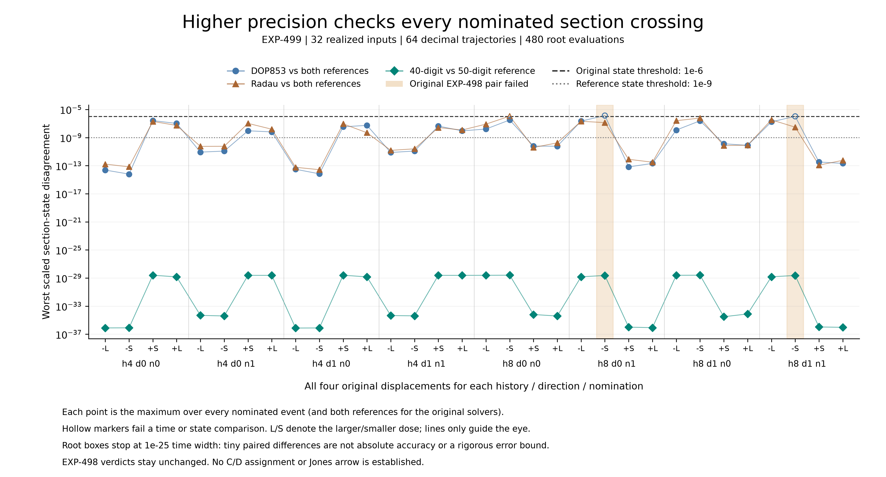

# EXP-499: resolving the near-tangent accuracy question

EXP-498 is complete and merged through PR68 (`44b76c5`). Its two failed
section-state comparisons remain failed. The saved-data phase diagnostic
motivates a distinct, higher-precision reference, not a correction to those
original verdicts.

**The execution and raw coefficient audit are complete. The decimal reference
qualifies at all 32 inputs and all 240 paired event nominations.**
All 64 trajectories completed in 108.799 seconds, retaining 233 files and
544,299,853 bytes including the summary. The stronger reference also identifies
a third method/input discrepancy beyond the two already failed original pairs.



## What the result changes

The 40- and 50-digit configurations agree within the fixed 1e-9 scaled-state
and 1e-12 time criteria at every nominated crossing. Their largest observed
paired state difference is **2.563062e-29**. This is a discrepancy, **not an
absolute error bound or a claim of 29-digit root accuracy**. Both configurations
bisect the same nominated boxes to time widths at most 1e-25 (largest retained
width about 6.776264e-26). They can land on the same bisection grid point; the
largest paired time difference, 1.774898e-37, does not bypass that resolution.

Against both references, DOP853 stays within the original criteria at 30/32
inputs and Radau at 31/32. All original-method time comparisons pass. The
three state discrepancies are:

| History / direction / nomination | Dose | Accepted event index | Method outside 1e-6 scaled-state limit | Largest mismatch | Original paired-solver check |
| --- | --- | --- | --- | --- | --- |
| h8 / d0 / n0 | Smaller negative | 5 | Radau | 1.132221e-6 | Passed |
| h8 / d0 / n1 | Smaller negative | 8 | DOP853 | 1.376180e-6 | Failed |
| h8 / d1 / n1 | Smaller negative | 8 | DOP853 | 1.062668e-6 | Failed |

Every event is compared to both reference configurations; these are repeated
checks of the same fixed inputs, not independent statistical samples. The first
row shows why paired solver agreement is not itself an error bound: two
methods can agree with one another while one differs too much from the
higher-precision reference. Neither original integrator is uniformly better.
The remaining reference-method discrepancies remain visible in the complete
table and figure, not merely in this three-row summary.

This is useful progress on the **numerical reliability** obstacle. It does not
retroactively repair EXP-498's frozen boundary verdict or verify Jones's
symbolic chains. The reference does not re-shoot the grazing roots, certify
the complete event census, establish the second smooth critical point, or
move the one-fold anchor onto a two-object contact.

## What ran

All 32 realized side inputs, all eight candidates and all 240 previously
accepted event nominations were retained. Each input was integrated in
40-digit/degree-24 and 50-digit/degree-32 decimal arithmetic, with fixed steps
.02/.01: 64 new local CPU trajectories and 480 event-root evaluations. NumPy longdouble
on this Mac has only Float64 precision; changing that dtype would not supply
the needed reference.

The reference configurations must agree within 1e-12 in time and 1e-9 in
scaled full state. Then compare **both** original methods to **both** references
under the original 1e-7 time/1e-6 state thresholds. Failed, empty and missing
cases cannot be hidden by choosing one favorable reference.

Full decimal Taylor coefficients are streamed to local compressed archives
as steps complete. The auditor checks the coefficient equations with a
separate scalar calculation, mesh continuity, root states, complete inputs,
all comparisons, and source/raw hashes without integrating again.

## Local design audit and scope

- The method is not a rigorous enclosure. A small retained tail and agreement
  between configurations do not bound the unknown exact-flow error.
- Both configurations share one Taylor implementation. Independent scalar
  coefficient checks and known analytic solutions address some shared bugs;
  they do not amount to independent-team replication.
- Boxes come from the existing accepted-event census. This experiment can
  refine those nominations or fail to find them, not discover all missing
  crossings outside the boxes. Full-census qualification remains separate.
- Exact realized binary64 inputs and parameters are promoted with
  `Decimal.from_float`; no new section, equilibrium or nominal displacement
  is substituted.
- Only the state equation is integrated. The original variational state
  influenced adaptive error control but does not change the mathematical
  state ODE; its removal here is explicit, not an unnoticed solver setting.
- No reference result repairs EXP-498, proves C/D or identifies a second
  smooth critical point. The one-fold anchor still is not a verified center.

During result-free implementation, the final-time calculation was made
explicit to prevent Decimal rounding from causing a tiny nonadvancing final
step. Coefficient streaming replaced end-only storage so failures preserve
their partial trajectory. Both changes precede new target outcomes. The first
analytic control directory is retained; the second exercises the final
streaming consumer. No target run has been repeated.

The first isolated startup rehearsal failed before any target outcome: two
public transitive receipts (EXP-486 and EXP-491) were checked upstream but
absent from the copied input list. The failed temporary source tree and
`artifacts/EXP-499/sealed-startup-01-failure.json` remain. The unfrozen
successor now explicitly hashes both receipts; the parent source/plans are
unchanged. A read-set regression and actual isolated-checkout test guard the
complete input and import closure.

Before freeze, the initial storage reserve was set to 11 GiB because retained
preflight copies leave just over 12 GiB free. The 2 GiB output cap and 8 GiB
free-space floor are unchanged, leaving at least 1 GiB additional headroom.
No scientific accuracy threshold, sample or failure rule changed.

## Evidence and execution status

All 22 focused tests pass, including the complete read-set and isolated-source
startup checks. The final full suite passes **2,246 tests with one existing
Linux-only skip** in 149.01 seconds, retained in
`artifacts/EXP-499/preflight-tests-02.xml`. The preceding 2,244-test run is also
retained; the two added tests cover the packaging gap it did not detect.
All six analytic control profiles pass:
two precision configurations for a transverse rotation crossing, a near-tangent
rotation pair, and a nonlinear system with exact exponential solution.
The streaming controls are retained in
`artifacts/EXP-499/preflight-controls-03`. Their raw coefficient and root
identities also pass with integration disabled, recorded in
`artifacts/EXP-499/preflight-controls-audit-01.json`. All 92 imported/bound
source paths are present. The staged credential scan passes on 2,736 files.

The [protocol](../experiments/EXP-499-decimal-event-reference.md),
[plan](../../experiments/manifests/EXP-499-decimal-event-reference.json),
[runner](../../scripts/run_exp499_decimal_reference.py) and
[auditor](../../scripts/audit_exp499_decimal_reference.py) define the bounded
successor. Execution source `cef7b57ee1102b5bb6fa7350e22be2ae05de9240` was
pushed and preserved at `codex/exp499-local-execution` before the run. The
runner checked its live remote ref and clean source, passed controls, and
consumed `artifacts/EXP-499/target-once.json`. All 92 source hashes remain
unchanged. Do not reset that marker or repeat the run. Raw evidence is under
`artifacts/EXP-499/target-cef7b57`, with summary SHA-256
`340617c9dfde4240a468b04574f87dc01c2cc3f13a6e488d933050adef1deab3`.
Maximum workload: 64 target IVPs, 7,200 seconds, 2 GiB
output, 11 GiB initial disk reserve and 8 GiB free-space floor.

Paid review: **not run**, under the human-approval policy. No GPU rental,
credential access or raw upload was used. Existing raw-publication boundaries
remain unchanged; compact evidence does not imply a full public raw release.

## Reproduction and release

The [audited all-event result](../experiments/receipts/EXP-499-decimal-event-reference-result.json)
contains the full 26-parent ledger, 32 input rows, 480 decimal root records and
every reference/original-method comparison. It is byte-identical to the local
primary audit: 770,301 bytes, SHA-256
`d8e01f7cf572f5a77a0319fc59aa465f6e5f2ce9c590d613c7ebbd7cfd29c8d5`.
Full Taylor-coefficient trajectories remain local; the compact table does not
let a public reader redo their coefficient audit. No public raw download,
off-machine raw backup or independent-environment trajectory replication is
claimed.

With the retained raw directory, run the frozen auditor into a fresh file:

```sh
PYTHONPATH=.:python .venv/bin/python -m scripts.audit_exp499_decimal_reference \
  --run artifacts/EXP-499/target-cef7b57 \
  --expected-sha256 340617c9dfde4240a468b04574f87dc01c2cc3f13a6e488d933050adef1deab3 \
  --output artifacts/EXP-499/reader-audit.json --public
```

The [figure generator](../../scripts/plot_exp499_decimal_reference.py) reads
only the audited compact result and recomputes every plotted maximum. SVG,
PDF and 300-DPI PNG outputs have a shared receipt and index. The PDF was
rendered and visually checked; no clipped or overlapping labels were found.
The root-resolution caveat is printed on the figure itself.

Final local release validation: **2,250 tests passed, one Linux-only test
skipped, zero failures or errors** (150.023 seconds; retained JUnit receipt
`artifacts/EXP-499/release-tests-01.xml`). All 26 focused tests pass. The
public figure receipt verifies, the staged credential scan passes on 2,744
files, and the paper-reference and quadratic-control-table checks pass.
All 92 frozen numerical source hashes remain unchanged after execution.

```sh
MPLCONFIGDIR=artifacts/plot-cache PYTHONPATH=.:python .venv/bin/python \
  -m scripts.plot_exp499_decimal_reference --verify-only --output-dir docs/figures
```

## Next scientific step

Use the now-qualified higher-precision formulation to close the **complete**
near-tangent event-domain and geometric checks, not to substitute one favorable
solver row into EXP-498. The saved coefficient trajectories permit a separately
declared full polynomial event census and geometric analysis without new IVPs;
that analysis must retain unresolved root isolation and must not claim an
all-root proof for the exact flow. High-precision grazing/root transport at new
parameters is a distinct next calculation. Then test joint contact conditions
in a and c while preserving primitive-period checks and the distinction between
a piecewise boundary and a smooth C/D critical point. The legacy turning-point
impact audit remains required before the next formal manuscript release.
