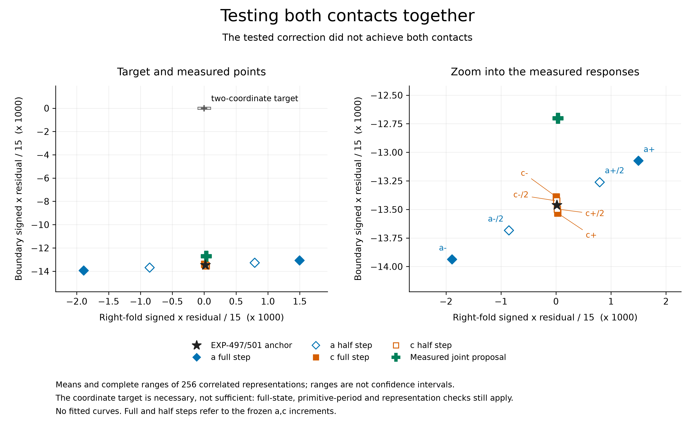

# EXP-503: complete the interrupted joint-contact matrix

**Full raw audit passed. The joint correction helps, but does not achieve both contacts.**

The central result is simple: changing a and c together reduced the dominant
contact residual by **5.64%**, while the right-fold pair remained within its
1e-4 full-state proximity tolerance. The limiting boundary still misses the
cycle by **0.012702**, about **127 times** that tolerance. The primary
joint-contact criterion and the separate 20% reduction criterion both fail.
This is a qualified negative result for this bounded correction, not a solver
failure, an exact contact, a C/D identification, or a refutation of Jones's
symbolic chains. Those chains remain unverified at flow level.



The eight fixed points all qualify. All 256 correlated response variants
have consistent orientation and finite condition numbers of approximately
23.49-24.07 in the frozen normalized coordinates. Full/half-step disagreement is
at most 2.514%, below the predeclared 5% limit. Thus the measurements support
a usable local two-parameter response, not a singular system at this stencil.

The unbounded linear prediction would change c by about -0.3595, well beyond
the allowed local correction. The frozen radial cap therefore applied only
5.5636% of that prediction, moving c from 7.212 to 7.192 and a to
0.21558803194140663. The observed 5.64% residual reduction is close to the
clipped linear prediction. **The distant, unmeasured full step is not a
validated root or permission to jump there.** A guarded continuation toward
lower c is the next hypothesis to test, with renewed geometry and period
checks along the path.

## Complete measured contact census

Distances are the worst scaled full-state comparisons over all prescribed
representations, not just the plotted mean x residuals. The fold column
includes both input and successor states at the frozen index; the boundary
column uses the frozen limiting-predecessor index. Both must be at most 1e-4.
Full steps mean 0.0001 in a or 0.002 in c; the common b is 0.2.

| Point | Fold-pair distance | Boundary distance | Joint proximity |
| --- | ---: | ---: | --- |
| EXP-497/501 anchor | 0.00002603 | 0.01346118 | No |
| a minus full step | 0.00286281 | 0.01393661 | No |
| a plus full step | 0.00227311 | 0.01307425 | No |
| a minus half step | 0.00130183 | 0.01368280 | No |
| a plus half step | 0.00120335 | 0.01326032 | No |
| c minus full step | 0.00000644 | 0.01338952 | No |
| c plus full step | 0.00004615 | 0.01353265 | No |
| c minus half step | 0.00001617 | 0.01342537 | No |
| c plus half step | 0.00003603 | 0.01349694 | No |
| Measured joint correction | 0.00005007 | 0.01270200 | No |

No point or unfavorable representation was removed. Every new cycle retains
primitive six historical/eight Barrio returns and the frozen event-index
correspondence. The 256 representations are correlated numerical checks,
not 256 independent replications or confidence samples.

## Execution and evidence

The pushed execution source is
`ea11c80a49c85b1671fdaf3d6f536000c53bcb45`. The isolated startup and
original-control replay passed. All seven completed points were reused
without new integrations. The eighth fixed point and the sole qualified
joint proposal were computed from the original cold seeds in
`artifacts/EXP-503/target-ea11c80`. The continuation completed at
2026-09-09 21:30:31 UTC after 1,150.26 seconds and 363 new integrations.
The summary SHA-256 is
`c645fb359b05737eedfa26f0256dbd731ac6d77728274c189f6e04335cbad663`.
Its inventory contains 527 files totaling 2,458,474,020 bytes before the
summary itself. All 62 frozen source files remain unchanged. Both source
freezes are retained on separate public execution references.

The full raw audit passed for all nine completed points and **1,580 actual
integrations**, including 216 separately retained guard integrations. The
older archive-product convention would count 1,364, so it is reported
separately. Seven original points contribute 1,217 integrations; the new
eighth point contributes 166 and the correction 197. Across both attempts,
there are 1,690 reservations, 1,689 retained target trajectories and 109
partial-original trajectories outside the completed-point evidence. The
single rejected reservation and EXP-502's failure remain preserved.

The [public compact result](../experiments/receipts/EXP-503-joint-contact-result.json)
is byte-identical to `artifacts/EXP-503/primary-audit-01.json`, SHA-256
`56cf4e0d13d2f082c3272494f0ef6a4719dfd92d7d9686a74c67026c995437a7`.
The audit replayed all complete-point meshes, guard joins, Newton traces,
high-precision coefficient recurrences, full prefix count certificates,
representation comparisons and response decisions without new integration.
Incomplete original attempts remain hash-inventoried, not numerically
promoted into complete evidence. This is a local audit with shared helpers,
not independent-team validation or a rigorous exact-flow enclosure.

Public replay needs only repository files:

```sh
PYTHONPATH=.:python .venv/bin/python -m scripts.verify_exp503_public_contact \
  --result docs/experiments/receipts/EXP-503-joint-contact-result.json \
  --expected-sha256 56cf4e0d13d2f082c3272494f0ef6a4719dfd92d7d9686a74c67026c995437a7
```

It reconstructs compact comparisons, not the private raw audit. Byte hashes
and discrete gates remain exact; reconstructed floating arithmetic uses the
existing scalar-audit tolerance (rtol 1e-12, atol 1e-13) for portability.
This does not change any frozen numerical accuracy or contact threshold.
The figure includes every complete matrix, the old anchor and the measured
proposal, with full representation ranges, no fitted curves and a separate
coordinate-target view. Its source/data/output receipt is in the
[figure index](../figures/README.md).

The separate continuation marker remains consumed. EXP-502 ran under its original frozen caps.
Its first two complete points each occupy about 1.2 GiB. This operational
observation indicates that the 8 GiB whole-run allowance may be insufficient
for eight points plus a possible proposal. No evidence is being removed and
the original runtime's cap is not being edited.

The [resource-continuation protocol](../experiments/EXP-503-joint-contact-resource-continuation.md)
keeps every scientific setting unchanged. It requires the original archived
resource failure and at least six completed fixed points. It reuses every
complete point, preserves the interrupted attempt, and computes only the
remaining fixed slots in a new directory. Its own attempt marker is distinct;
it cannot reset the old one or race a still-running original experiment.

The first EXP-502 point's negative contact result has been inspected after
raw audit. The recovery's point selection does not depend on that result:
selection is strictly the original contiguous completed prefix. The full
matrix and exact original proposal rule still govern the result.

Only storage/time/integration-attempt allowances change prospectively. The
continuation permits at most 4 GiB of additional output, with 13 GiB free at
launch and the original 8 GiB floor, retaining all original files. These are operational
limits, not relaxed accuracy or contact criteria. No paid calls, rentals,
credentials or uploads were required to execute it.

The earlier preparation checkpoint proposed a smaller 6 GiB reserve. Before
any continuation targets or marker, available disk space increased without
deletion by this agent, allowing the stricter original 8 GiB reserve to be
retained. The source and final machine plan reflect that amendment.

## Outcome-free validation

The first seventeen focused tests pass (`artifacts/EXP-503/preflight-focused-02.xml`).
They cover complete-prefix reuse, holes and favorable-subset rejection,
preserved unfinished slots, failed-point inclusion, exact remaining-point
selection, durable response-before-proposal ordering, unchanged/reused
proposals, resource-plan substitutions and refusal to recover a run without
an archived failure. These tests validate software, not the scientific result.

The expanded source candidate passes twenty-five focused tests
(`preflight-focused-05.xml`), adding original-startup corruption rejection,
refusal to treat numerical exceptions as resource failures, and the limited
public-replay interface. At that checkpoint, positive whole-receipt replay
tests awaited the audited result; they now pass in the release checks below.

The original analytic control archive also passes replay through the successor
consumer without new integrations. Its receipt is
`artifacts/EXP-503/preflight-control-replay-01.json`. The strengthened consumer
also checks the original copied-source startup and passes again in
`preflight-control-replay-02.json`.
The complete local suite passes **2,350 tests with one Linux-only skip** in
171.17 seconds (`artifacts/EXP-503/preflight-suite-01.xml`).
The expanded source candidate passes **2,358 tests with one Linux-only skip**
in 168.80 seconds (`preflight-suite-02.xml`). Those tests preceded the
original-failure machine plan and authentic copied-source startup below.

## Release checks

After the full raw audit, public comparison replay passes using only public
repository files. The complete local suite passes **2,381 tests with one
Linux-only skip** in 167.96 seconds (`release-suite-01.xml`). A final PDF
label-spacing adjustment is covered by the subsequent **63 passing focused
tests** (`release-focused-02.xml`), including the pinned complete receipt,
rehashed-envelope tampering, one-ULP reconstructed arithmetic, exact gate
rejection, figure data/layout and the legacy inventory. The final PDF was
rendered to PNG and inspected; its data/code/output verification passes in
`docs/figures`. No scientific source or raw-audit source changed after freeze.

## Actual failure binding and startup

EXP-502 stopped at its storage cap with seven complete fixed points and an
interrupted eighth. All original evidence remains untouched. The final
machine plan is now generated and validated, SHA-256
`ac90cbfa8168abd8a21e49066bc294c2102bb1542811caef9d74354eb6d515e9`.
It binds the entire failed-run file inventory, all original source hashes,
the consumed original marker and failure SHA-256
`bf995c17d6c2c0e635e58143295477bfd01957b9816b87f24a6337a40a2817c7`.

The authentic isolated copied-source consumer passes against that read-only
archive with 66 copied source/input files, identifying exactly seven reusable
points and generating no new integrations. Receipt:
`artifacts/EXP-503/preflight-startup-01.json`.

The local design audit checks selection by execution completion, never by
scientific qualification; preservation of all partial evidence and reservations;
unchanged cold seeds and response rules; separate new attempt identity; and
the original 8 GiB reserve. This is not independent-team or paid Pro review.
The source freeze was pushed before execution; both Python 3.12/3.13 jobs
passed for [that exact freeze](https://github.com/tdj28/butterfly/actions/runs/34405430788).
Next: freeze a bounded, event-index-preserving continuation toward lower c
that monitors both full-state contacts and the same primitive orbit. Size
its retained-data budget before execution; do not reset either consumed
attempt, delete old evidence, take the unbounded extrapolation, or relabel
the finite curve as an invariant quotient. In parallel, the
[legacy exposure inventory](../experiments/EXP-481-legacy-turning-point-incident.md)
now identifies 42 candidate manifests and authentic EXP-186 replay inputs;
historical numerical impact still needs its own prospective sensitivity audit.
No paid
model review, rental, or raw-data upload has been used for this continuation.
