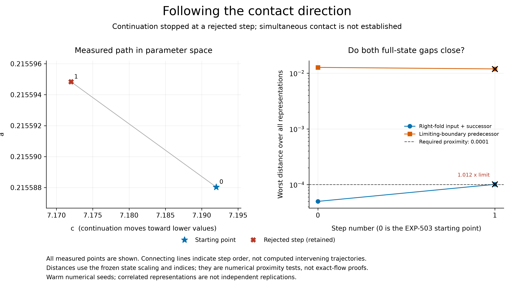

# EXP-504: follow the measured contact direction

## Current checkpoint

**The complete raw audit passes all 200 integrations. The first step is
numerically qualified but rejected because its fold distance exceeds the
unchanged proximity limit.** The other seven slots remain explicitly unrun.
No target attempt was restarted, and no failed row was removed.

| Quantity | EXP-503 start | EXP-504 measured step |
| --- | --- | --- |
| a | 0.21558803194140663 | 0.21559483661175796 |
| c | 7.192 | 7.172000000000001 |
| Worst fold input/successor distance | 0.00005007375 | 0.00010118864 |
| Worst limiting-boundary distance | 0.012701999 | 0.011925723 |
| Required distance for each contact | 0.0001 | 0.0001 |

The dominant residual fell 6.11% diagnostically, but this is **not an accepted
continuation improvement**: the fold is 1.19% outside its limit and the boundary
is still about 119 times too far away. Both original and adjacent cycle-index
checks passed, as did all four fold and eight limiting-boundary representations,
primitive six/eight counts, paired ODE checks and high-precision event audits.
The primary contact endpoint and secondary accepted-path endpoint both fail.

The combined directional prediction error passed (worst 5.46%, limit 10%), yet
its fold component predicted a decrease of 0.000001951 while the observed fold
residual **increased** by 0.000033168. The larger boundary component masks that
directional error in the combined norm. This is a concrete limitation of the
proposed continuation controller, not evidence that Jones's chains are false.
Next, restore the fold constraint at fixed c before accepting a further path
point. Use a new prospective experiment; do not relax this experiment's limit
or resume its consumed marker.

The [complete audit receipt](../experiments/receipts/EXP-504-contact-path-result.json)
has SHA-256
`83b55c0063779f85370890ff34a04a419c475a3692dc5e3567ad4376a31ec128`.
It retains all 256 variants, the rejected point and eight-slot ledger, all 26
parent candidates and the full decision. The local raw summary hash is
`f8eb916d725854a0ea62f3ba82ee07d915a816916f1f38360b8bb41657262e26`.
The target run took 668.01 seconds and retained 284 files / 1,363,017,548 bytes
before its summary. Of 200 IVPs, 176 follow the older product-count convention
and 24 are separately retained guard integrations. The full audit replayed
meshes, Decimal Taylor recurrence, Newton traces, complete prefix census and
all state comparisons; it is a local shared-code audit, not independent-team
certification. The public comparator passes without private raw files but
does not repeat that full raw audit. The figure's latest PDF was rendered and
visually checked, and the source/data/output hash verification passes.

## Execution and pre-target validation history

The target run executed at frozen source
`0657f510e2ca07939237a2a70ca681278977e14a`, live verified on both the working
branch and preserved `codex/exp504-local-execution` remote ref. The exclusive
marker SHA-256 is
`9a35855b8d378522243dc0ad7e823f9424647bb767b71f8e6ba394f357196795`.
Full raw evidence remains under artifacts/EXP-504/target-0657f51.

EXP-503 established a reproducible direction that reduced the dominant contact
gap by 5.64%, while leaving it far outside tolerance. EXP-504 now tests whether
up to eight smaller corrections can extend that improvement. The
[prospective protocol](../experiments/EXP-504-guarded-contact-continuation.md)
and [local design audit](../experiments/EXP-504-local-design-audit.md) define
the experiment before any new target trajectory is generated.

This is a directional secant continuation with warm numerical seeds, not eight
fresh two-axis derivative measurements or an independent cold-start replication.
Every step retains all 256 correlated residual variants, four fold
representations, eight boundary representations, both cycle solvers/windows,
both Decimal configurations and the unchanged full raw-data accuracy audit.
The cycle must retain its identity against both the preceding point and the
original anchor. A failed point ends the path; there is no backtracking or
replacement by a favorable earlier endpoint.

Before freeze, 68 focused tests passed, the isolated copied-source consumer
passed, and all 34 hash-bound original analytic-control files (9,701,176 bytes)
replayed without new target integrations. The first full-suite attempt retained
2,410 passes, one Linux-only skip and one new test failure: the test incorrectly
ran the production import-closure check inside the interpreter containing the
entire test suite. The test now invokes the actual isolated consumer; the
production closure restriction is unchanged. Its failed JUnit receipt is
retained under artifacts/EXP-504/pretarget-suite-01.xml.

Exact free space observed before freeze was 21,884,575,744 bytes versus a
21,474,836,480-byte admission minimum. The runner repeats admission immediately
before execution and preserves an 8 GiB floor. No data was deleted, no cloud
worker rented, no raw data uploaded and no paid model review requested.

The corrected full suite passed **2,418 tests**, with one Linux-only skip,
in 172.47 seconds; 75 focused tests also passed. Both manuscript/reference
checks passed and the staged public scan found no common credential patterns
in 2,805 files. The isolated startup passed again with the final test harness.

Before any target attempt, free space subsequently fell to 21,246,738,432 bytes,
below the draft 20 GiB admission limit. The prospective allowance was reduced
from 11 to 10 GiB and admission from 20 to 19 GiB together, preserving the
8 GiB floor and 1 GiB admission headroom. No scientific setting changed and
no target marker existed. Focused tests and isolated startup are repeated
after this resource-only change; the earlier full-suite receipt is retained.
They passed: 75 focused tests in 3.41 seconds and an isolated startup with no
target integrations. The frozen plan hash is
`a5cc08a114d1c967d6b6b22f8e7307959c7f02d7a5dc7b69af1e846ebce9774c`.

These were pre-target checkpoints; the complete audited result is now reported
above. Jones's flow-level chains remain unverified, not debunked.

## Public replay preparation during the run

The separate public comparator and path figure generator do not modify the
frozen numerical closure. Their first fixture test exposed an adapter mistake:
the compact fold summaries flatten the `qualification` object expected by the
original comparison helper. Restoring that wrapper made all ten controls pass
against the already audited EXP-503 point. Four failed first-pass tests and the
passing rerun are retained in public-controls-01.xml and public-controls-02.xml.
This is reporting-code validation, not fresh flow evidence. The public replay
reconstructs compact comparisons but explicitly does not repeat the raw meshes,
Taylor coefficients or event census audit.
