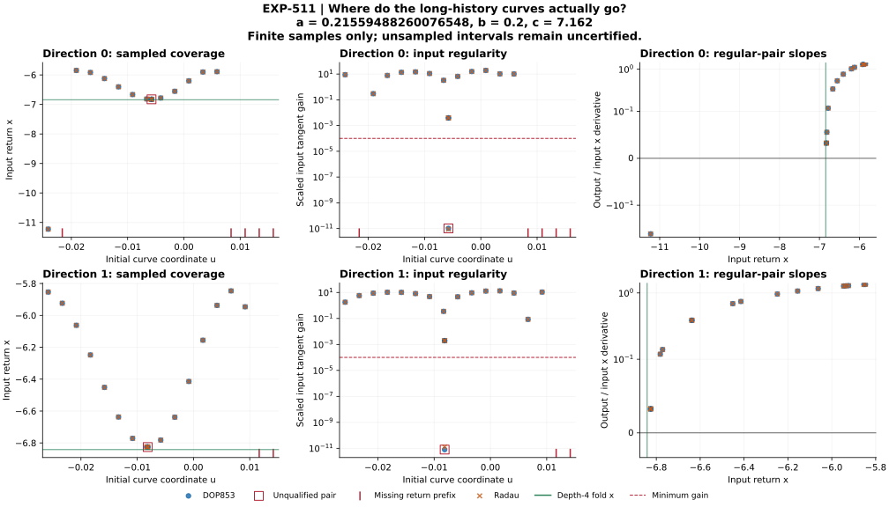

# EXP-511: test curve coverage instead of repeating Newton

## Current checkpoint

The direct-curve diagnostic completed and all 160 IVPs pass raw replay, from frozen source
`273e5f5ba6819478ad7d2372fcfdcb1423be9f53`, preserved on remote
`codex/exp511-local-execution`. The exact ref was verified live before any
target integration. The full suite passed: 2,607 tests, one Linux-only skip,
225.96 seconds. The run sampled both depth-eight
curves at the failed EXP-510 parameter, with 20 fixed nodes per curve and both
DOP853/Radau (80 profiles, at most 160 IVPs). No paid API calls or cloud workers.

The complete matrix contains 80 solver profiles, 40 paired samples and
326 files including the summary. Execution took 631.4581 seconds and retained
1,600,780,561 bytes, within the frozen 2 GiB total-output quota.

| Direction | Paired-regular samples | Near-collapsed input | Only eight returns before horizon | Qualified sampled brackets |
| --- | ---: | ---: | ---: | ---: |
| 0 | 14/20 | 1 | 5 | 0 |
| 1 | 17/20 | 1 | 2 | 0 |

Both solvers complete all integrations. Each of the seven missing-prefix
samples has eight accepted returns and no flagged uncertain extremum before
the prescribed horizon (about 55.67). This is **time-window censoring**, not
a solver crash, proof of a domain hole, or proof that a ninth return never
occurs. Whether extending the horizon supplies a qualified ninth return is
the next question. Neither a global curve-coverage failure nor an absent
physical fold follows from this grid.

The collapsed-root neighborhood samples have input x near -6.82575551,
whereas the qualified depth-four fold is near -6.84179318. At the center,
full-state scaled input distances to all four reference representations are
about 0.00164527. Neighboring graph slopes remain positive, about +0.0324286.
Direction 1's sampled inputs do not reach the target x. Direction 0 also has
an isolated negative-slope sample near x=-11.226, but its next grid sample
is censored: joining that negative slope to the later positive slopes would
invent a bracket across missing information. All unsampled cells remain
uncertified, including those with regular endpoints.



Circles and crosses are DOP853/Radau. Squares mark paired irregularity and
red baseline ticks mark missing return prefixes. Green lines locate the
depth-four fold's input x. No lines interpolate across unsampled intervals.

The distinction matters: a Newton zero with a collapsed input tangent is not
a fold. Direct sampling can reveal whether another regular part of the curve
reaches the intended fold, or whether a different finite-curve representation
is needed. A finite grid cannot prove that no such part exists between nodes.

## Verified before target exposure

- Thirty new/related target-free tests pass, including dense-data tampering,
  omitted products, solver disagreement, input turns, missing samples and
  preservation of a failed guard before the collector raises.
- Six analytic profiles (12 IVPs) pass closed-form state, time and tangent
  checks, and their saved dense polynomials replay successfully.
- An isolated startup using 119 copied source/input files passes without
  access to the local raw target artifacts.
- The full regression suite passes (2,607 tests, one Linux-only skip). The
  manuscript citation/figure check and generated symbolic control table pass.
- Earlier failures and frozen sources remain unchanged. The extracted EXP-510
  collapsed-root witness is diagnostic input, not a qualified Newton seed.

The first target-free control implementation exposed a units mismatch: its
unscaled analytic z coordinate failed the unchanged target projection gate.
The control was conjugately rescaled to z=0.01 units (k=10000) and checked
against the corresponding closed form. No target was run and no target
threshold was changed. All final analytic controls then passed.

Control summary SHA-256:
`6e7ad59ec7e39e715da2abc69d891141d8e14f3deb7ee2c1b13f96a7d2be7714`.
Collapsed-root input SHA-256:
`5b271195075b337b72b09552c5b86f707f2e68595a7f8974262a1cbce7518df9`.

## Execution and evidence contract

See the [frozen protocol](../experiments/EXP-511-direct-curve-coverage.md).
The runner defaults to validation; only explicit execution consumes the one
attempt. It retains guard/main trajectories, full dense coefficients, solver
event lists, reconstructed events and corrected tangents. The audit replays
those products and separately checks scalar distances and bracket decisions.
All raw products and the final summary share a pre-write 2 GiB quota.

The full local audit replays all 160 guard/main products and all dense
polynomial/event/measurement comparisons, with no new integrations. The
[public receipt](../experiments/receipts/EXP-511-direct-curve-coverage-result.json)
is an exact copy of that audit result (3,845,144 bytes). The public verifier
and 18 positive/tamper controls pass; compact replay recomputes event-to-curve
measurements and decisions but does not independently rerun the unavailable
raw meshes, integration counts or disk accounting. This is a same-code local
audit, not independent-team replication.

The final local suite passes 2,625 tests with one Linux-only skip (272.03
seconds). The figure was rendered and visually inspected; its full u ranges
include the censored samples rather than clipping them out of the plot.
A public replay also passes from an isolated 122-file source/input copy with
no raw-artifact directory. The first ad-hoc isolation wrapper compared a
resolved module path against macOS's unresolved `/var` symlink spelling;
canonicalizing the copy root fixes that harness assertion. Scientific code
and the public receipt are unchanged; the successful second harness receipt
is retained as `artifacts/EXP-511/public-isolated-replay-02.json`.

- Manifest SHA-256: `c6e22b10ba2d8169dbb5aaeb456cd8e97bb2b79cd23b4d6e0eb451edb5d5080f`.
- Summary SHA-256: `d6e0a98ba0abfd25eaefd8386ba026f0eaa965ed0beb404ade8f9988a9aae05f`.
- Audit/public receipt SHA-256: `245610c6116eed25f76bc775cc77be6cce66eacd4193d466a069c23b1892eb85`.
- Consumed marker SHA-256: `9160e8d45482c28d2b319ba9d364acceb95d9a130018393b95a246901b74d8e5`.

Reproduce the compact public comparison:

```sh
PYTHONPATH=.:python .venv/bin/python -B scripts/verify_exp511_public_coverage.py \
  --result docs/experiments/receipts/EXP-511-direct-curve-coverage-result.json \
  --expected-sha256 245610c6116eed25f76bc775cc77be6cce66eacd4193d466a069c23b1892eb85
```

## Next discriminating test

Freeze a bounded horizon extension for **all seven** censored samples, both
solvers, preserving their initial states, tangents, parameters and u values.
Compare every saved eight-return prefix against the extended trajectory
before admitting its ninth return into a newly labeled coverage analysis.
Retain the other 33 original samples explicitly; never relabel EXP-511 as a
successful complete-coverage study. Keep the collapsed roots rejected and
all tolerances unchanged. New opposite-sign endpoints, if found, are still
only candidate brackets until event-sheet continuity and fold regularity are
checked; no interpolation across a grazing cut is allowed.

Only after separating finite-window censoring from actual return-domain
changes should we decide between event-sheet refinement and reanchoring
finite curves at the current parameter. This avoids declaring a representation
failure while an observation-window limitation remains unresolved.

Jones's flow-level chains remain unresolved. This experiment rejects neither
Jones's paper nor the existence of the physical fold; it diagnoses limits of
our attempted identification and provides the exact inputs for the next test.
