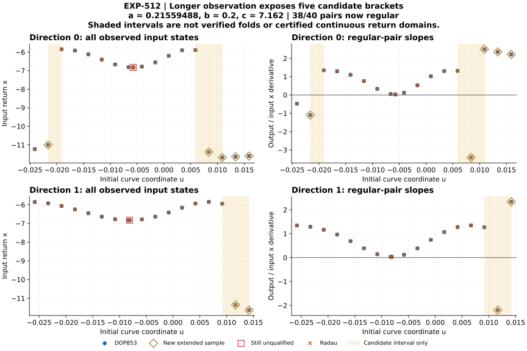

# EXP-512: resolve finite observation-window censoring

## Current checkpoint

The successor completed all 28 new integrations, and every new raw product
passes the dense-polynomial/event audit. **All seven censored ninth returns
are recovered**, while every saved eight-return state/time/raw-tangent prefix
is identical at retained precision in its same-method comparison. The new
grid has 38/40 regular pairs and five candidate sign-change intervals. The
two collapsed inputs remain rejected. None of these five intervals is yet a
verified fold or a symbolic-chain link.

The 13 target-free tests pass. An isolated
128-file source/input consumer passes, and the unchanged dense capture/replay
producers pass replay of EXP-511's six analytic profiles without new IVPs.
The full regression suite passes: 2,638 tests, one Linux-only skip, 313.88
seconds before target exposure. The branch is based on fresh
main `72883c948390539234b1f674289cff650a3f8940`, after PR #77 passed all four
final-head push/PR Python checks and merged normally.

After adding the public verifier and its tamper controls, the complete release
suite passes **2,655 tests, with one Linux-only skip**, in 349.817 seconds
(`artifacts/EXP-512/release-suite-01.xml`). The final figure was visually inspected.

The fixed selection is **all seven** EXP-511 paired samples that recorded
eight of the required nine accepted returns before the horizon, not a
selected promising subset. Increase each horizon by exactly 15 time units
and retain the complete trajectory from its unchanged initial data. Two
solvers, seven samples, guard plus main: at most 28 new IVPs. The target
remains local, with no paid API review or cloud worker.

Execution source: `1e602474ffc17f2fc15298d3fdae1663e851c47f`, preserved on
remote `codex/exp512-local-execution` and verified live before execution.
The run took 149.1208 seconds and retained 60 files including the summary,
356,437,274 bytes total, within the 512 MiB quota. All shared frozen source
files and old consumed markers remain unchanged.

Every previously recorded eight-return prefix must agree in state, time and
tangent, with no added or missing accepted event or uncertain extremum before
the old horizon. A matching prefix does not imply that the ninth return was
observed: the controller records these as separate outcomes. Failed prefix
checks prevent admission to a qualifying pair and do not delete evidence.

## Why the extension mattered

[EXP-511](2026-09-09-exp511-direct-curve-coverage.md) gave us a complete,
audited finite grid but no qualified sampled fold bracket. Seven samples
were censored by time, while two other samples reproduced the collapsed
input tangent. We must separate observation-window limitations from genuine
return-domain or finite-curve coverage changes before claiming either.

This exposes a limitation of **our diagnostic setup**: reusing the warm
root's relatively short horizon for a wider curve grid censored real returns.
The seven ninth returns occur about 0.12–6.17 time units after that cutoff.
The unchanged EXP-511 result remains correct for its declared finite window,
but it cannot be used as evidence of global lost coverage or absent returns.

| Direction | Original node | Ninth-return time, DOP853 (rounded) |
| --- | ---: | ---: |
| 0 | 1 | 55.870550 |
| 0 | 16 | 55.790764 |
| 0 | 17 | 61.564653 |
| 0 | 18 | 61.578695 |
| 0 | 19 | 61.844823 |
| 1 | 18 | 55.846976 |
| 1 | 19 | 61.662987 |

Both methods observe and qualify the required ninth returns. The maximum
same-method differences over all saved prefixes are zero for scaled state,
time and relative scaled raw tangent; this is finite-precision reproducibility,
not an exact-flow equality proof or independent-team replication.

The new diagnostic explicitly combines 33 unchanged EXP-511 samples
with seven extended samples. It does not reset or relabel EXP-511. The two
collapsed inputs remain rejected. Any new opposite-sign endpoints still need
event-sheet continuity and actual fold qualification before receiving a
critical symbol; a bracket spanning a grazing discontinuity is not a fold.

The complete new analysis exposes the following **five candidate intervals**:

| Direction | Zero-based node pair | u interval (rounded) |
| --- | --- | --- |
| 0 | [1, 2] | [-0.02161319, -0.01911319] |
| 0 | [15, 16] | [0.00588681, 0.00838681] |
| 0 | [16, 17] | [0.00838681, 0.01088681] |
| 1 | [17, 18] | [0.00918278, 0.01168278] |
| 1 | [18, 19] | [0.01168278, 0.01418278] |

These are not necessarily five distinct physical objects. Different upstream
preimages can reach the same physical fold; other sign changes can instead
straddle return-domain discontinuities. No curve interpolation or critical
symbol assignment is licensed by the endpoint signs alone.



Diamonds identify the seven newly extended samples, squares the unchanged
collapsed inputs, and shaded cells the candidate intervals. The plot contains
the complete explicitly mixed-provenance grid, not a selected successful subset.

## Evidence contract and next action

See the [prospective protocol](../experiments/EXP-512-censored-return-extension.md).
Limits are 28 IVPs, 900 seconds and 512 MiB total output, including final
summary. Initial/continuing free-space requirements are 9/8 GiB, with a
1 MiB failure reserve and exclusive one-attempt marker. Every new guard/main
mesh and main dense polynomial is retained and must pass raw replay.

Manifest SHA-256: `bb37c10e80f31745425c6fe8cc5ba9e8ab967ff553a64bbe21f9e4cc7739aa84`.
The source closure contains 117 paths; the actual copied consumer uses 128
source/input files. Preflight startup and control replay receipts are in
`artifacts/EXP-512/`.

The [public receipt](../experiments/receipts/EXP-512-censored-return-extension-result.json)
is an exact copy of the local audit (4,990,921 bytes). New dense products are
fully replayed locally; old EXP-511 inputs are reused from its authenticated
compact receipt, not subjected to another 160-IVP raw audit. The public
verifier replays the new prefix/measurement and complete-grid decisions but
does not repeat either raw audit. Its 17 integration/tamper controls pass;
unit mutation tests authenticate unchanged historical inputs once, while a
separate real-I/O integration test checks the complete public dependency path.

- Summary SHA-256: `ad438ce81d51aeb2525b6643850683abb9dba8144bc0d037589635db6d61d948`.
- Audit/public receipt SHA-256: `c89bb30f90bf26a4f4902e349459b234201a66b00d3d2b4a500d6849fdb96e76`.
- Consumed marker SHA-256: `472b888b216b7cb578a9c5a4ce1e7da16b6306d3969e36e279a8624e4490760b`.

```sh
PYTHONPATH=.:python .venv/bin/python -B scripts/verify_exp512_public_extension.py \
  --result docs/experiments/receipts/EXP-512-censored-return-extension-result.json \
  --expected-sha256 c89bb30f90bf26a4f4902e349459b234201a66b00d3d2b4a500d6849fdb96e76
```

## Next substantive experiment

Freeze regular-fold localization and event-sheet discrimination for **all five**
candidate intervals, both solvers, with the unchanged transversality, event
ordinal/time, gain, input-coordinate and curvature checks. Compare any
qualified roots in full state with all four depth-four references at this
same parameter. Retain unsuccessful candidates, domain cuts and distinct
preimages explicitly; do not warm-start from the rejected collapsed roots or
declare a physical fold from a numerator equation alone.

If the required fold representations are recovered, resume the constrained
joint-contact research prospectively. A fold-only result still is not a joint
point, generating partition or p-to-p+1 arrow. Jones's chains remain unresolved.

The existing same-task continuation remains active at its 30-minute interval
and now targets this five-candidate follow-up, retaining per-call human
approval for paid reviews. This uses the documented
[heartbeat handoff pattern with human gates](https://developers.openai.com/cookbook/examples/agents_sdk/agent_improvement_loop#step-9-close-the-loop),
not a new standalone task or a paid review loop.
