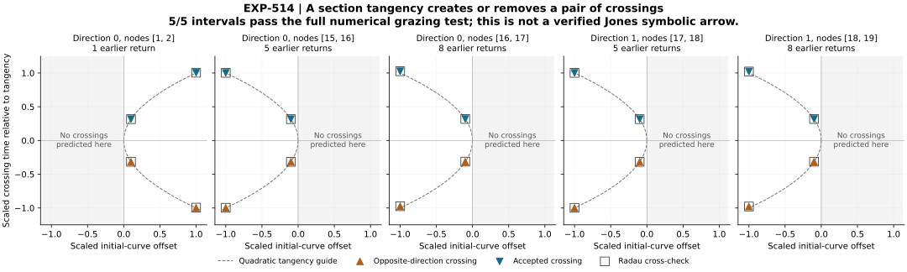

# EXP-514: distinguish section grazing from projected folds

## Completed result

**All five candidates pass the full numerical grazing test and raw audit.**
The complete batch retains 120 target IVPs: forty fixed-time shooting
integrations and eighty guard/main side-census integrations. Both solvers
converge in every candidate; every prescribed signed perturbation is retained.
All local birth/death counts, accepted prefixes, square-root separation ratios
and full-horizon paired event comparisons pass. No candidate is dropped.

This identifies a concrete reason these endpoint sign changes are not reliable
smooth-fold brackets: a section tangency changes the counted return sequence
inside each interval. It does **not** establish that no additional smooth fold
occurs anywhere in those intervals. Nor does it restore the missing depth-eight
fold representations, identify Jones's C/D symbols, or verify a symbolic arrow.
The result strengthens the diagnosis of **our reconstruction**, not a claim
that Jones's chain is verified or debunked.



The triangles are measured crossings; open squares show the second solver.
The dashed curves are quadratic tangency guides, not additional integrated
observations. Each panel uses its measured unfolding and curvature to scale
the initial-curve offset and crossing time. The earlier-return counts are
history prefixes, **not primitive periodic-orbit periods**.
This is crossing time versus initial-curve offset, not a plot of the return map.

Across the ten solver/candidate profiles, the measured separation ratio is
3.1623435–3.1631496, close to the predicted square root of ten. The five
upstream representations cluster near the same physical grazing state; their
post-result scaled state diameter is 1.50344e-8 using [15,15,.01]. This is a
descriptive comparison across all ten roots, not five independent discoveries
or an exact-identity theorem.

## Frozen execution and audited evidence

Frozen source `c1fdf14749a28d5c907b4263c1a9dac935a69c3a` is pushed and
preserved at `codex/exp514-local-execution`. The runtime live-verified that
exact ref and passed its isolated consumer and retained analytic controls
before consuming the one-shot marker. Complete target evidence is retained in
`artifacts/EXP-514/target-c1fdf14`.

Plan SHA-256:
`791b2b6d623f27134bbaacf66ef20f072fad7a74f7fd6b52e85087be96e0daf9`.
The runtime completed in 557.3560 seconds. All 229 files including the summary
occupy 1,104,405,337 bytes, within the 2 GiB cap. The separately retained
execution controls used 24 analytic IVPs; these are not target integrations.

Summary SHA-256:
`5b779fb39c8d8a942d744af920429f3d26a36088bf13ab64418573701efe2ed9`.
The [public audit receipt](../experiments/receipts/EXP-514-candidate-grazing-boundaries-result.json)
is an exact 2,557,658-byte copy of the full local audit, SHA-256
`825b6298900cf644b5b1e6e6b433c1e42bf3e791af8f0d89d90fd2ebc977d4bc`.

```sh
PYTHONPATH=.:python .venv/bin/python -B scripts/verify_exp514_public_grazing.py \
  --result docs/experiments/receipts/EXP-514-candidate-grazing-boundaries-result.json \
  --expected-sha256 825b6298900cf644b5b1e6e6b433c1e42bf3e791af8f0d89d90fd2ebc977d4bc
```

The local audit replays all new shooting meshes with separately coded Rössler
grazing algebra and every side's dense polynomials, guard and event census.
It also replays the analytic controls and complete decision/accounting matrix.
This is a same-agent numerical audit, not independent-team replication or an
exact-flow proof. The public verifier replays compact algebra, events and
decisions; it does **not** repeat the raw-mesh/control/disk audit. Raw files
remain local. No paid review, new worker or raw upload was used.

The nineteen public replay/tamper tests pass in 64.36 seconds. A fresh
**161-file public consumer passes** under isolated Python without any raw
artifact directory; every project import resolves inside its copied source
tree. Its receipt is `artifacts/EXP-514/public-isolated-replay-01.json`.
The figure has SVG/PDF/300-DPI PNG versions with per-figure data/provenance
metadata and a receipt index. The final preview was visually inspected.
The complete release regression suite passes **2,719 tests, one Linux-only
skip**, in 549.92 seconds (`artifacts/EXP-514/release-suite-01.xml`). Exact
regeneration matches the published SVG, PDF, PNG and figure receipt byte for
byte, with all forty plotted crossing observations retained. Figure metadata,
source/output hashes and receipt index pass. All 146 frozen execution sources,
the raw inventory, summary and consumed marker remain unchanged. The
pre-target validation record below is kept separately.

## Next substantive action

Do not repeat these five searches as if they were still unclassified fold
brackets. Reconstruct event-consistent input-curve coverage near the known
depth-four fold reference, retaining the complete depth/direction contrast.
The saved depth-eight samples are closest to that reference at their collapsed
input-curve tips, but do not reach it. Distinguish finite-image support limits
from numerical conditioning before changing the representation or continuing
the parameter path; a new representation needs a prospective protocol and
its own qualification. Neither a tighter Newton seed nor a lower gain
threshold establishes missing physical coverage.

In particular, following a fixed upstream curve as parameters change can lose
coverage even when a separately observed downstream fold persists. That is a
testable representation-level explanation, not a demonstrated global
bifurcation. Any reference-guided recentering is **calibration**, not an
independent confirmation of the reference it was designed to match. Require
separate curve directions and held-out observations before claiming improved
history independence; do not build the desired agreement into the test.

Only recovered qualified fold representations can support renewed combined
fold/boundary membership on the primitive periodic family. That membership,
an operational C/D dictionary and an actual p-to-p+1 family connection remain
the central unfinished chain test.

## Preserved nomination evidence

The five failed EXP-513 fold searches are not evidence of root absence.
Read-only diagnostics of the saved EXP-512 endpoints and EXP-513 midpoints
identify a concrete alternative: **each surviving sign-change half contains
one aligned extremum changing sides of the section plane**. Both solvers agree
on the extremum ordinal and the preceding accepted-return count.

| Direction | Original nodes | Extremum index (zero based) | Accepted returns before candidate |
| --- | --- | ---: | ---: |
| 0 | [1,2] | 3 | 1 |
| 0 | [15,16] | 11 | 5 |
| 0 | [16,17] | 19 | 8 |
| 1 | [17,18] | 11 | 5 |
| 1 | [18,19] | 19 | 8 |

These are **nominations from old observations**, not new integrated roots or
grazing certificates. The derivation is checked in, preserves all five cases,
and rejects ambiguous alignment instead of selecting a favorable extremum.

## Preserved pre-target design

The [EXP-514 protocol](../experiments/EXP-514-candidate-grazing-boundaries.md)
directly solves the section-tangency equations and then tests the two-sided
birth/death of crossings at four signed offsets. It reuses the validated
grazing equations and thresholds from EXP-492, but retains every new side's
full dense census, guard mesh and all accepted returns over the EXP-513 horizon.
The controller and audit were implemented and validated before the freeze
and any target integration, as recorded below.

This refines the previously proposed event-aware search: there is already
enough endpoint evidence to nominate the grazing equation directly. It does
**not** claim to implement safeguarded bisection. Its Newton step is bounded;
an out-of-box proposal remains a retained failure, not a reason to enlarge the
box. No root, fold, Jones symbol or arrow was established at this pre-target
checkpoint; the later numerical grazing result is reported separately above.

Local analytic positive/negative controls exercise the combined producer.
The prospective cap is 160 target IVPs, 3,600 seconds and 2 GiB including the
summary. No paid review, new worker or raw upload is requested. All earlier
failed attempts, frozen sources and raw products remain intact.

## Preserved pre-target checks

EXP-513 merged normally through PR #79 at
`e678aff6d477dc4d43f00eeb98047db41c792270` after all four final-head CI jobs
passed. EXP-514 continues on a new branch from that main commit.

All 12 initial target-free tests passed. The real combined analytic control
producer then passed **24 integrations**, retaining every mesh and side
census in `artifacts/EXP-514/preflight-controls-01`.

The first isolated consumer failed because the source allowlist omitted the
EXP-492 numerical manifest read by the new plan builder. The failed isolated
tree remains intact. The missing manifest is now explicitly included, with a
regression assertion. No target was accessed or attempt marker consumed. The
obsolete full-suite run was deliberately interrupted after 941 passing tests;
its partial XML is preserved and is **not** claimed as a complete pass.
The corrected **159-file isolated consumer passes**, with its complete receipt
in `artifacts/EXP-514/preflight-startup-02.json`. The final pre-target full suite
passes **2,700 tests, one Linux-only skip**, in 481.14 seconds
(`preflight-suite-02.xml`). The staged public scan passes on 2,915 files;
manuscript citation/figure checks and the symbolic control table also pass.

The local design audit distinguishes a tangency of the chosen section from
a smooth projected-map critical point. It requires all four signed side inputs
at a common paired-root center and the full-horizon event comparison, retains
all five intervals, and forbids promoting a qualified tangency to an absence
claim about other folds. The changed nomination equation is disclosed rather
than described as a rerun of EXP-513. This is a same-agent local audit, not an
external or paid review. The source is ready for the pre-target Git freeze.
