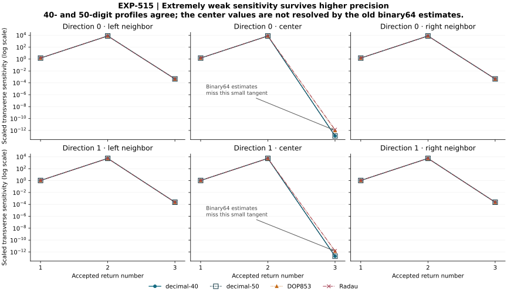

# EXP-515: test the sensitivity loss at its first occurrence

## Completed result

**All twelve target IVPs pass the complete raw audit. All eighteen paired
return sensitivities are resolved by the frozen numerical comparison.**
Both higher-precision configurations agree at every input and all three
return ordinals; complete event classifications, time/state parity and
root-box sensitivity checks pass.

The result separates two effects that the old binary64 data could not:

- The very small transverse tangent persists at higher precision. At the two
  center inputs, the third-return scaled norms are approximately
  **1.20749e-13** and **1.94719e-13**, not zero.
- Both old solvers fail the new 1% vector-comparison diagnostic at those
  centers. Their scaled vector errors are **8.00–10.36 times** the
  higher-precision norm. They reproduce the neighboring tangents and the
  first two returns well, while all old/new event time/state comparisons pass.

There are four distinct failing old derivative vectors (two inputs times two
solvers), not eight independent failures. Comparing each against both decimal
profiles gives eight failures among 72 comparison rows. The other 64 pass.
The eighteen paired decimal comparisons and these historical comparisons
are deterministic numerical checks, not independent statistical samples.



The figure retains all 72 norm observations. Higher-precision curves overlap;
symbols and line styles distinguish the profiles. Lines guide the eye between
return ordinals, not between sampled continuous times. No confidence interval
or rigorous ODE error bound is implied.

This is evidence for a genuinely tiny **numerically resolved derivative at
the specified inputs**, together with inaccurate old binary64 estimates there.
It is not evidence for an exactly zero derivative, a singular flow, uniform
contraction of an entire neighborhood or disappearance of the physical fold.
The derivative is smaller, not large enough to rescue the historical 1e-4
gain gate. The rejected depth-eight representation stays rejected. Jones's
C/D symbols, primitive-family membership and symbolic arrows remain unverified.

## Evidence and release

Frozen source `bee18f1cf6f19f0b908521ba99a314349fc9bc59` was live-verified on
`codex/exp515-local-execution` before the marker at
2026-09-10T10:06:52.214718Z. The target run completed in 21.1193 seconds,
retaining 58 files including its summary and **76,074,520 bytes**. All twelve
execution control IVPs passed separately. No target or control was dropped.

Plan SHA-256:
`f5ff3cf15c98bfd9fa2f72e032f264a536efe958347152c3b0344b8932796243`.
Summary SHA-256:
`85bd91bc9334f951d2d4b2285f7a6683264e56cd936a3bd0c898133ab614d57b`.
The raw target archive is `artifacts/EXP-515/target-bee18f1`; it remains local.

The [public audit receipt](../experiments/receipts/EXP-515-third-return-precision-result.json)
is an exact 342,649-byte copy of `primary-audit-01.json`, SHA-256
`b924000f8abac6c68bd600b63a842cd36d1ed9b4e2d96c0e7938b8425aa963e5`.
The full local audit checks every Taylor coefficient recurrence, verifies
every polynomial root certificate, replays the analytic controls and all
decisions, and separately evaluates the determinant-form tangent correction.
It is a same-agent audit, not independent-team replication.

```sh
PYTHONPATH=.:python .venv/bin/python -B scripts/verify_exp515_public_precision.py \
  --result docs/experiments/receipts/EXP-515-third-return-precision-result.json \
  --expected-sha256 b924000f8abac6c68bd600b63a842cd36d1ed9b4e2d96c0e7938b8425aa963e5
```

The public replay checks compact event algebra and the complete comparison
matrix. It does **not** repeat the unavailable raw-coefficient, root-certificate,
control-archive or storage audit. All sixteen initial public/tamper/isolation
tests pass, including a fresh 37-file consumer without the raw artifact
directory. The final PNG was visually inspected. Exact regeneration matches
the published SVG, PDF, 300-DPI PNG, figure receipt and index byte for byte.
Figure source/output hashes and provenance metadata pass. All 34 frozen
source files, the target raw inventory, summary and consumed marker remain
unchanged (`artifacts/EXP-515/release-recheck-01.json`). The complete final
regression suite passes **2,752 tests with one Linux-only skip** in 542.51
seconds (`release-suite-01.xml`). The staged public scan passes on 2,940 files;
manuscript citations/figure availability and the symbolic control-table check
also pass.

## Next substantive action

Do not repeat the binary64 center refinement or lower its gain threshold.
The higher-precision result removes that ambiguity but does not recover
missing input-curve coverage. Next use the resolved early-return geometry
to test an event-consistent, well-conditioned curve reconstruction around
the depth-four reference. Preserve both history depths and directions;
any reference-guided recentering is calibration and needs held-out validation.
A mere reparameterization cannot manufacture physical states outside the
original image's support. Qualify coverage and fold geometry before resuming
the joint fold/boundary/primitive-cycle contact test.

## Preserved pre-target motivation

EXP-514 is merged through [PR #80](https://github.com/tdj28/butterfly/pull/80)
at `1aaf32e041b02a26bf1804682b1a97fd66cae9ad`, after all four exact-head
Python 3.12/3.13 checks passed. Its five numerically qualified grazing
representations must not be recycled as unexplained smooth-fold brackets.

The remaining issue is the near-collapsed transported curve. The saved data
locate its first tiny event-corrected sensitivity at the third return, well
before the eighth-return rejection. Subtracting the flow-direction component
can be ill-conditioned, but the subtraction formula is mathematically correct;
that observation does not itself establish a bug, a true zero, or the accuracy
of a tiny nonzero result.

The [prospective EXP-515 protocol](../experiments/EXP-515-third-return-precision.md)
therefore keeps all six center/neighbor initial conditions in both directions,
compares the existing two higher-precision Taylor configurations, and retains
both historical solver comparators. It needs twelve target integrations, not
twenty-four duplicated solves. Exact binary64-realized inputs and the existing
binary64 section are carried into Decimal without silently changing the IVPs.

The main measurements are the complete event-corrected tangent, its
root-box sensitivity and paired relative error at each of the first three
returns. A tolerance larger than the tangent cannot label it resolved.
The historical gain threshold is unchanged. The strongest positive outcome is
a precision-consistent small nonzero tangent at these inputs, not a verified
Jones symbol or chain. Agreement of two numerical profiles is not an exact
ODE error enclosure or independent-team replication.

## Preserved pre-target validation

The runtime, complete-polynomial census adapter, scalar raw auditor and
analytic controls are implemented. The controls include ordinary sensitivity,
pure phase sensitivity, a tiny transverse remainder, and roots on both sides
of the initial exclusion cutoff. They use the actual compressed archive,
quota-admission and event-analysis paths.

The first test run passed twelve cases and failed four because control input
strings used lowercase scientific notation while Decimal's archive producer
canonicalized them to uppercase. The first retained control run stopped on the
same exact-byte discrepancy after five control IVPs. No target IVP or attempt
marker existed. The control builder now emits canonical Decimal strings;
the strict raw-input comparison was not weakened. Failed XML and partial
control products remain in `artifacts/EXP-515/preflight-tests-01.xml` and
`preflight-controls-01/`.

The corrected **17 focused tests pass**. All **12 actual analytic control
IVPs pass** their known identities, full raw recurrence audit and independent
polynomial-certificate replay, retained in `preflight-controls-02/`.
A fresh **35-file isolated consumer passes** under `python -I -B`, with no
ambient checkout or bytecode; its receipt is `preflight-startup-02.json`.
Full regression passes **2,736 tests with one Linux-only skip** in 538.84
seconds (`preflight-suite-01.xml`). The staged public scan passes on 2,931
files, and manuscript citation/figure checks plus the symbolic control-table
check pass. No target outcome is claimed at this pre-freeze checkpoint.

## Preserved design audit and pre-execution handoff

The local audit explicitly rejects these shortcuts: changing the section while
claiming only a precision change, treating two old solver labels as distinct
initial conditions, projecting at a float-rounded event time, trusting only
the x component, using a large absolute tolerance to resolve a small tangent,
and dropping a failed return ordinal. The paired profiles differ in precision,
order and step together, so their contrast is not a precision-only causal test.
The separately coded coefficient recurrence and determinant-form projection
supplement, but do not replace, the shared integrator/census limitations.

Raw data remain local. No paid review, new worker or raw upload is used.
The next action at this pre-execution checkpoint was to freeze and live-verify
the tested source, execute the
complete twelve-IVP matrix once, audit every retained product and publish the
result whether it resolves the sensitivity or leaves it unresolved.
