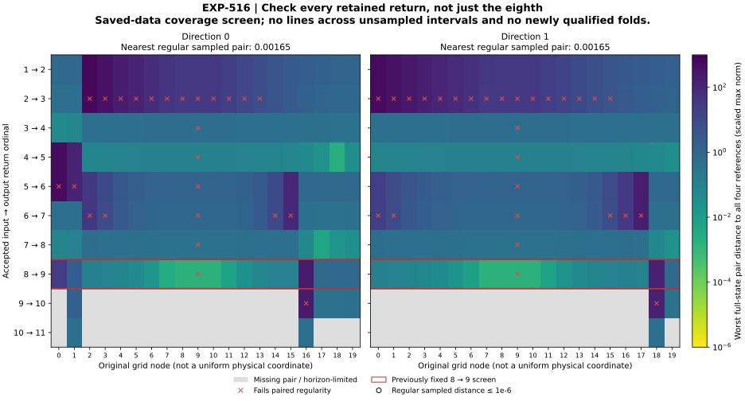

# EXP-516: search every saved return before rebuilding the curves

## What changed scientifically

**The missing reference is not recovered merely by changing the return number
at the saved sample points.** The complete saved-data audit covers 80 solver
profiles, 740 accepted events and all 660 consecutive pairs. All 40 old
eighth-return regularity decisions remain unchanged.

Across both directions there are 400 node/ordinal cells: 330 have both solver
pairs, 70 are horizon-limited or missing, and 277 pass the paired regularity
screen. None approaches all four depth-four input/output references within
the unchanged 1e-6 full-state threshold. The nearest regular sampled pair is
still at the eighth return, about 0.00164527 away in scaled max norm—roughly
1,645 times that threshold. This is a finite-grid result, not proof that the
continuous curve lacks the fold.

The useful new lead is **two previously untested endpoint sign changes** on
earlier returns. Both occur in direction 0:

| Input → output return | Original nodes | Endpoint slopes | Largest endpoint time jump |
| --- | --- | --- | --- |
| 4 → 5 | 17–18 | +0.44930, −0.04621 | 0.08012 |
| 7 → 8 | 18–19 | −0.43534, +0.53116 | 0.22272 |

Both have well-conditioned endpoints and bracket the reference's input x
coordinate. That does **not** locate a full-state root, establish continuity
inside either cell or identify C/D. They are leads for direct tests between
samples, not newly recovered folds.

The full screen contains eleven endpoint-only candidate cells. Five are the
old eighth-return candidates. Four of the six additional cells reuse u
intervals in which EXP-514 already localized a grazing before or at the
relevant output ordinal. The two cells above are the remaining untested
intervals. The complete receipt retains all eleven; the other nine have not
been erased or declared free of additional smooth roots.



Color is the worst distance across both full-state endpoints, both solvers
and all four references. Crosses retain regularity failures. Gray cells are
missing, not zero distance. Return ordinals are not assumed to label the same
physical segment across a grazing. No lines connect unsampled interiors.

## Why we did this

The source-lineage check confirms that the original EXP-486 x/z anchors and
initial directions were retained as parameters moved from a=.21575, c=7.212
to a=.21559488260076548, c=7.162000000000001 (b=.2 throughout). Only the
section y offset changed. That is a limitation to investigate, not proof of
a code defect: a fixed initial curve remains a legitimate test object.

EXP-514 showed that grazing changes the number of accepted returns. EXP-515
then resolved the extremely small derivative at the old center. Together
they motivated checking every retained ordinal before paying for more
trajectories or rescaling a curve that might not cover the required states.
This was designed after those outcomes were known and is explicitly a
post-result diagnostic, not a fresh confirmation of Jones's claim.

For Jones, the conclusion remains: **the symbolic chains are neither
independently verified nor debunked.** We have narrowed a reconstruction
problem and found two concrete new test locations. A failure of the fixed
eighth-return representation is not a counterexample to the physical chain.

## Reproducibility and checks

Source `94e1aaa64dff7ee7bbc3b34e35e09d6bdfff2859` was pushed and live-verified
on `codex/exp516-local-execution` before the exclusive attempt marker. The
complete local suite passed **2,775 tests with one Linux-only skip** before
execution; 23 of these test the new analytic diagnostic and isolated CLI.
This experiment performs **zero new integrations and zero paid calls**.

The [complete public result](../experiments/receipts/EXP-516-event-ordinal-coverage-result.json)
is an exact 4,856,339-byte copy of the saved result, SHA-256
`45b8dd88ee0cab27d4eba7ec4c4891afdd6948ddaa83c110017ed26ac012a445`.
The [separate audit](../experiments/receipts/EXP-516-event-ordinal-coverage-audit.json)
checks complete event/pair counts, all 5,280 full-state reference distances,
terminal censoring, a separately evaluated event-correction formula and the
unchanged historical decisions. This is same-agent saved-event auditing,
not independent integration or another audit of the older local raw archives.
In particular, agreeing correction formulas do not resolve the inaccurate
binary64 center sensitivities identified by EXP-515.

```sh
.venv/bin/python -B scripts/exp516_ordinal_coverage.py \
  --verify docs/experiments/receipts/EXP-516-event-ordinal-coverage-result.json \
  --expected-sha256 45b8dd88ee0cab27d4eba7ec4c4891afdd6948ddaa83c110017ed26ac012a445
```

The public replay requires only the tracked code and receipts, not `.env`,
raw artifacts, a GPU, an API account or an external data server. The generator
retains the complete 400-cell plotted matrix and hashes its SVG/PDF/PNG outputs.
All **41 focused release tests** pass, including eighteen public replay,
tamper and plot-matrix tests. A fresh nine-file consumer reproduces the result
without the raw directory or numerical integration libraries. The inspected
PNG is legible; SVG, PDF, PNG, figure receipt and index regenerate exactly.
Manuscript citation/figure availability, the symbolic control table and diff
whitespace checks pass. No frozen EXP-516 source or earlier experiment was
modified after execution.

## Next execution

Directly test the two unclassified earlier-return cells with event-aware,
bounded fold refinement, both solvers, full-state reference comparisons and
the original gain/projection/curvature/transversality thresholds. Extend the
other initial direction prospectively using an explicit input-coordinate
mapping, not a word-matching search or a favorable root selected afterward.
Keep earlier-return recovery distinct from restoring the rejected original
eighth-return curve. The depth/direction controls and eventual held-out
dictionary/primitive-family tests remain necessary for a Jones arrow.
