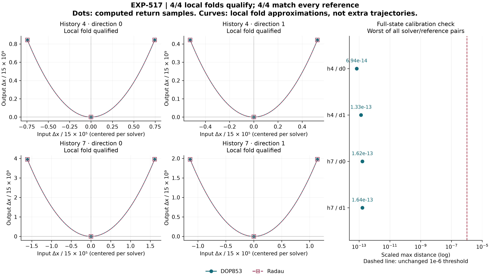

# EXP-517: test the two new fold leads in both directions

## Completed result: the same local fold recovered in all four cases

**All four representations qualify and restore every full-state reference.**
Histories four and seven, each with both original initial directions, recover
the same local scalar minimum. Both DOP853 and Radau pass every unchanged
gain, projection, angle, curvature, finite-difference, full-prefix and
state/time gate. All 108 target integrations pass the local raw audit.

This is a useful positive result for a local ingredient of Jones's picture:
our failed eighth-return construction did not establish absence of the fold.
It is not a verification of the C/D dictionary, a generating partition,
primitive-cycle membership or a symbolic-chain arrow. The original
eighth-return representation remains failed. The four representations locate
one physical object, not four independent discoveries.

| History | Direction | Qualified / solvers | Worst scaled full-state reference distance |
| --- | --- | --- | --- |
| 4 | 0 | 2 / 2 | 6.94e-14 |
| 4 | 1 | 2 / 2 | 1.33e-13 |
| 7 | 0 | 2 / 2 | 1.62e-13 |
| 7 | 1 | 2 / 2 | 1.64e-13 |

The maximum spread among all eight input/output solver profiles is
**1.556046957951196e-13**, against the unchanged **1e-6** threshold with
scales `[15,15,.01]`. Input gains range from 9.65 to 29.54 (minimum 1e-4);
normalized input-x components are about .545 (minimum .001). Curvature is
positive, about 30.4779. These are deterministic numerical agreements,
not rigorous error bounds or evidence of thirteen-digit accuracy.
Matching an exposed reference is calibration, not a held-out word prediction.



The figure uses all 24 prescribed local samples. Lines are local fold
approximations, not extra trajectories. Per-solver centering is only for
display; the right panel separately compares uncentered full states against
all four reference pairs. Raw shooting/census replay and the compact public
replay have different scopes: the public receipt cannot replace unavailable
raw meshes, census polynomials, control bundles or disk-inventory checks.

### Immutable execution and evidence

- Frozen source: `147964cb89c5ac2611b8b2ab5aa24640ad9f85ea`, preserved remotely
  as `codex/exp517-local-execution` before execution.
- Plan SHA-256: `ce708cfe1cb99e58599949013c74e57cb0d804855cd89e6f09de40fc0828cfe3`.
- Exclusive marker: `artifacts/EXP-517/target-once.json`; start
  `2026-09-10T11:58:01.677171+00:00`. No reset or repeated target run.
- Raw directory: `artifacts/EXP-517/target-147964c`; 152 files including
  summary, 459,379,008 bytes, 533.19 seconds, 108 / 128 allowed target IVPs.
- Summary SHA-256: `ead1c828c64e26360b87d8649ba2606821af96f8e08239b745aa6d622123ed90`.
- [Public audit receipt](../experiments/receipts/EXP-517-earlier-return-folds-result.json):
  1,459,138 bytes, SHA-256
  `0c1233986f4ac6463d8ded47ce0a92353a98a86a889089a3f2bafe78742adf76`,
  identical to local `artifacts/EXP-517/primary-audit-01.json`.
- No paid Pro request, GPU job, new cycle/boundary calculation or raw upload.

Public replay (source checkout plus declared public inputs, no target IVPs):

```sh
PYTHONPATH=.:python .venv/bin/python -B scripts/verify_exp517_public_folds.py \
  --result docs/experiments/receipts/EXP-517-earlier-return-folds-result.json \
  --expected-sha256 0c1233986f4ac6463d8ded47ce0a92353a98a86a889089a3f2bafe78742adf76
```

### Next scientific step

Prospectively transport the four newly qualified constructions to the two
remaining fixed EXP-510 parameter substeps, retaining complete solver matrices,
all event/regularity gates, cross-representation agreement and adjacent-state
identity. This tests new representations prospectively, not a retrospective
pass of EXP-510 or fully blind parameter validation: the final endpoint was
already exposed in EXP-508/509 using the old representations. Only a qualified endpoint can support the subsequent fold/cycle
contact comparison and resumed joint continuation. Operational critical
symbols and a primitive-family chain arrow remain separate requirements.

### Public release checks

All **59 focused tests pass** (`artifacts/EXP-517/release-focused-02.xml`):
the twenty frozen analytic controls, twenty-eight public replay/mutation/
isolated-consumer tests, and eleven figure controls. The public consumer
replays from a fresh **145-file** source/input copy with no raw `artifacts`
directory or bytecode. Semantic mutation tests also reject nonfinite values
before arithmetic comparisons; this post-result verifier hardening does not
alter the frozen numerical source or target evidence.

The final figure and its receipts regenerate byte-for-byte in
`figure-03` and `figure-replay-03`. Its PNG/SVG/PDF image bytes are unchanged
from the visually reviewed `figure-02`; the later receipt adds the final
verifier provenance. All 128 frozen source paths still match the execution
marker. The manuscript builds to 74 pages with 37 figures, blank author
metadata, no LaTeX warnings, and visually checked changed result/figure/
discussion pages. The local PDF was rebuilt, not published as a new release.
All 25 cited keys and 24 required references pass the citation checker.

The full post-result regression suite and final-head remote checks are
additional merge gates; their completion is not inferred from these focused
tests. The preflight full-suite result is recorded separately below.

The pre-target checkpoint below is preserved as historical evidence; its
future-tense execution instructions are superseded by the completed result.

## Prospective execution checkpoint

EXP-516 was normally squash-merged through PR #82 after all four final-head
Python 3.12/3.13 checks passed. Main is
`7116df03db3361afb9f09e1f56395637dd5bf470`; the merge occurred at
2026-09-10T11:53:57Z. Its complete saved-data screen found two
earlier-return cells worth direct testing after retaining all eleven
sign-change nominations and the nine known-grazing classifications.
The [EXP-517 protocol](../experiments/EXP-517-earlier-return-folds.md) now
defines the numerical test; no target result is claimed by this checkpoint.

The four fixed representations are:

| Input history | Initial direction | Fixed u interval |
| --- | --- | --- |
| 4 | 0 | [0.010886807025298047, 0.013386807025298042] |
| 4 | 1 | [0.015396270146115155, 0.018931804052047942] |
| 7 | 0 | [0.013386807025298042, 0.015886807025298044] |
| 7 | 1 | [0.018931804052047942, 0.022467337957980647] |

The second direction's intervals come from matching the first direction's
initial x endpoints on its original affine curve. They are new extensions
of that direction's saved grid, not intervals selected after observing new
trajectories. The z coordinate is not fitted to the reference or a desired
word. Histories four and seven are named explicitly: neither is a pass of
the rejected eighth-return test.

Each candidate gets both solvers, a paired midpoint census, the unchanged
bounded Newton corrector and the complete three-offset fold qualification.
Every full-state input and output must agree with all four existing
depth-four references. The all-four verdict additionally requires all eight
solver representations to agree within 1e-6. Existing gain, projection,
transversality and curvature thresholds remain unchanged. A successful result
would restore a local calibration reference, not verify Jones's C/D dictionary,
primitive-family membership or a chain arrow.

## Checked before target execution

- Sixteen new analytic tests pass in a fresh isolated copy. They cover the
  complete nomination ledger, mapped inputs, both histories and directions,
  missing/failed solver and reference cases, and continuation after failure.
  Four additional checks now explicitly exercise output ordinals five and
  eight and rejection of an earlier prefix disagreement; all twenty focused
  tests pass in `preflight-tests-02.xml`.
- The actual prepare/validate/startup commands pass in that isolated copy:
  **128 source paths, 21 input bindings, 143 unique deployed files**, with no
  raw archive or new target integration required for startup.
- The retained analytic dense-census and fold control bundles replay through
  the unchanged implementations. Receipt:
  `artifacts/EXP-517/preflight-controls-01.json`, SHA-256
  `364823e4ddb92e98b05d3bea2cd3f184e49b0f0e0c8efd71bb79d056b2d8a6ce`.
  These are audits of existing controls, not new control IVPs.

The first standalone control-audit invocation ran before concurrent plan
preparation had finished and raised `FileNotFoundError` without any IVP or
target marker. After the plan was present and validated, the same read-only
control audit completed. No consumed experiment was reset or retried.

The complete local regression run passes **2,809 tests with one Linux-only
skip** (`preflight-suite-01.xml`). The four additional ordinal-prefix tests
were added after that suite collected its tests and pass in the separate
twenty-test run. The final 143-file isolated deployment is checked again in
`preflight-startup-02.json`; every deployed source/input hash still matches.
Manuscript citations/figures, the symbolic control table and whitespace
checks pass. Freeze/live-push and the exclusive target marker are still
required before new trajectories. The cap is 128 target IVPs, 2 GiB including the summary,
3600 seconds, an 11-GiB initial free-space requirement and an 8-GiB continuing
floor. Raw products stay local. No paid review, GPU job or external upload is
needed. The existing source-derived symbolic diagram remains labeled as
historical, not independently reproduced.
