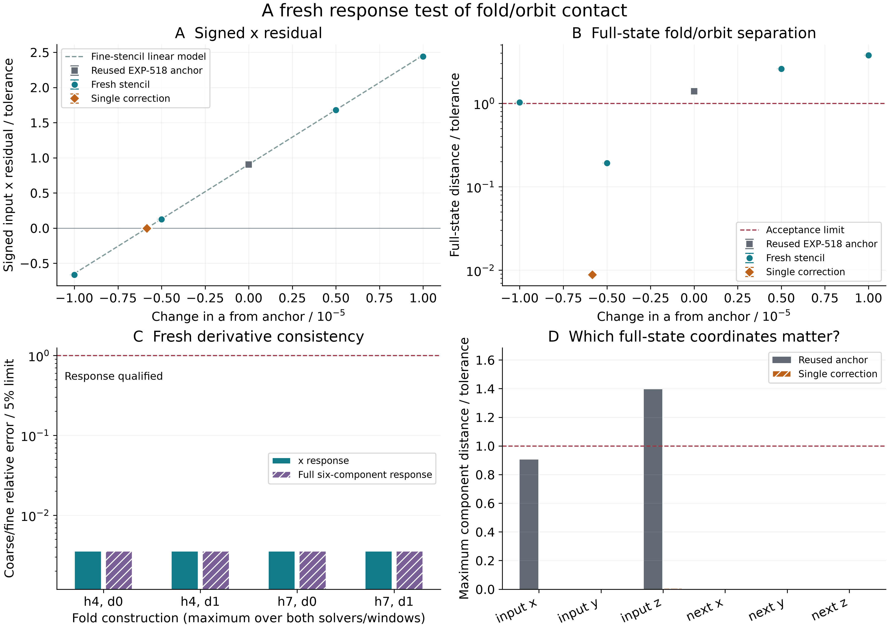

# EXP-519: a fresh correction restores full-state fold/orbit proximity

## Audited result

The single prescribed correction passes **every full-state contact and
prediction check across all sixteen variants**. All 513 retained target IVPs
pass the full raw audit. This resolves EXP-518's local contact failure at a
nearby parameter point; it does not relabel the old failed point as a success.

At fixed `b=0.2`, `c=7.152000000000001`, the corrected parameter is
`a=0.21559309191221962`. The worst scaled input/next-return separation is
`8.822001578909222e-7`, below the unchanged `1e-4` radius. The largest full-state
prediction error is `0.0063225625016077` (about 0.63%, limit 10%). The worst
coarse/fine derivative disagreements are `0.0001777664278481284` for x and
`0.0001779443488016557` for the six-component response (about 0.018%, limit 5%).
Both solvers retain the same qualified primitive-cycle identity and historical
six/Barrio eight section counts at every new point and both repeat windows.

All fixed points remain visible; the passing fine-minus point was **not**
substituted for the prescribed correction:

| Point | a | Worst scaled full-state separation |
| --- | --- | --- |
| Coarse minus | 0.21558892539912652 | 1.02291318938e-4 |
| Coarse plus | 0.21560892539912654 | 3.76337306342e-4 |
| Fine minus | 0.21559392539912653 | 1.92932185387e-5 |
| Fine plus | 0.21560392539912654 | 2.58565667009e-4 |
| Prescribed correction | 0.21559309191221962 | 8.82200157891e-7 |

The four construction choices are histories four/seven and two initial
directions. Combined with two solvers and two observation windows, they give
sixteen deterministic comparisons, not sixteen statistically independent
discoveries. All constructions qualify locally; their largest full-state
spread over the five points is `2.6700863742235015e-12`, not a rigorous error
bound. The failed original depth-eight representation remains failed.

### What this means for Jones

This is positive numerical support for one local ingredient: the independently
constructed scalar fold can meet the corrected periodic orbit to the declared
full-state tolerance, with a response that predicts the correction accurately.
It is not exact contact, a zero flow multiplier, identification of the second
critical point D, a doubly critical center, or a verified p-to-p+1 arrow.
No new grazing boundary was computed. In particular, the old boundary distance
cannot be relabeled as a measurement at the new corrected parameters.

The next mechanism test must distinguish a second critical point in a specified
return-curve/quotient geometry from a section-grazing boundary, while retaining
this qualified fold/orbit family and checking any newly needed parameter
response. An old depth-eight or joint-contact Jacobian is not reusable by fiat.

### Evidence and replay

- Frozen source: `cdd08b37762e2c89bc368535331450c94cd33f53`.
- Plan SHA-256: `59b960184c36eedfa69dca805a721ddd1d9ea38b229747419bfed9492b3ce81e`.
- [Compact raw-audit receipt](../experiments/receipts/EXP-519-fixed-c-fold-response-result.json):
  8,104,489 bytes; SHA-256 `92ff9159ca3de7794a481e9d682d02626b945495f3ad87e6c7d095137f0117ec`.
- Retained target output including summary: 1,810,219,839 bytes, below 3 GiB.
- Full raw replay: `artifacts/EXP-519/primary-audit-01.json`, 513/513 IVPs.
  Raw data remain local, not remotely backed up or publicly distributed here.

```sh
PYTHONPATH=.:python .venv/bin/python -B -m scripts.verify_exp519_public_response \
  --result docs/experiments/receipts/EXP-519-fixed-c-fold-response-result.json \
  --expected-sha256 92ff9159ca3de7794a481e9d682d02626b945495f3ad87e6c7d095137f0117ec
```

The compact checker, semantic mutation matrix, isolated public deployment and
cycle/figure controls passed **76 tests** (`release-helpers-01.xml`). The final
figure and repeated generation in `figure-03` / `figure-replay-03` are identical
in all five SVG/PDF/PNG/receipt/index products. The final PDF was rendered and
visually checked; initial layout drafts remain local. Published plotted data
and manuscript numbers receive a separate receipt-binding test. Same-agent
replay is not independent-team replication or a rigorous exact-flow proof.

The final figure suite passes **12 tests**, including byte identity of the
published copies, re-derivation of plotted data from both pinned receipts,
and checks that the manuscript's reported correction, distance, prediction
error and derivative discrepancy match those receipts. Together with the
previous helper suite this covers 77 distinct tests, not 88 independent tests.
The combined manuscript builds with 39 figures (13 main, 26 supplementary),
25 cited bibliography keys, no unresolved-reference/overfull-box warnings,
and blank author metadata. The new main Figure 5 and preserved Figure S26
were inspected in the final 77-page local PDF.



The manuscript puts this fresh-response result in the main article, preserving
the earlier failed transport/contact figure unchanged in the supplement. It
still contains the historical symbolic-chain diagram with its original
evidence categories. Author metadata remain blank; the local PDF is not a new
public PDF release.

## Execution chronology

At the 16:46 UTC continuation, the filesystem reported 14,788,008 KiB free,
above the original 12 GiB startup reserve. The full regression suite had
completed: **2,972 passed, one expected Linux-only skip**, in 1,115.93 seconds.
Its retained receipt is `artifacts/EXP-519/release-suite-01.xml`.

The earlier request to lower the startup reserve became unnecessary. **No
amendment was made, no approval was inferred, and no threshold changed.**
The two earlier pre-target launch refusals remain recorded on the work branch
and in its public commit `ec927d9fa20ee287e1ae7a7525263e30783b7f19`.

After confirming that the suite had finished, the checkout switched to the
preserved execution branch at `cdd08b37762e2c89bc368535331450c94cd33f53`.
The runtime live-verified that exact public ref, replayed its existing controls,
and passed the isolated 159-file startup before creating its exclusive marker.
The numerical run has now begun in `artifacts/EXP-519/target-cdd08b3`;
`artifacts/EXP-519/target-once.json` is consumed and must not be reset.

The original four-point fixed-c response calculation and conditional single
correction completed normally, with **513 target IVPs**. At 17:22 UTC the
exclusive run was finished and the full raw auditor was launched. The summary
SHA-256 is `6aded74665ff16d63ff3f4e2b53cea49f5aec445db7c644e98f88f6bce54aa89`.
Every completed point and raw product is retained. No intermediate residual
was used to redesign the experiment. Full raw audit precedes interpretation
and public figures. There is no paid review, remote worker, or raw upload.

The goal was qualified full-state fold/orbit proximity, not an x-only match.
That local goal passes. D and Jones's flow-level symbolic chain remain separate
scientific questions.

## Release preparation while the target runs

The separate compact cycle checker passed on authentic, previously audited
EXP-497 cycle evidence and rejected 24 altered versions. Together with the
new figure-reduction and synthetic rendering controls, **36 tests passed**
(`public-helpers-tests-02.xml`). The synthetic figure is a software control,
not target evidence; repeat SVG/PDF/PNG and provenance products were byte
identical. The public checker explicitly excludes re-auditing dense meshes,
complete polynomial root counts, polygon construction, shorter-period
interpolation and disk totals. Those remain the full raw auditor's job.

The first work-branch CI run (`34500805146`, head `ec927d9`) passed Python
3.13 but had two 240-second isolated-replay timeouts on Python 3.12; the other
2,971 tests passed there. These are retained software-replay failures, not
target outcomes. One diagnostic retry of only the failed job was requested.
The frozen source, timeout and numerical thresholds have not been changed.

A local, zero-integration profile of the unchanged validation path completed
in 120.532 seconds under profiling. It recorded 197,678,677 function calls,
including repeated ancestor validation and 15,991 JSON decodes. This identifies
redundant ancestry replay as an efficiency issue for a prospective successor;
it does not alone explain all runner-to-runner timing variation. The profile
is retained as `artifacts/EXP-519/authentication-profile-01.prof`.
