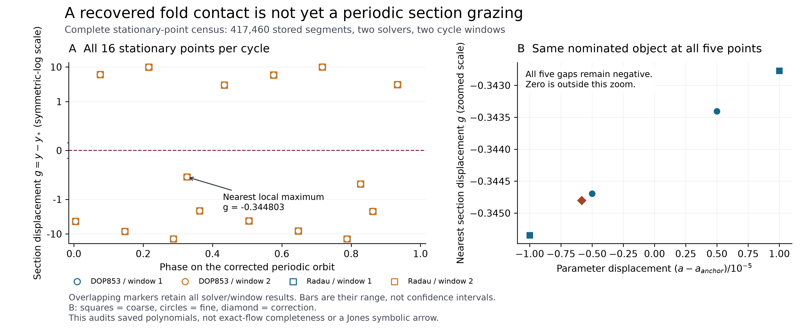

# EXP-520: the periodic object is identified; the grazing gap is still open

## What we learned

The complete census and certificate audit pass for **417,460 saved dense
segments**, covering all five EXP-519 parameter points, both solvers and both
cycle windows. There are no unresolved root intervals, join failures or missed
extrema relative to the original callbacks. Each of the ten full observations
contains 40 stationary-point records; each of the twenty cycle windows contains
16. These are repeated observations, not independent statistical samples.

All four method/window contexts at each point nominate the same nearest
stationary point, with a clear separation from the next candidate. At the
corrected EXP-519 point it is a local maximum at phase approximately 0.326468,
with `g=y-y*` approximately **-0.344803**. It has not reached the section.

| EXP-519 point | a | Mean nearest signed gap g |
| --- | ---: | ---: |
| Coarse minus | 0.21558892539912652 | -0.345347 |
| Coarse plus | 0.21560892539912654 | -0.342771 |
| Fine minus | 0.21559392539912653 | -0.344695 |
| Fine plus | 0.21560392539912654 | -0.343407 |
| Prescribed correction | 0.21559309191221962 | -0.344803 |

All rows hold `b=0.2, c=7.152000000000001` fixed. Means are over both
solvers and both repeated windows; the receipt and figure retain all four
values. The worst cross-solver phase discrepancy is about `1.34e-14`, and
the worst normalized state discrepancy is `5.94e-10`, within the frozen
`1e-7` phase and `1e-6` state bounds. These discrepancies are not rigorous
error bounds. The smallest nearest-versus-runner-up separation across all
contexts is about 0.00605 in normalized gap, above the frozen `1e-7` rule.

## What this means for Jones

This closes an actual measurement gap: the candidate is on the numerically
qualified periodic orbit, not a transient trajectory, and its nomination no
longer relies on ordinary event callbacks having found every extremum. The
exact certificates cover the retained interpolation polynomials; they do
**not** enclose the exact ODE flow.

It also prevents a false identification. EXP-519's successful fold-contact
test is not a successful section-grazing test. At the corrected point, the
nominated extremum has z displacement about **15.1495** from the small
equilibrium, full speed about **108.148**, and y acceleration about **-14.8047**.
This particular object is far from a stationary flow state. A future crossing
of `g=0` would need to be distinguished from an approach to the equilibrium;
one is not automatically the other.

This does **not** debunk Jones's general homoclinic claim, independently verify
a Jones symbolic arrow, or identify this object as D. It rules out treating
this tested local fold-contact point as the missing grazing event. No
cross-parameter branch identity is inferred just from an equal root ordinal.

## Reproducible evidence and execution

- Source freeze: `ed4bb3fe2ef905dbe5210e1df21f28afd24fe094`, live-pushed
  before outcomes and preserved on `codex/exp520-local-execution`.
- [Frozen protocol](../experiments/EXP-520-periodic-stationarity-census.md)
  and [machine plan](../../experiments/manifests/EXP-520-periodic-stationarity-census.json).
- Plan SHA-256: `e4620142e16f09bd8950ded1d5696788699c752549edae4605d394c6ef6f267d`.
- Local raw census: `artifacts/EXP-520/target-ed4bb3f`. Summary SHA-256:
  `7d109dc3c17480332b5db266ea3cf6dddd2ee46a439432a8048870f9854188e7`.
- [Complete audit receipt](../experiments/receipts/EXP-520-periodic-stationarity-census-result.json),
  SHA-256 `cb0c5983e0ec2d6c0dc6e7ebf4f4569c028d84f7f6ce8b8ea67fac5465a00b23`.
- All 75 preflight tests passed, including actual isolated startup and a
  synthetic end-to-end census/writer/auditor run. That synthetic authority is
  not represented as scientific execution evidence.
- All ten target profiles completed in 27.11 seconds, producing 67,232,194
  bytes, within the 256 MiB output allowance. The independent basis/count
  verification replay covered every segment. Geometry/classification code is
  shared; this is not independent-team replication.
- The one-shot marker is consumed. Do not reset it or rerun its target namespace.
  Original EXP-519 evidence, code and failed earlier experiments are unchanged.
- No new target integration, paid review, GPU rental or raw-data upload occurred.
  The ordinary CPU reference smoke test ran separately at its standard control
  parameters; it is not part of the target census.

The exact root certificates and original trajectories remain local. Public
code, compact audit receipt and receipt-bound figures are not a claim that
the full raw data have been released or remotely backed up.

Release checks: **89 tests passed in 2.09 seconds**, including figure semantic
mutations, byte-identical regenerated SVG/PDF/PNG/receipt/index products and
mechanical checks of the numbers in this update. The final PDF figure was
rendered and visually checked after adjusting axis margins to avoid clipping
any data marker. All **70 frozen source files** were rehashed unchanged.

One provenance limitation remains explicit: the frozen producer bound the
dependency lock and source inventory but did not embed runtime version strings
in its binding. The release-time environment was observed as Python 3.13.11,
NumPy 2.5.1 and SciPy 1.18.0, matching the separate preflight CPU smoke check.
This is a post-run environment observation, not a retroactively inserted
runtime attestation. The next runner should record these versions before
outcome access. The original binding is not rewritten.

## Next decision-relevant work

Follow this actual periodic family and test whether a consistently tracked
negative local maximum reaches the section. Retain both inner candidates,
because the corrected cycle has another negative local maximum; do not assume
that the presently closest one remains the relevant object everywhere.
Check periodic closure, minimal-period exclusions, event-root completeness,
cross-solver agreement and full-state identity through the continuation.
Where return counts change, distinguish a section tangency from a flow
bifurcation and from equilibrium approach. A Jones C/D word assignment and
its insertion rule still need their own operational dictionary and tests.

The observed small a stencil is useful local sensitivity evidence, but is
not permission to extrapolate an untested zero or reuse the old transient
boundary. The next bounded continuation must be frozen before new outcomes.
