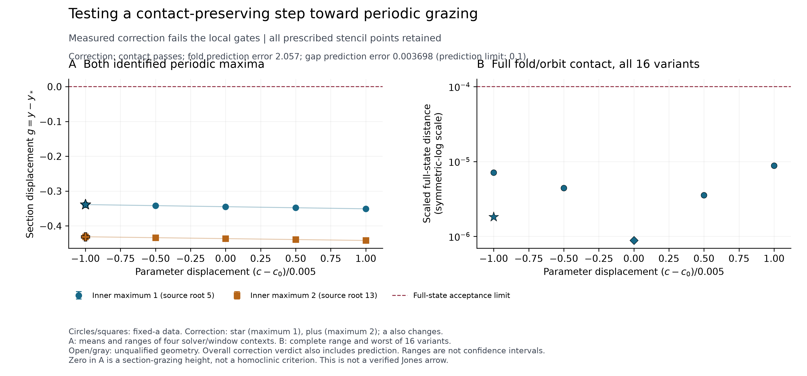

# EXP-521 — Real gap progress, but a failed linear fold predictor

The complete raw audit passes. The scientific predictor verdict does not.
All five prescribed points completed: **569 new IVPs and 416634 censused
periodic dense segments**. All sixteen stationary roots retain their unique
full-state/phase/curvature identity. Both inner maxima move closer to the
section at the prescribed correction, and all sixteen full-state contact
distances pass. But every fold prediction fails its predeclared relative-error
gate. This is not an accepted contact-preserving continuation step.

## What the numbers say

The original anchor is (a,b,c)=(0.21559309191221962,0.2,7.152000000000001).
The prescribed correction is (0.21559346273240781,0.2,7.147000000000001).
Gaps below are the mean of four numerical solver/window contexts, not
independent observations or confidence intervals.

| Check | Observed | Frozen requirement |
| --- | --- | --- |
| First inner maximum, signed y−y* | −0.344803228428 → −0.338663276607 | Improve in every context; passes, 1.78071% mean absolute-gap reduction |
| Second inner maximum, signed y−y* | −0.436488716610 → −0.431176469971 | Prediction/identity required; also improves, 1.21704% mean reduction |
| Worst full-state contact distance, all 16 variants | 1.81881766228e−6 | <=1e−4; all pass |
| Worst relative full-vector fold prediction error | 2.05740914290 | <=0.1; all 16 fail |
| Worst relative gap prediction error | 0.00369802324 | <=0.1; all eight pass |

Thus the gap response is useful, but the contact predictor is inaccurate even
though its measured endpoint lies within the contact radius. Neither small
geometric distance nor a passing raw audit overrides the failed predictor.
Both gaps remain negative; neither maximum has reached grazing. At the first
maximum, the z displacement from the equilibrium remains about 15.13 and the
flow speed about 107.93. This is not evidence of a homoclinic endpoint.

## Why the predictor failed, and what happens next

A separately labeled [post-run diagnostic](2026-09-10-exp521-postrun-curvature-amendment.md)
uses the even part of the already measured c stencil. Its coarse/fine
quadratic coefficients differ by at most 9.23412e−5 relatively; the quadratic
contribution leaves at most 4.77281% of the linear prediction error unexplained.
Central first-derivative agreement does not detect this even curvature. The
fresh prediction gate caught the problem. This explanation was selected after
seeing the failure, so it is not a validated quadratic forecast.

Next: freeze and execute EXP-522, a one-point nonlinear a correction at the
same new c. Require the unchanged full-state/prediction gates and an additional
tenfold contact-residual reduction in every variant. Keep net gap progress
relative to the original c-step anchor explicit: the normal correction may
give back some of the imperfect trial's gap improvement. No old verdict is
rewritten. Jones's flow-level symbolic arrow remains unverified, not debunked.

## Evidence and reproducibility

- Frozen source: `7260931511c2fc4583dbb89e7716b2d54c082005`, retained at
  `refs/heads/codex/exp521-local-execution`.
- [Frozen protocol](../experiments/EXP-521-critical-periodic-response.md);
  plan SHA-256 `29178f095da8a15602e8290d0d2339437f57148efad3fdc9aac0ad1471f9303b`.
- [Complete raw-audit receipt](../experiments/receipts/EXP-521-critical-periodic-response-result.json),
  SHA-256 `8bfc3ec343335af24514a4162b22e9a9d52499e49c5ee8140fa92c08697d499d`.
- Summary SHA-256 `8d58db8d48bc98603823da3ef4de50b68c2a04313050c6aabf8d4d18de171dba`.
- [Post-run curvature receipt](../experiments/receipts/EXP-521-postrun-curvature-diagnostic.json),
  SHA-256 `d2708ddde959d41d130b0ac2d6020d8b9305c9ddc65ad349e7cc0ed330dbbd47`.
- [Figure receipt](../figures/EXP-521-critical-periodic-response.receipt.json)
  records all plotted variants, source/generator/output hashes and claim limits.
- Raw data: local `artifacts/EXP-521/target-7260931`, 2068120266 bytes;
  2195.22 seconds. Python 3.13.11, NumPy 2.5.1, SciPy 1.18.0. One consumed
  attempt; no target rerun, paid Pro call, GPU rental or new private upload.
- All 17 release-helper tests pass. Actual PNG and PDF were visually checked.
  A mistyped figure-input hash was rejected before rendering; the corrected
  invocation produced the published figure. No numerical run was affected.
- [Source-audit clarification](2026-09-10-exp521-source-audit.md): segment quota
  counts periodic census segments, not all stored meshes. The output byte cap
  applies to all data. The immutable protocol's broader wording is not rewritten.

These are complete local raw replays with separate scalar and polynomial-basis
checks, not independent-team verification or exact-flow error enclosures.
The public compact receipts/figure support derived-data inspection; the raw
binary records are retained locally and are not claimed to be remotely backed up.
