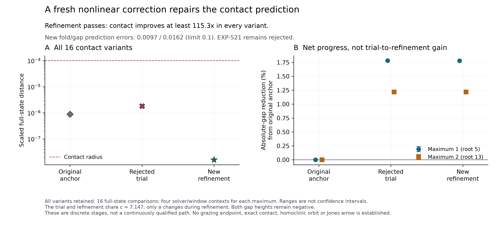

# EXP-522 — The fresh nonlinear correction passes

**All new numerical gates pass.** Every one of sixteen full-state contact
residuals decreases by at least **115.27×**, against a prospectively required
10×. Both fold and gap predictions pass their unchanged 0.1 limits. All
96 new IVPs and 83406 periodic dense census segments pass the complete raw
audit. This is a successful new fixed-c refinement, not a revision of the
failed EXP-521 predictor.

## What changed, in plain language

The c step moved the two inner parts of the periodic orbit toward the section,
but its linear model did not accurately predict the remaining fold/orbit
offset. Rather than accept the offset because it was small, we measured a new
parameter correction. That correction tightened the full-state match by more
than two orders of magnitude and was accurately predicted from the trial.
We now have a qualified corrected point at the new c value, not merely a
favorable picture or an untested model of why the earlier attempt failed.

At fixed b=0.2 and c=7.147000000000001, a changes from
0.21559346273240781 to **0.21559338680106457**. The integrators remain DOP853
and Radau; the Newton-style step adjusts a, not the time integration method.

| Predeclared check | Observed | Requirement |
| --- | --- | --- |
| Worst full-state contact distance | 1.57791751887e−8 | <=1e−4 |
| Smallest improvement factor across all 16 variants | 115.26694 | >=10 |
| Worst full-vector prediction error | 0.00966493 | <=0.1 |
| Worst gap prediction error, all eight contexts | 0.01617163 | <=0.1 |
| First maximum, mean signed section height | −0.338673170350 | All four contexts closer than original anchor |
| Second maximum, mean signed section height | −0.431170574752 | Identity and prediction retained |

The comparison points matter. Relative to the **original EXP-519/520 anchor**,
mean absolute gap reductions are 1.77784% and 1.21839%. Relative to the
**imperfect EXP-521 trial**, the first gap worsens slightly, as predicted,
from −0.338663276607 to −0.338673170350. The nested old local-progress verdict
therefore remains false. The new refinement's protocol explicitly requires
net progress from the original anchor, not monotonic progress from that trial.
All numerical variants are retained; their ranges are not confidence intervals.

## What this means for Jones

This supports continuing the local geometrical construction: qualified fold
proximity can be restored while retaining progress toward periodic grazing.
It is not a verified Jones arrow, a second smooth critical point, an exact
critical locus, a homoclinic connection, or a complete parameter-plane result.
Both maxima remain below the section. No Jones claim is debunked by the failed
linear predictor, and this successful correction does not validate the claims
that still lack a physical symbolic dictionary and a connected flow path.

A new [conditional theory note](../theory/periodic-grazing-and-symbol-insertion.md)
derives why ordinary section grazing can add one recorded return. It states
the extra partition, C/D and temporal-order conditions needed before that
becomes Jones's zero insertion. A source-only local review found no mathematical
blocker; its reporting corrections were incorporated. Sixteen analytic controls
pass, but they are not target evidence or proof that the hypotheses hold here.

## Evidence, source and retention

- [Frozen protocol](../experiments/EXP-522-nonlinear-contact-refinement.md),
  [design and controls](2026-09-10-exp522-refinement-design.md).
- Frozen commit `41bb1943fdcd0756a1f8077241287272afbf8548`, retained at
  `refs/heads/codex/exp522-local-execution`; all 193 bound source files remain
  unchanged. Manifest SHA-256
  `5caf77cfce8c6e3caac3ccd35ad1cbb4279d7d9386407d6958af9ac466bba783`.
- [Complete raw audit](../experiments/receipts/EXP-522-nonlinear-contact-refinement-result.json),
  SHA-256 `0f942da7d44560dc57feed927263198f68e389bb53472f0f0e6028927d52c866`.
- Summary SHA-256
  `ad57bf271f1e94b3b692df8c3cde2fa821df09f7aedfa9bc17a7a3291d7d0688`.
- Local raw namespace `artifacts/EXP-522/target-41bb194`, 348637490 bytes,
  356.07 seconds, completed 2026-09-10 21:12:32 UTC. Initial free space
  12241272832 bytes. Python 3.13.11, NumPy 2.5.1, SciPy 1.18.0.
- One consumed attempt; no retry, paid Pro review, GPU rental or private upload.
  Producer and auditor share geometry/controller sources, with separate scalar
  and exact polynomial-basis checks. This is not independent-team replication
  or a rigorous exact-flow enclosure.
- The [figure receipt](../figures/EXP-522-nonlinear-contact-refinement.receipt.json)
  retains every variant, both reference points and source/output hashes.
  Public source and compact products are backed up in Git; raw arrays remain
  local and are not represented as remotely backed up.
- Release checks: 36 figure/theory/manuscript tests passed, followed by all
  eight final figure tests after a layout-only legend correction. The actual
  PNG/PDF and affected manuscript pages were visually checked. The manuscript
  builds to 79 pages/40 figures with no unresolved references or overfull boxes;
  all 25 cited BibTeX keys and 24 required citations pass the source checker.
  Source/figures are public; publishing a new manuscript PDF remains separate.

## Next execution item

Build a bounded multi-step predictor/corrector continuation from this accepted
point, with explicit derivative refresh, new-data prediction checks, full-state
contact restoration and complete periodic-extremum tracking. Retain rejected
trials and distinguish predicted tangent motion from the normal correction.
The current fixed 6/8 crossing-count validity gates must stop at a section
change; a separately frozen two-sided grazing protocol must investigate that
boundary rather than silently relaxing the old count requirement.

Avoid extrapolating the old a derivative indefinitely or turning local success
into a claimed globally continued locus. Before a larger batch, resolve storage:
the Mac has roughly 11 GiB free, while a read-only check of the existing prax
SSH host found about 22 GiB and two CPUs. That host currently exposes system
Python 3.12.3 and no uv on its default PATH; verify or prepare a managed,
locked runtime before using it. New experiments can be designed to start from
public compact inputs, without transferring the blocked historical raw archives.
No remote environment or data was changed by these read-only checks.
